# Season1 Episode11

> 由于视频文件过于庞大，不方便上传，希望在阅读笔记之前，自己要有《老友记》的资源
> 
> **先将这一集看一遍**，然后根据个人的学习习惯再开始学习~~
>
> 如果时间紧迫或无心观看，请读概要。

关键词: 呵！女人！

## 概要

- 这一集也是非常经典的一集，Monica和Phoebe在路上碰到一个帅哥，在帅哥过马路的时候Monica向帅哥吹口哨导致帅哥被车撞。

  于是俩姐妹就开始去医院照顾帅哥，并且展开了一系列对帅哥身份，爱好等方面的联想和猜测。甚至两姐妹因为帅哥而开始“耍心机”。充分的体现了呵，女人！的核心思想。

  那么到底后来谁把到了帅哥呢？

- Chandler的老妈来纽约看他，在众人一起吃晚饭的时候Ross竟然kiss了Chandler的老妈...


## 正文


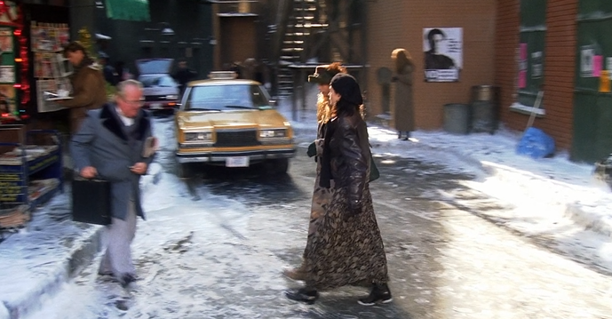

哈哈哈，一开场的外景发现亮点了吗？Joey感恩节的VD海报竟然还贴着。。。。

---

```
Monica: OMG, don't look now, but behind you there's a guy
        who has the potential to break our hearts and plunge
        us into depression.
```

Monica这句话充满了那种美式恋爱的戏剧性，整句话其实表达的意思就是`让你心碎`。但Monica说了这么一长串，我们来品一品。

- 我们直接从定语从句开始，has the potential to break our hearts，有让我们伤心的潜在威胁。plunge us into depression, 把我们扔到沮丧中去。这样一翻译就很明显了，加了修辞之后整句话都看起来高级了。


---


- 其实这里的翻译有一点儿不太对，`come to mama`并不是直接的字面意思，**这里更像是表达`快到老娘这里来`的意思**。其实身边的女生也时不时会以老娘自称，所有是相对带有一定口气的一句话。**当然，翻译成到妈妈怀里来也是可以的**。比如你的孩儿被人欺负了，你当然可以说come to mama。

---

看到这张图我只想说：呵， 女人！


---


俩妹子就开始对着帅哥浮想联翩了。其实Monica和Phoebe说的这些潜移默化地表达的是自己相对憧憬的男生类型。

---

```
Chandler: Are there no conscious men in the city for you two?
```
Chandler真的说话笑死人。`难道纽约就没有适合你俩的醒着的男人？`言外之意你俩为啥非守着一个昏迷的人。

- `conscious`意味`清醒的`。那`不清醒的`就是在这个词前面加一个否定词缀`un-`即`unconscious`意味`不清醒的，无意识的，潜移默化的`。

  英语单词中很多都是一个词加后缀加前缀变成别的词性或是类似，或是相反的意思。这也是有的书推荐被`词根`。但我不是很推荐这种方法，我们应该做的是领悟其中的规律，了解每一个词前缀和后缀的意思。

---

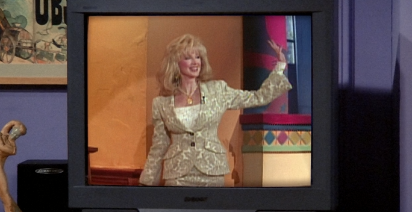

Chandler的老妈竟然是著名作家！Chandler这么幽默的文采可能也是基因优势吧。

但是我看到这里觉得Nora Bing(Chandler's mom)是写小黄书的....可能在美国这个东西是合法且很受欢迎的吧？


```
Compere: What is this about you being arrested in London?
```
- 主持人在这里用了一个`What is this about...`翻译成了`听说...`。我们常用的听说还有`I heard that...`

---

```
Chandler: Shh! I'm busy beaming with pride.
```

- `be busy doing sth.`表示`正在忙着做某事。`还有一个用法是`be too busy to do sth.`其实这也不算一个用法，这个不就是too to嘛。这个短语表示`太忙以至于不能做某事`。
- `beaming with + v.`表示`后面这个动词加大程度的意思。`比如这里的`beaming with pride`就是表示pride这个动作加大程度， 深感自豪。

---

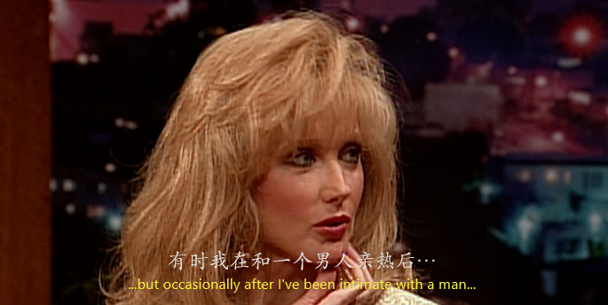

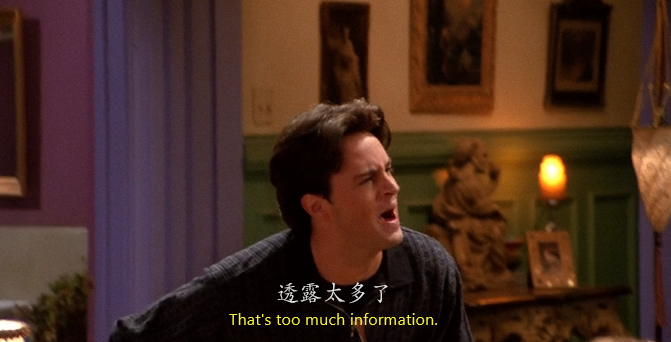

这里我在当时看的时候是get不到笑点的，更不会理解Chandler为什么大喊Too much information!

经过我查阅一些资料(假正经.jpg)，终于懂了。

- Kung Pao Chicken其实在美语中不单单是一道菜名，美俚中是有`毒品`的意思。这也是为什么Nora Bing在London会被捕。

  但是，Kung Pao Chicken还有更深的一层含义，就是代表男性的**，嗯，你懂得。因为cock这个词也表示**，都是鸡，所以都指代**。

  所以Chandler直接秒懂大吼Too much information


---

```
Nora: I'm famished.
```

- `famish` 动词，表示`感到极其饥饿`。程度是要高于hungry的。所以如果我们想表达`我真的快饿死了`的时候，如果一直喊I'm hungry别人还以为你只是单纯的饿，谁知道一会儿你已经饿到断气了。

---

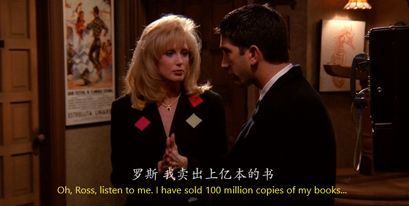
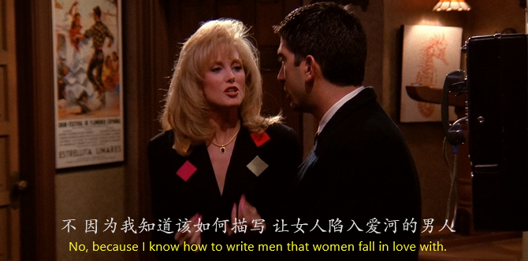
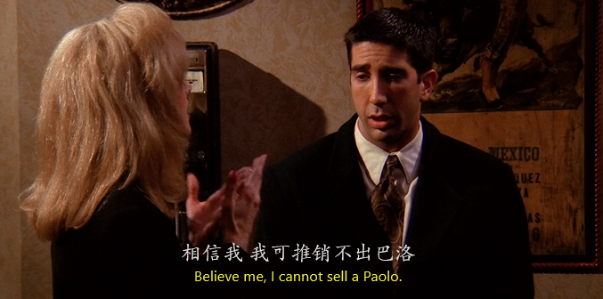
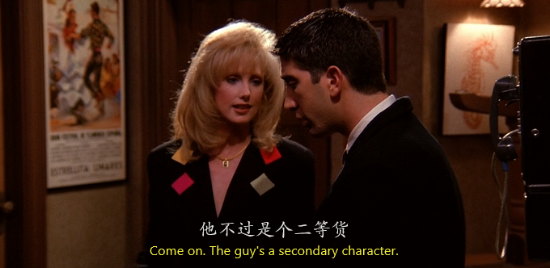

- 就发现歪果仁很喜欢在跟别人说一些自己观点的时候，为了加强这个观点的可信度，他们一般都会讲一件事情，或一个例子。

---

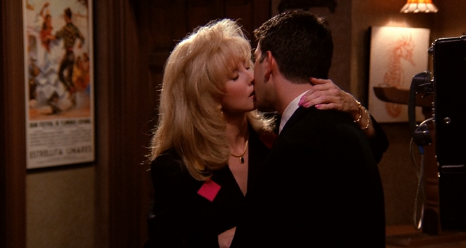

在喝了那么多酒之后，又加上Nora贴心的安慰。这一幕发生了。

---

```
Joey: Now, you tell me she's not a knockout!
```

- 这里的`knockout`，并非它的本意`昏死过去`。而是借用其本意来表示`一个女生美的让人昏死过去`。是个名词。

---

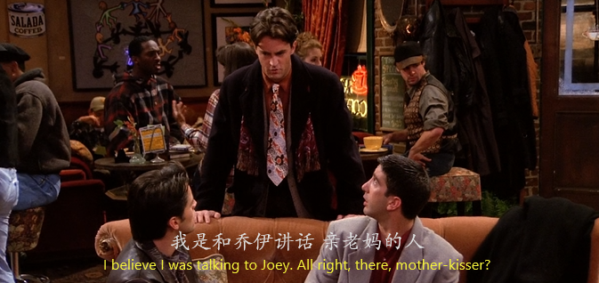

哈哈哈哈哈哈哈哈哈哈哈哈哈哈哈哈哈哈哈哈都这个时候了Chandler还不忘开玩笑。

当然这个梗很好get，motherf*cker~~

---

```
Chandler: That would be a no.  Just because you played tonsil tennis with my mom...
```
- 这里的`played tonsil tennis`直译为`扁桃体网球`。就是一种相对委婉的表达`接吻`。可以看出Chandler都不想直接说出这件事。

---

在帅哥醒来之后一脸懵逼的看着Monica 和 Phoebe

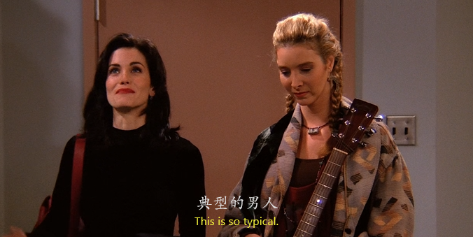


哈哈哈哈哈，最后Monica和Phoebe生气的离开，这段时间也都白忙活一场。

---

而Chandler则鼓起勇气和他妈妈敞开心扉，把所有对他妈妈的不满抱怨一并通过Ross这件事都说了出来，在和老妈交流过之后，一切都解开了，母子重归于好。对Ross的事也释怀了。


## Vocabulary

- potential *adj.* 潜在的 *n.* 潜力
- plunge *v.* 用力插入， 使陷入 *n.* 投入，陷入，游泳
- depression *n.* 萎靡不振， 沮丧， 下陷处
- conscious *adj.* 有意识的，神志清醒的，自觉地，有意的
- beaming *adj.* 照耀的，光亮的， 喜气洋洋的 *v.* 发出光与热
- occasion *n.* 机会，时机，场合 *v.* 惹起，引起
- intimate *adj.* 亲密的，亲近的，私人的，个人的 *n.* 密友 *v.*暗示，提示，宣布
- crave *v.* 渴望，热望，恳求。