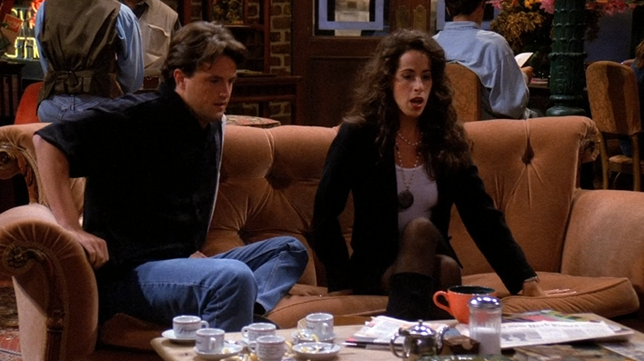
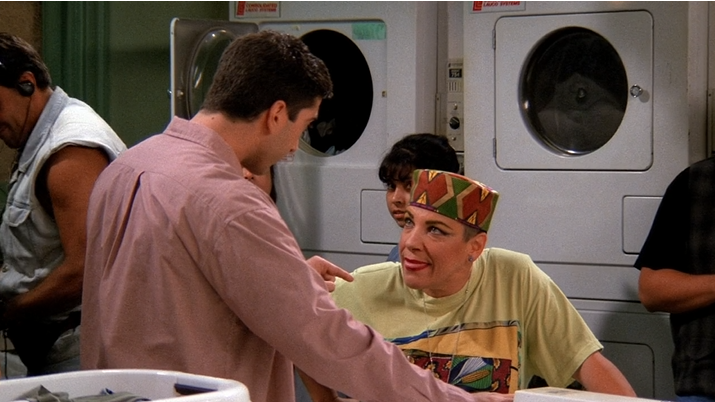
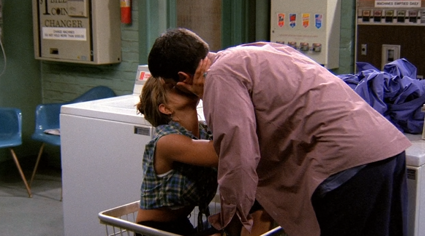

# Season1 Episode5

> 由于视频文件过于庞大，不方便上传，希望在阅读笔记之前，自己要有《老友记》的资源
> 
> **先将这一集看一遍**，然后根据个人的学习习惯再开始学习~~

关键词`even`

#### [干货传送门](#id)

## 正文

开场大家就男生和女生所能做的特有的事情展开了激烈的讨论，但这个讨论并不是要争出自己的性别所能做的比异性要多，而是要证明，异性能做的`尴尬且特有的事`比自己多~~~

```
Monica: Would you let it go? It's not that big deal!

Ross: Not that big deal? It's amazing Okay? You just reach in it
      and there's one little maneuver and bam, a bra right out 
      the sleeve.
```
Ross一开场就出了一记狠招，说女生就那么轻而易举的可以脱掉bra然后从一个袖子里拿出来。Ross还有那么一点戏谑的称之为amazing。

---

```
Rachel: Come on! You guys can pee standing up!
```
Rachel 当然也不甘示弱，直接来了一句，你们男生能站着尿尿~
- 这里的`standing`是一个动词+ing形式表定于，修饰前面的pee，这种非谓语动词，比如v. + ing / v. + ed来变为形容词的用法事非常之常见的，所以不要觉得奇怪哦。

---
```
Joey: You know, what blow my mind? Women can see breasts anytime 
      they want. You just look down and there they are~
      How you get work done is beyond me.
```
Joey当然也不甘示弱，typical Joey talk, 说妹子们无论何时何地，只要想看胸，低下头就是了。

- `blow my mind`意为我想到了什么。`blow`这个词有`吹，殴打，吹风`的意思。但是在口语中经常用来表示一些比较意会的意思，比如这里的blow my mind如果直译则变成吹我的思想，显然会感觉很怪异。
  * 还有一些blow的短句可以学习，比如`You blow it.`意为`你搞砸了`。你搞砸还可以说`You screwed up!`
- `How you get work done is beyoned me.`这句话的句式我们要先分析一下，先找谓语动词`is`，那么它前面的就是主语，而后面的就是宾语或者表语。这里的主语却是`How you get work done.`是一个完整的句子。Right！你一定也想起来了，就是我们之前说过的`主语从句`。

---
```
Pheobe: You know what? I don't get is the way guys always do so
        many mean things and they're not even care.
```
Pheobe一般不想说到点子上，但一说，绝对是威力惊人。确实，连我这个男的听了都没办法反驳。男生总是做出很过分的事情，而且做了以后还不自知，不觉着做错了。

**这里就要引出今天的关键词`even`了。**

- `even`这个词对大家来说再熟悉不过了，意为`甚至`,就4个字母，是一个很简单大家都认识的单词，但是它在口语表达中却有着非同凡响的作用。`even`在口语中多半是用作`强调某事`，是表达一种力度，并非一直是表达其本意`甚至`。这里的`even`就是一个强调语气，当然也可以翻译成`甚至`(怎么感觉被打脸)。他们甚至都不在乎。但是我感觉这里翻译成`他们根本不在乎`比较好。

---
众人沉默，确实是无法反驳。Ross绞尽脑汁来了一句

```
Ross: Multiple orgasms!
```
哈哈哈哈哈哈啊哈哈哈哈哈哈。XXX的时候可以high好多次。这确实是女生的特性额。男生总是在一阵抽动之后一切都变得索然无味了。

---

这一集大概分了三个故事线，Chandler和Janice分手，Ross和Rachel去洗衣房洗衣服以及Monica和Joey去拆散情侣。

画面一转Chandle激动的喊出若干次`Saturday Night`。其实这里要说一下，老外对`星期六`特别重视，觉得星期六，尤其是晚上，没点啥事简直是浪费光阴浪费生命。而且这个时候可以说是电视的黄金收视时间，当然对于现在mobile phone盛行的年代已经不那么明显，但是在以前确实是很棒的，大家都处于休闲的时间。礼拜五刚下班，礼拜日又快要上班了。都没有周六的晚上好，明天还可以休息一天，想想就舒服是吧。

所以美国有一个很火的节目就是`SNL(Saturday Night Live)`还挺好看的。我们也有啊，湖南卫视的`快乐大本营`。原来还好看，现在...口区。

---

说到分手。。。嗯。。。我最近刚分手(难受)。Chandler和我对分手的看法简直一模一样的。

```
Ross: Not even say breaking up with Janice?

Chandler: Let me see, oh shut up!

Monica: Chandler! Nobody likes breaking up with someone.
        You just gotta do it.

Chandler: I know, but it's just so hard. You know, I mean
          you sitting there with her she has no idea what's happening.
          You finally get up the courage to do it.
          There's horrible awkward moment when you've handed her the note.
```
Chandler说的很对，我个人感觉，就会觉得分手的时候很尴尬，无敌尴尬。而且悔恨自责，她根本不知道接下来会发生什么，还要承受分手的伤害。反正就是自己心里很复杂。

- `like doing sth.`意为`喜欢做某事`。
- `get up`意为`增强，增加`。

```
Joey: Why you have to break up with her.Be a man, just stop calling.
```
这时候Joey说的话又自一次印证了Pheobe的话，boys always do something mean and they even don't care.Joey一看就是不和女生说分手，而是直接不再联系。这样真的很恶心。后面也会有说到Joey很难开始一段认真的relationship,也会说到Joey经常只和妹子419，后面就不会再联系他们了。算是Joey的一个缺点但也是特点吧。

---

这时候Pheobe来帮Chandler
```
Pheobe: You know, if you want, I'll do it with you.

Chandler: Thanks, but she'd feel like we were ganging up on her.
```
Pheobe表示如果你不敢分手，那么我可以和你一起分手，给你壮壮胆。

Chandler说那样Janice会觉得我找人联合起来对付她。

其实Pheobe是和自己的男朋友分手。反正也要分了。

- `gang up on sb.`意为`联合起来对付某人`。

---

这时候要引出本集第二条线Ross和Rachel洗衣服这里了。

```
Pheobe: What's the matter why so scrunchie?

Rachel: Oh, It's my father, he wants to give me a mercedes convertible.

Ross: That guy he burns me up.
```
Rachel这不就是典型的不努力就要回家继承家产了嘛。。。
- `mercedes`看到这个词，绝对不要说不认识。好吧，如果你不认识，那我说`奔驰`你认识吗？对`奔驰`的全称就是`Mercedes Benz`是一个德国的词，奔驰取自后面的部分`Benz`。而我们一般说的`梅赛德斯`则是前面音译过来的
- `burns me up`可以理解为`真让我火大`类似于这种意思。

Rachel的爸爸还是希望她能回家，回去过被安排好的生活，但是Rachel不想。这时候Monica就开始模仿Rachel他老爸的口吻。

```
Monica: Did he give you that whole "You're not up to this" thing again.

Rachel: Yeah, I got the exxtended disco version with three choruses.
```
- `be up to this`可以译为`不是这块料，不适合干这个`。
- Rachel这句话就很有说法了，这句`extend disco version with three choruses`可以说是一种很讽刺的说法来表示`不光说了这些，不光这样，我爸还变本加厉的说我不是这块料`。大概就是这个意思。`choruse`可以表示`副歌部分，一首歌的高潮`。其实如果大家有专门研究过音乐歌曲，我是指流行歌曲的话，一首歌一般是有两次副歌部分，而Rachel他爸的话就像有三次副歌的扩展版disco。说是disco可能是他爸说的很带劲，甚至有了节奏感(skr???)。

---

这时候来到本集的第三条线，Joey拆散前女友和她男朋友的部分，前女友走进central park然后Joey就走上去搭讪，因为前女友看起来好看多了。得不到的永远再骚动。
```
Joey: You look good.

Angela: Because I'm wearing a dress that accents my boobs.

Joey: You don't say.
```
- `accent`有`重音，口音`的意思。但是这里`accent`明显是作为一个动词出现，是有`强调，突出`的意思
- `boobs`和`breasts`同义
- `You don't say.`这句话是一句很地道的表达，意为`这还用说，太明显了，众所周知`的意思。

---
镜头切回Chandler和Janice分手这里，简直笑死了。

Janice走进来开始bbbbbbbbb，Chandler显然有点紧张，然后这时候Pheobe的男朋友走进来和Pheobe交谈几句，然后一个拥抱，分手结束。

Chandler一脸懵逼。然后开始疯狂喝咖啡，可以看到桌子上有好多杯咖啡。



---


洗衣房的Rachel和Ross遇到了一个野蛮大妈。



经过和野蛮大妈的争论让他俩感情更进一步的，Ross和Rachel的感情线应该是整个第一季的主线。




<span id="id"></span>
## 干货

- `even`这个词在口语中有时候会用作语气强调。

## Vocabulary

- maneuver **v.** 策略，演习，操纵
- bam **n.&v.** 欺骗，哄骗，迷惑
- scrunch **v.** 蜷缩，压，挤压
- convertible **adj.** 可变的，可变换的 **n.** 敞篷车
- detergent **n.** 洗涤剂
- brutal **adj.** 残忍的，野蛮的，不讲理的
- freakish **adj.** 异想天开的，朝三暮四的
- supreme **adj.** 最高的，至高无上的，最重要的。还记得当时傻傻的把这个词认成super me，尬


