# Season1 Episode9

> 由于视频文件过于庞大，不方便上传，希望在阅读笔记之前，自己要有《老友记》的资源
> 
> **先将这一集看一遍**，然后根据个人的学习习惯再开始学习~~

本级关键点：

**Thanksgiving Day**

## 正文

正如前文所说的，Friends的每一集都是有若干个小故事穿插进行，进而完成一集。而且基本是一个简短的搞笑段子开场，然后进入一集的正片。

如果说Friends每一集必有几一个简短而搞笑的段子开场

**那么每一季，都必有一集是讲Thanksgiving day，另一集讲Christmas Day**，这两集一般都不会离太远。

那么在开始这集之前，先要科普一下`感恩节`。

> 感恩节可以说是地道的美国节日，如果非要类比一下，感恩节在美国的重要性不亚于中国的中秋节，要是和春节比，我感觉还差一点，毕竟有圣诞节。
> 
> 美国把`每年11月的第四个星期四定为感恩节。`其实这里有一点大家应该注意一下就是老外的节日尤其是老美的节日喜欢用第几个月的第几个星期几来划定而不是具体的几月几日。
>
>当然，比起我们祖先发明的智慧的阴历，还是差一点。（个人观点）

---

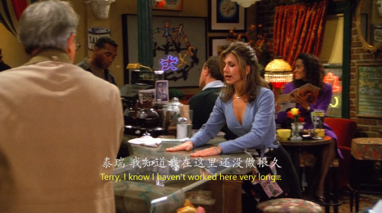

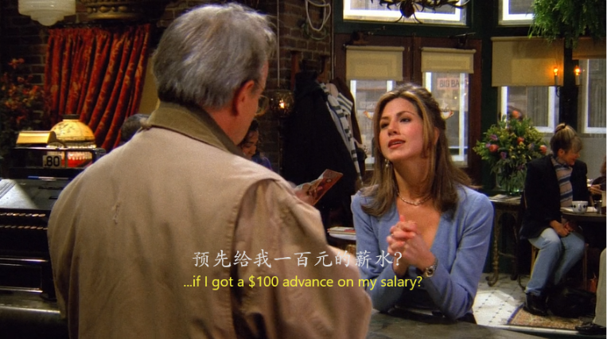


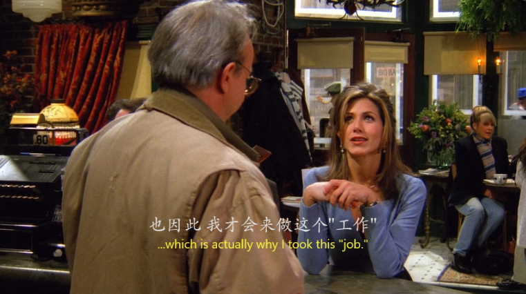

一开场便是Rachel找老板预支自己的工资(btw, 我如果没记错，这是我唯一一次看到Central Park的老板，如果还有哪一集老板出现了请指出)。

注意到Rachel这里预支工资的表达方式

- 我们先说说她这几句话的语气：
  - `but I was wondering...` / `do you think it would be possible...` / `if ...`
  
  可以看到这一系列的表达给人的感觉都非常的`委婉`。怎么让人感觉都委婉的呢？

  - `wonder`这个词，如果我们把它单独拿出来是`adj. 奇妙的，钦佩的，远超预期的 / v. 好奇， 想知道， 想`的意思。多半在口语中是`想，想要`的意思。而`I wonder`更是一个常见的搭配，`I wonder how, 我想知道是怎样? / I wonder why, 苍天啊， 到底为啥？`。读到这里你没有唱出来吗？ I wonder how, I wonder why, I wonder where they are?咳， 回归正题。
  - `do you think it would be..`就是一个简单的一般疑问句，这里会让人觉得委婉是因为，我们翻译一下就明白了，`你觉得...怎么样？`

- 接下来我们说一下预支的表达
  - `advance v. 将...提前，预付，增加 / adj. 预先的， 现行的`。看到这里再结合Rachel说的这句话
  
```
if I got a $100 advance on my salary?
```

就可以看出，这里就是简单的用了一个advance做形容词，修饰$100。但是注意这里的介词，用的是**on** my salary, 而不是 in my salary。介词这东西，我真的记不住，所以大家如果有好的方法可以分享给我。。。

---

Rachel 要这$100也不是乱花，只不过每一家过年都有自家的习俗，Rachel家的感恩节是要一起去滑雪，而我们也知道Rachel逃婚让她一下子从美国的中产（Rachel的爸爸，和他逃婚的老公，都是医生。懂的人都懂，美国的医生有多挣钱。）掉到普通市民。一个普通的waitress想要去滑雪还是很难滴。

可以仔细品一下Rachel和老板说原因的时候，是这么说的

```
你知道all of this independent thing, So I took this Job.
```
当Rachel说到took this job 的job时，做了一个这样的动作


这样两手放在两侧，然后食指和无名指弯着的姿势，**是老美用的特别特别特别多的一个姿势！是一个非常地道的姿势了。** 哈哈哈哈哈哈哈哈,地道形容姿势。

你会在诸多美剧中看到这个姿势。

那这个姿势是什么意思呢？你可以把这个动作理解成一个标点符号，就是`""`，对，就是引号，在我们的表达中，有时候也会调侃一句，你真"美"。而这个引号的意思就是此美并非真美。

这个动作多是调侃或者讽刺的意思，起一种修饰或者强调的含义，表示当前说的这个意思，并非真正的字面含义。

那么Rachel这里用这个动作来`修饰`了Job这个词，可见，Rachel根本就从心底里不把这个当成自己真正的工作，只是现在一下子脱离舒适的生活，来到Monica所说的Real world，需要谋生罢了。

后面第18集Rachel也会第一次找工作，会找到什么样的工作呢？到时候记得关注哦！

---
老板看到Rachel这样的态度，当然是不会借给她钱。。。

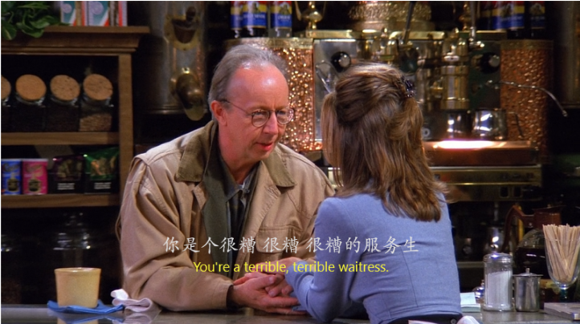

---

刚才我说到Friends每一季大家都会在一起过Thanksgiving和Christmas，但是又不能用爱发电，大家就，哇，我们是好朋友，我们一起过感恩节吧。这样太唐突了，所以每个人都需要一个Reason，一个没办法和家人过节的Reason。

那么Monica, 和Ross的Reason这不就来了。


他们的父母甩开他们自己去Pueroto rico过节去了。

---

而Joey在这个时候满脸脂粉的就进来了，Chandler看到那绝对是要嘲讽的。


- 注意这里的化了妆用的是`wearing makeup`，化妆动词配的是`wear`而不是`paint or draw`。
- `makeup`就是名词`化妆品`的意思。

```
As of today, I am Joey Tribbiani, actor / model.
```
- 这里有个标点符号`/`，读作`slash`，表示`兼, 兼具， 兼备`的意思，还有一些很常用的标点符号我在这里举一个`#`，为什么举井号呢？大家刷微博，刷twitter, 刷ins的时候，一个话题恰恰是用`#`来开头的，那么比如：

```
#photo#sunset#mylove
```
这样的一连串话题该怎么读？

- `#`读作`hashtag`, `hashtag photo, hashtag sunset, hashtag mylove`

而这次Joey当模特的经历，为后面买下了伏笔，我们继续看。

---

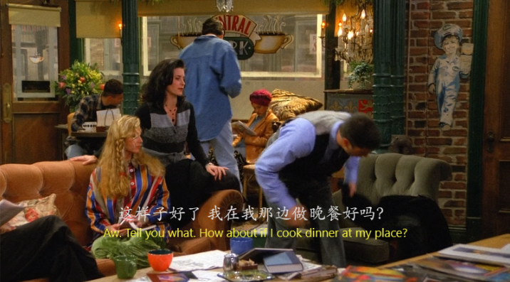
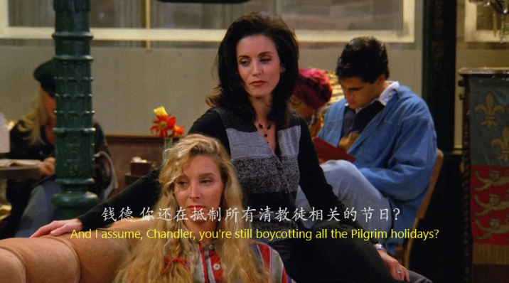
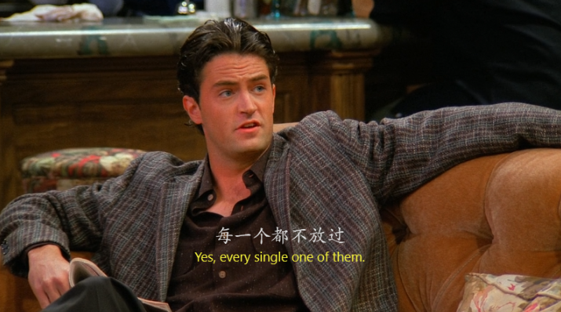
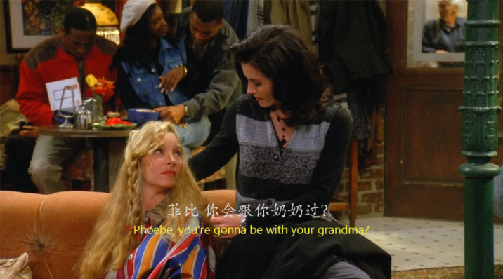


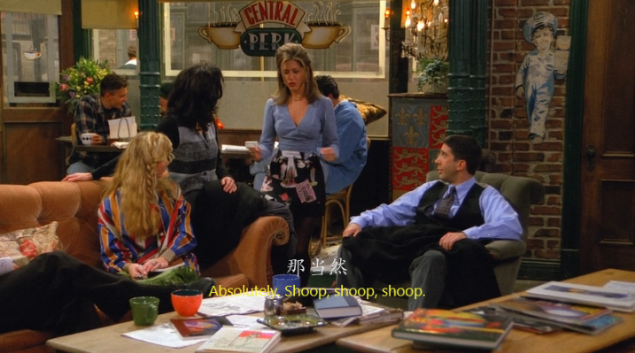

那么这么就交代了大家在Thanksgiving原本的安排，Chandler, Pheobe, Monica, Ross已经确定要在一起过Thanksgiving了。

那么Rachel和Joey呢？

---

```
Ross: Well, I'm off to Carol.
```
这里插播的一个故事线是Ross要去前妻家拿头骨

这里注意一下Ross表达`要去哪里`的方法:
- `I'm off to somewhere`。`off`有`关，离开`的意思。`I'm off`表示一个状态，或者说是动作，我要离开了。`to`则表目的，`要去...`，所以是一个很简洁很地道的表达离开，或者说是`离开并且要去哪里`的方式。

- 当然，最普通的`I'm gonna leave, and I'm going to do / go...`的表达方式也要会。

---

Ross 和 Susan真的是冤家对头，每次在一块都能笑死，但是这一部分没啥讲解的，所以自己去看吧。

---


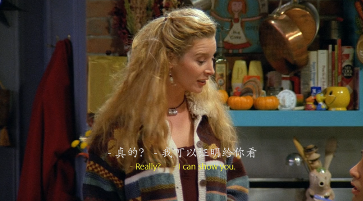


这个“火鸡头”的梗后面玩了不止一次，而且，因为这个火鸡头，Chandler和Monica还发生了一些不可思议的事情！等到了那一集再说！（脸红）

---


就这里我们可以注意到一个细节，就是Rachel和Monica他们是很好的朋友，但是Rachel从一开始就没有考虑过向Monica他们借这$100，也不是很大一笔钱，但是Rachel没有借，后面还有很多这样的细节。

我觉得这就是真的朋友吧，不会和利益扯上关系，纯粹而真诚，记得《名侦探柯南》里有一集叫“钱买不来的朋友”，园子叫小兰去滑雪，但是小兰拒绝了，说是最近零花钱快花光了。

新一就说园子家那么有钱，干嘛不让园子请你去？ 小兰一下子就火了，说不可以，因为她要和园子做一辈子的朋友。

感觉这就是我从这些地方提炼出来的对朋友的理解，朋友有难，可以帮忙，那是发自内心的，但是带有私心的利益关系，无非是酒肉，根本就不是朋友。

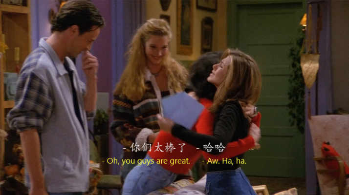

让人感动的就是Monica大家看到Rachel是多么拼命的在凑这$100，所以大家帮他凑到了$100让他回家能和家人滑雪。真的，这才是朋友！！！！

咳，言归正传。

---

当Rachel问到Chandler到底怎么了，这么恨节日的时候，她是这么说的


```
What is it with you and this holiday?
```

- 如果我稍微换一下词，那么这句话就会很好理解`what is it between(with) you and this holiday?`是不是一下子就理解了。`你和这个节日之间到底发生了什么？`

---


镜头来到Joey这边，正要坐地铁回家啊过节，碰到了之前的美女同事并前去搭讪。


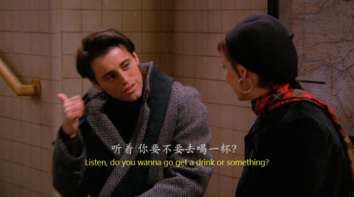

然后就搭讪成功，约去“喝酒”了。

不是，兄dei，你不是要回家过节吗？？？？？？？？？？？？？

这可能就是我单身的原因吧（哭泣）


但是这位美女起身貌似看到了什么扭头就走了。


哈哈哈哈哈哈哈，原来Joey去当`性病`宣传海报的模特了，最关键的是注意这张海报上的话

```
what Mario isn't telling you....
```

显然，Joey就是Mario.....

- `VD = veneral disease`, `veneral, adj. 性欲的， 性病的， 性交的`。

随后的镜头更是给到全城大街小巷贴满了他的海报。这下Joey别说约会了，连家里人都觉得他得了性病，不让他回家过节了。

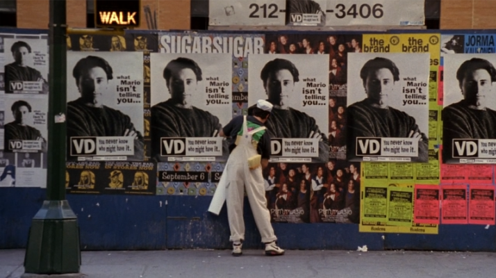

这下，Joey也确定要留下来一起过Thanksgiving了。

---


美国每年的感恩节都会举行游行来庆祝。这张图是游行中的一个大狗气球。记住这只大狗。它是众人在一起过的第一个感恩节的最终推手。

---


注意Monica在这段话的表达，非常的押韵，前一个名词和后一个类似于前一个名词的ing分词。

但是，这几个分词真的。。。。就是单纯的表达它们都一切正常，马山就会有香喷喷的饭。没啥卵用。

---


- 我们日常交流中经常要用到时间，那么表示时间的方法也有很多种，是不是想起来被听力考试支配的恐惧了。。。。
  - 第一种就是报时法：
```
8：00就是8 o'clock

8：45可以说是 eight forty-five, 9:15 nine fifteen
```

- 然后就是一些整点的报时

```
// 小于半小时，我们用past

9：30 half past nine

9: 10 ten past nine

// 大于半小时，我们用to

9：40 twenty to ten

9: 50 ten to ten
```

- 这里Rachel的表示却很新颖，`five hours from now`，从现在起5小时，表示再过5小时。学到了。

---

这时候那只大狗断线飞走了，于是大家都去屋顶看大狗了。

结果，回来大家都没有带钥匙。

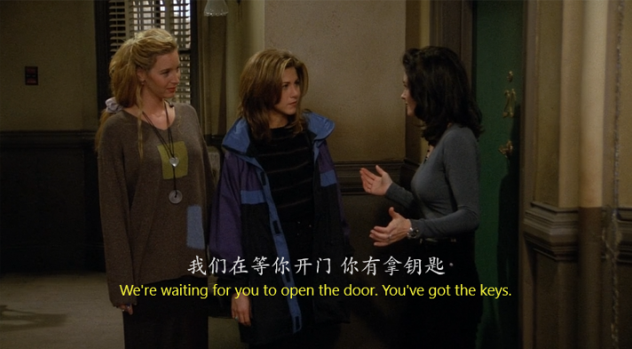
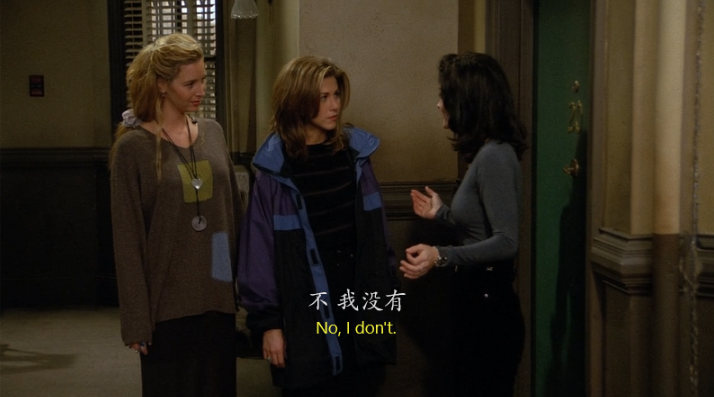

然后Rachel责怪Monica让她很生气


这下Rachel因为进不了门，没办法拿到票，也没法回家过节了。

---


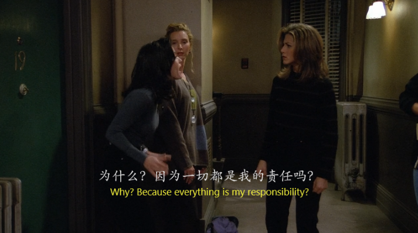
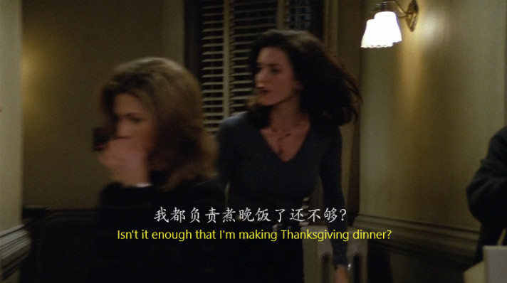


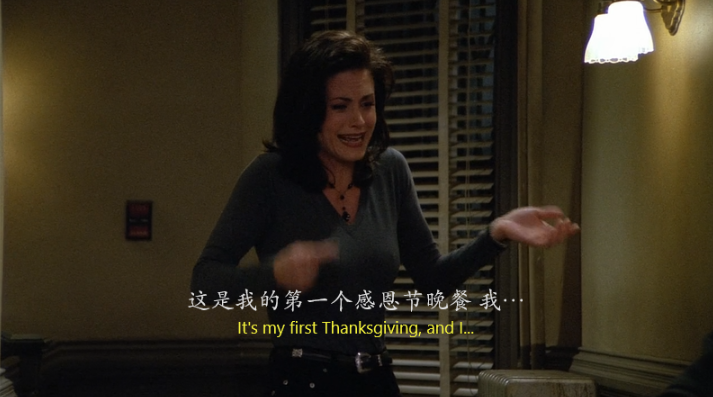


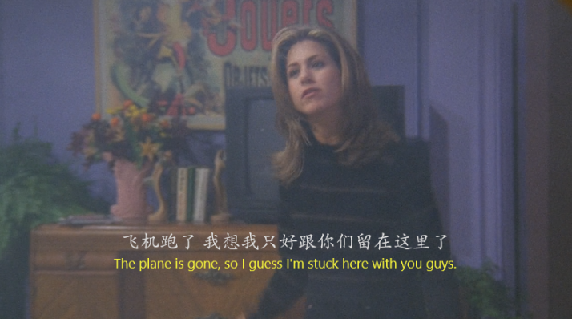
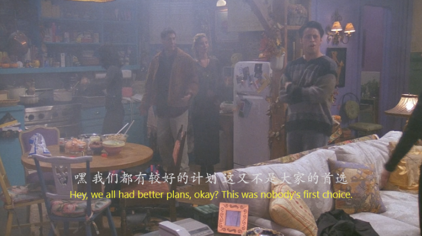


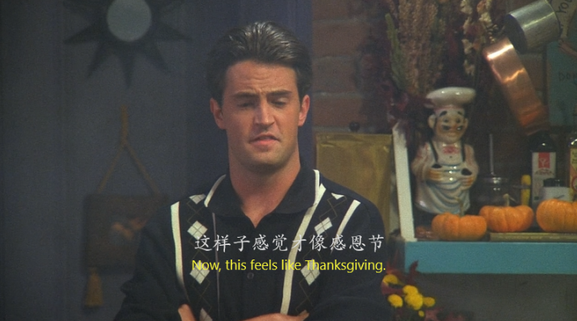

这应该是大家在一起第一次很严重的争吵，这也让众人之间的关系更加立体，他们不是玛丽苏般的友情，只有开心快乐。他们也会争吵，也会因为事情而互相生气，这也是友情的一部分。
---


如果再看他们的几场争吵，会发现很多次都是Pheobe打破僵局，让大家意识到拥有彼此是多么幸福的一件事。

---

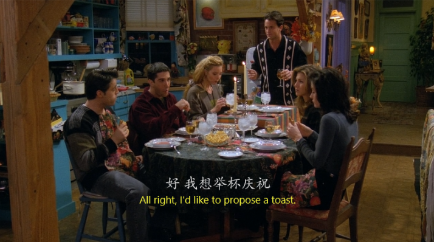
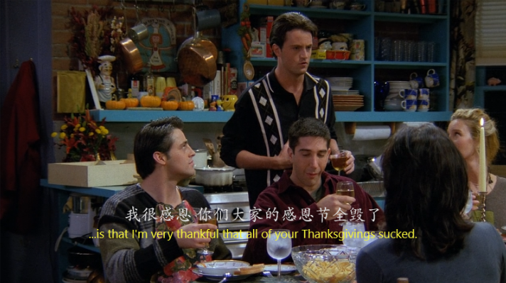


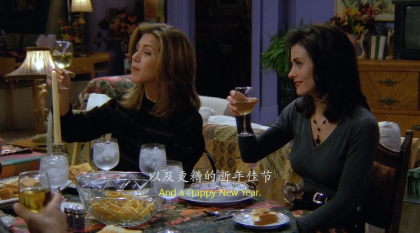


这一幕也是再经典不过的一幕，这种钱氏幽默的调侃，在感恩节感恩大家有这么糟糕的经历，感谢这些经历让大家相聚在一起。

而后面的lousy Christmas和crappy New Year更是点睛`the real world is sucks, but you're gonna love it!`

这集真的太好看了！！

## Vocabulary
- faculty **n.** 能力，才能，全体教职员
- familiar **adj.** 熟悉的，通晓的 **n.** 常客，密友
- concept **n.**  概念，观点
- magnificent **adj.** 壮丽的，伟大的，高尚的，华丽的
- vivid **adj.** 生动的，清晰的（多指记忆），丰富的（多指想象力）
- infect **vt.** 使受影响，感染，传染
- smirky **adj.** 假笑的，傻笑的，小人得志的笑的
- lousy **adj.** 讨厌的，污秽的
- crap **n.** （算句脏话了）表示艹，废话的意思


