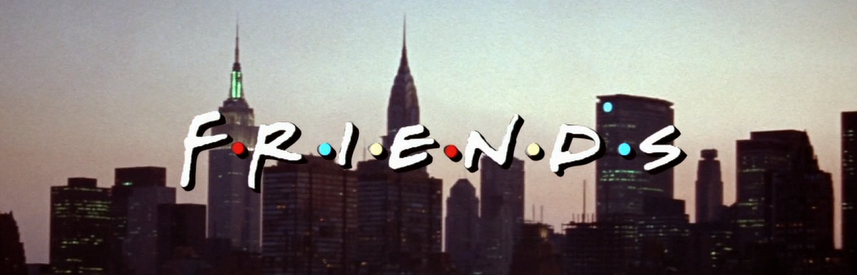

# Friends 

 

Hi Everyone, 特别喜欢看《老友记》，一直想通过看老友记来学习一些很地道的口语表达。

现在开了这个repository也算给自己立下了Flag，希望能把自己所学习的跟大家分享。

### **NEW!!!** 配套微信小程序正在加紧制作，敬请期待！

[GitBook链接](https://hanqizheng598.gitbook.io/english/)阅读起来会更舒服一些。

## 目录

### [Season 1](https://github.com/hanqizheng/Engilsh-Note/tree/master/Season1)
- [Episode 1](https://github.com/hanqizheng/English-Note/blob/master/Learn/Season1/Episode1.md)
- [Episode 2](https://github.com/hanqizheng/English-Note/blob/master/Learn/Season1/Episode2.md)
- [Episode 3](https://github.com/hanqizheng/English-Note/blob/master/Learn/Season1/Episode3.md)
- [Episode 4](https://github.com/hanqizheng/English-Note/blob/master/Learn/Season1/Episode4.md)
- [Episode 5](https://github.com/hanqizheng/English-Note/blob/master/Learn/Season1/Episode5.md)

### 关于我

[My Blog](https://hanqizheng.github.io)

如果大家发现笔记有错误

或者想继续`补充知识点`

or something else

**可以在issue里给我留言，也可以fork到自己名下给我提pr。**

总的来说希望大家可以喜欢这个repo，能从这个repo中学到东西，那么它的嘉佳就体现了！！！

