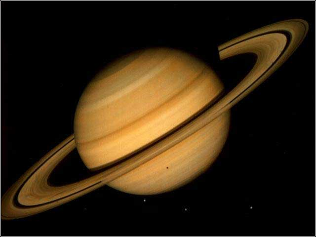
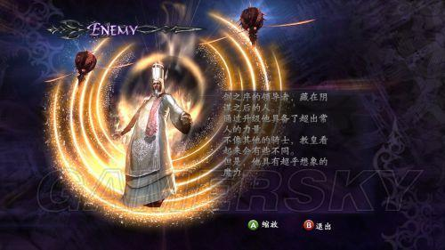

# Season1 Episode1 - The Pilot

> 因涉及版权且视频文件过于庞大，不方便上传，希望在阅读笔记之前，自己要有《老友记》的资源
> 
> **先将这一集看一遍**，然后根据个人的学习习惯再开始学习~~


关键词： just

[干货传送门](#id)

a ha! Hi everyone,现在正式开始《Friends》之旅~~~

作为整个剧的第一集，是有着非常重要的意义，这一集可以发现很多在`人物特点塑造`上的笑点，个人感觉是要先给大家把每个人物的特点说明白，才会在日后的那些`笑点`上不会让观众觉得很奇怪，毕竟现实生活中像Phoebe这样的人物虽有但不多，如果直接拿梗可能会有些僵硬额。

> 这里说明，在接下来的所有笔记中，不同人物的台词将由人物名缩写表示
> Monica: M 
> Chandler: C 
> Rachel: Ra 
> Phoebe: P 
> Joey: J 
> Ross: Ro

---

```
M: There's nothing to tell. It's just some guy I work with.

M: 没什么好说的，就是个跟我一块工作的人。
```
全剧第一句台词是Monica的，其实看到后面会发现Monica算是6个人中的灵魂人物（我个人见解），因为很多事情都是围绕着Monica展开，而且剧中一大场景就是Monica的公寓。其实如果看过几部情景喜剧大家可能回有相同的感受，就是所有人物中会有一个相对灵魂的人物。Monica，Sheldon, 佟掌柜~

这句话其实没什么可以说的，简单的`There be句型`。

`没什么好说的`这里用的是`nothing to tell`，就是确实没啥说的啊，这个意思。

当然还可以用`I have no words to say`这个有点像`speachless`的语境，更偏向`我竟无言以对`的意思。

后面这句话就要引出本篇要探讨的一个口语中再常用不过的词`just`。

如果你有仔细看过字幕的话你会发现，`just`的使用率太高了，而且他有好几种意思！！

在这里`just`是`仅仅,只`的意思。

---

```
J: Come on~ You're going out with that guy. 
   There gotta be something wrong with him.

J: Come on~ 这人跟你出去说明他肯定哪里有点问题。
```
- 这里要说的一个词是`gotta`

    **gotta = got to**

    表示`必须，一定，不得不`，大概体会一下，就是一种很肯定的语气可以用`gotta`

    ```
    // example

    I'm sorry, but I gotta go.
    我很抱歉，但是我必须要走了。
    ```
    gotta是一个在美语中使用频率非常高的词，和`gotta`类似的这种缩写表示的词还有很多比如`gonna，wanna`,这些后面会说到。
- 还有一个很常用的短语`go out with`
    
    直译可能就是和某人出去，其实这个短语可以表示`和某人在交往`。

---

```
C: dnaou@3!@#saf#$%/* as5465
```
这句话翻来覆去听十几遍也不知道Chandler在说什么，字幕也是错的。当然只是一句普通的`钱式幽默`罢了。

---

```
P: Wait, dose he eat chalk?
   Just cuz(cause) I don't want her to go through waht I went through with Carl, Oh~

P: 等等！ 他吃粉笔吗？？
   我只是不想让Monica像我和Carl约会那样和Paul（就是现在讨论的这个guy）约会。
```
这是Phoebe的第一句台词，上来就问他吃粉笔吗？Monica：？？？？

这里字幕上没有标出Just cuz而是直接给出后面这句话，但是如果你仔细听就会很清楚的听到Phoebe确实说了`just cuz`。

这里`just`这个词再次出现！意思大概是`只是，只`。

`cuz`是`cause`的缩写，在美语中大家说cause一般都会变成cuz，就这个因人而异吧，Ross就会把每个单词的音发的很标准（后面的剧集也有吐槽）

---

```
M: Ok, everybody relax. This is not even a date.
   It's just two peopel going out to dinner and not having sex!
```

`just` again。

---
```

Ro: Hi~~
```
Ross 的第一句台词竟然如此只短，但是其感情还是相当丰富额

（我怎么胡扯个不停了）

---

```
J: This guy says hello I wanna kill myself.
```
紧接着Joey就吐槽这句Hi了

这里就引出了第二个美语中不知道有多常用的口语表达`wanna`

**wanna = want to / want a**

表示想要去做某事或者想要某个东西

```
// example

I wanna kill myself.
I wanna go cuz this show is boring.
I just wanna cup of water.
```
是一个很简单但是很地道的词

---

```
Ro: I just feel like someone reached my throat, grabbed my
    small intestine, pulled it out of my mouth and tied it
    around my neck.
```
这句话是一堆动词的堆叠，其实很值得我们借鉴，记得当时上课老师教如何翻译句子的时候就有说过一堆动词的堆叠该如何表达，毕竟`英语中一个句子只能有一个谓语`。

在口语中貌似语法不是那么重要，但是Ross是一个Doctor（not that kind doctor, it's a PhD doctor！）他表达这句话还是蛮标准的。

整个句子就一个谓语动词，那就是`feel`,后面所有的抓住，握住，拽出来，捆上都是用非谓语动词ed形式来修饰或者补充或者说明。所以句子简化后就是`我感觉`。我感觉什么？就是后面这一长串的东西来说明补充。

上课的那个很经典的例子
```
我带着老婆出了城，吃着火锅唱着歌突然就被麻匪给劫了！
```
这句话也是一堆动词的堆砌，但其实主体就是`我被劫了`，其他那些都是来修饰说明你在被劫的时候是吃着火锅唱着歌带着老婆被劫的。所以可以大概写成：
```
I was robbed .....我忘了怎么写了....
```
--- 

```
Ro: Stop cleansing my aura!
```
cleansing是`cleanse`的变形，表示`净化,清洗`，当然这里和`aura`这样含义的词搭配应该是`净化`的意思。

`aura`表示光环。我们知道还有一个词也表示光环`halo`。

但是这两个光环其实还不是同一种光环，`halo`更偏向那种实体的，且没有宗教色彩的光环，比如土星有一个很大的光环，那个光环我们就可以用`halo`。当然可能会说Beyonce有一首歌很励志也叫做`halo`，确实这个`halo`不是实体的，但是也没有宗教色彩，它表示一个人的一种精神或者品质。这个就很具体的语境了。



`aura`这个光环就很有那种玄学色彩了，比如鬼泣4里的大boss教皇背后的那个光环就是`aura`，你可以体会一下。



---

```
Ro: To hell with her. She left me!!
```
相信我，看老友记能学到很多骂人的话23333333

To hell with sb.就是一句挺地道的骂人的。。。（sb = somebody,骚年你想什么呢？）

---

```
Ro: Why dose everyone keep fixating on that?
```
keep比较常用的用法有:

- keep doing sth 一直做某事（没有停）
- keep on doing sth 反复做某事（注意是反复）

这里还有一个就是`fixating`是`fixate`的变形

`fixate`表示`注视,注意力放在`

---

```
Ra: Oh God Monica Hi!
    Thank God!
    I just went to your building and there's a guy with a big
    hammer said you might be here.
```
千呼万唤使出来，6人中的最后一个Rachel终于登场，每次看这里都会被Chandler那句`I just wanna million dollars!!!`笑死。

这里可以注意到`just` 又 双 又双出现了！！！

这里的just就不是只，仅仅的意思了，而是`刚才， 刚刚`表示一个时间上的提前。所以这里可以注意到时态用的是`一般过去时`。

---
**所以到目前为止，6个人都出场完毕，这6个人的故事也才刚刚开始。**

---

```
Ra: I always knew he looked familiar but...
```
这里的always用法也值得注意，`always`后跟的是`一般过去时`表示一直怎么怎么样。

```
// example

It's like all of my life, everyone has always told me ...
```
这里always是和`现在完成时`搭配表示某个事情一直持续到现在，always就显得可有可无的样子了。

所以always的使用要注意结合时态。

---

```
M: Well, I guess we've established she's staying with Monica.
```
这句话很有意思，Rachel说我要和Monica住了在接下来的日子里。

Monica紧跟了这句，好吧，我猜我们已经决定了她要和Monica住。

这里的`establish`这个词的使用就非常地道了。`establish`原义为`建立，确立`。在这里使用`现在完成时`和`establish`相结合表示已经确定，已经建立，就可以很地道的将确定某事，敲定某事表达出来了！

这里的`she's staying`是`现在进行时表将来`的经典用法，表示Rachel将要和Monica住了。

时态真的很重要。

---

这里插播一个剧情上值得大家揣摩一下的地方

Rachel 和 老爸通话以后彻底谈崩，然后焦虑的拿纸袋在呼吸。然后Phoebe唱音乐之声的插曲来试图安慰Rachel，然后Rachel显然是不耐烦的用`I feel better！`打断。

然后Phoebe开心地说`I helped`。

这里我个人感觉就是一个角色特点塑造的桥段，Phoebe就是那种有点wired但是很善良的人，而且Phoebe的情商那是非常高啊！（后面会感觉到）

---

```
C: Please don't do that again, that's a horrible sound!
```
注意Chandler说这句话的语气，非常的emmmmm抑扬顿挫？这就是另一个典型的角色特点塑造，到后面也会调侃Chandler说话的音调和常用的句式`could I ...`


```
Ro: So Rachel, what are you up to tonight?
```
这个在听的时候就听不清，说的很快，Ross问Rachel今晚要干什么。

这也是一个很棒的表达吧`what are you up to?`

愿意表示你在忙什么？

---

```
Ro: Anyway, if you don't feel like being alone tonight...
```

这里有一个`feel like doing`的用法，表示`想要做什么`

**feel like doing = want to do**

---

```
J: What the hell do you do on a real date?
```
这里必须要说的就是又一个非常常用的口语表达`the hell / what the hell`。

可以理解为一个语气助词，就是加强自己的语气，当然也可以是处于一种`调侃，愤怒，疑惑`之类的，反正就是结合语境然后强调当前要说的这句话。

```
// example

What the hell are you talking about?
```
可以发现`what the hell`后面常跟一个`一般疑问句`。

---

```
J: I will not take this abuse.

J: 别这样羞辱我，我不吃你那一套。
```
`abuse`，侮辱，恶言，辱骂，还有滥用的意思

---

```
M: I can't stop smiling.
```
`can not stop doing sth`表示`情不自禁的做某件事`

---

```
P: Give her a break, it's hard being on your own first time.
```
`Give sb a break`表示`不要逼某人`

还有一个逼就是`push`

```
// example

Don't push me!!

别逼我
```

---

在众人说服下Rachel剪掉了所有家里给她的信用卡，银行卡。这表示她今后要靠自己来生活，来`buy stuff`。这是后Monica说的这句话出现在各大鸡汤博主的微博里：

```
M: Welcome to the real world!
   It sucks.
   You're gonna love it!
```

这里在说其鸡汤含义之前要先把今天最后一个重要的知识点说了就是`gonna`，第三个非常常用的口语表达。

`gonna`一般和`be动词`搭配使用

**be gonna = be going to do**
表示将要做的，要去做的事情，非常常用！！！

```
// example

You know what? I'm gonna kill myself!!
```

---

```
Ro: You know, you probably didn't know this,
    but back in high school I had a major crush on you.
```
这里我们可以学习一个很地道的表达`喜欢你`的句式，要知道其实外国人对`I like you. / I love you.`的使用是非常谨慎的，是非常正式表示一段感情进展到哪个阶段的表达。所以不能动不动就`I love you，`

`have a crush on sb`表示`喜欢某人`

这里的`major`表示程度，非常喜欢的意思。


<span id="id"></span>
## 干货

- just 在口语中非常常用，通常表示两种意思，`只，仅仅`或`刚刚，刚才`
- wanna = want to
- gonna = going to 通常和be动词连用be gonna = be going to 
- gotta = got to 表示不得不，肯定，一定。

还有一些很细碎的需要你仔细阅读。

### vocabulary
- hump **n.** 驼背
- cleanse **vt.** 净化， 使...清洁
- fixate **v.** 视线移向， 注视
- abuse **n.** 滥用， 恶习， 恶言 **vt.** 辱骂，滥用
- sophisticated **adj.** 复杂的，精致的，富有经验的
- metaphor **n.** 隐喻，比喻
- drift apart 疏远（指关系）

### 经典台词

```
Monica: Welcome to the real world.
        It sucks.
        You're gonna love it!
```