# Season1 Episode12 - The One with the Dozen Lasagnas

> 声明：
>       
>      所有内容只用于学习，如有侵权请告知。
>
>      如想转载请标明出处(github.com/hanqizheng)
>      
>      先看一遍原剧集再来阅读效果更佳
> 
>      希望可以Star支持一下😄
>
> 
>
> 如果时间紧迫或无心观看，请读概要。


## 概要

Phoebe给Rachel的男友做按摩(Phoebe是专业的按摩师)，但是Paolo趁机占Pheobe的便宜。

Carol做了胎检，知道了孩子的性别，而Ross却不想知道。

Chandler和Joey决定一起去买桌子。


## 正文


```
Monica: Well, the meats only third layer, maybe you can scrape.
```
- `scrape`这个词，最直接的意思就是`刮，擦`这种动作。是一个简单的动词，但是它还有另外一个比较常用且相对抽象的意思就是`勉强...`
  - scrape through 勉强通过
  - scrape along 勉强度日
  - scrape home 勉强成功
  
  可以看到这些短语的搭配，都是有一种`勉强做某事`的意思。

---

```
Pheobe: It says in some parts of the world people actually eat the placenta.

Chandler: And we're done with the yogurt.
```

Ross买了很多关于生育的书，因为我们之前说到Carol(Ross的前妻)正怀有身孕。而Ross的这句把我扔到子宫里不给我指南针我都能走出来可以看出Ross有很认真的准备相关生育的知识。

这时候Phoebe来了一句：“书里说世界上有人吃胎盘。”这时候Chandler的这个表达需要我们注意一下。

- `We're done with the yogurt.`意为`酸奶是没法吃了。`这里的`be done with sb/sth(more often).`表示`和某人/某事(和某事搭配更多些)彻底没关系了`。
  
  有的时候还会见到这样的表达`We're done. / Are we done now?`这是很常用的口语。表示`我们完了。 / 我们完了吗？`但是这个完了，**是要看语境的**，可以用在两人分手，也可以用在身处险境等等，是一个很灵活的用法。

---

```
Joey: Hi daddy, how come you don't live with mommy?
	  How come mommy lives with anthor lady?
```

- `How come...`意为`怎么会...`
  - How come you make this mistake? 你怎么能犯这样的错误？
  - How come rainy today?
  - How come I forgot this whole thing!

  其实感觉主要是表达一个疑问，但是带有一定的强调语气和不可思议，不尽人意的语气在里面。

---


Ross和Susan他俩早就是冤家了，从Carol跟Ross离婚开始，他俩见面总是笑skr人。所以Ross当然要让Susan吃点肉啦。

---
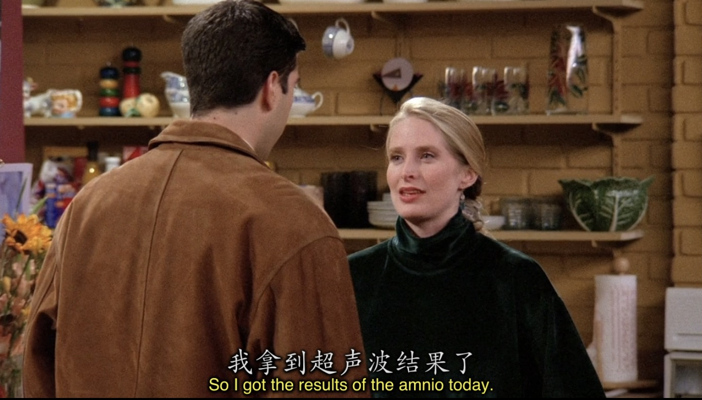
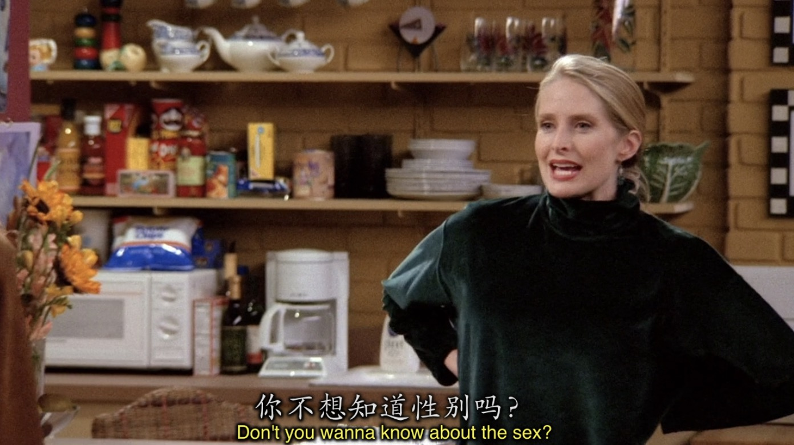
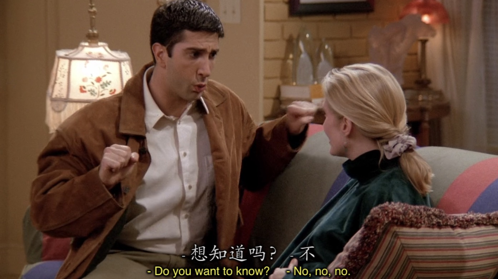

可以看出Ross还是一个知性且传统的人。

---

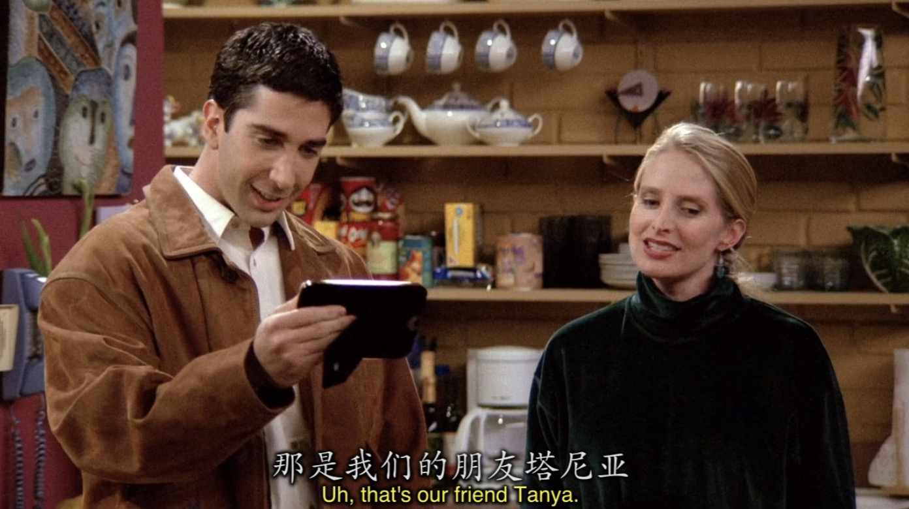

这里要解释一下为什么大家会笑，首先，我们看下Huey Lewis是谁？

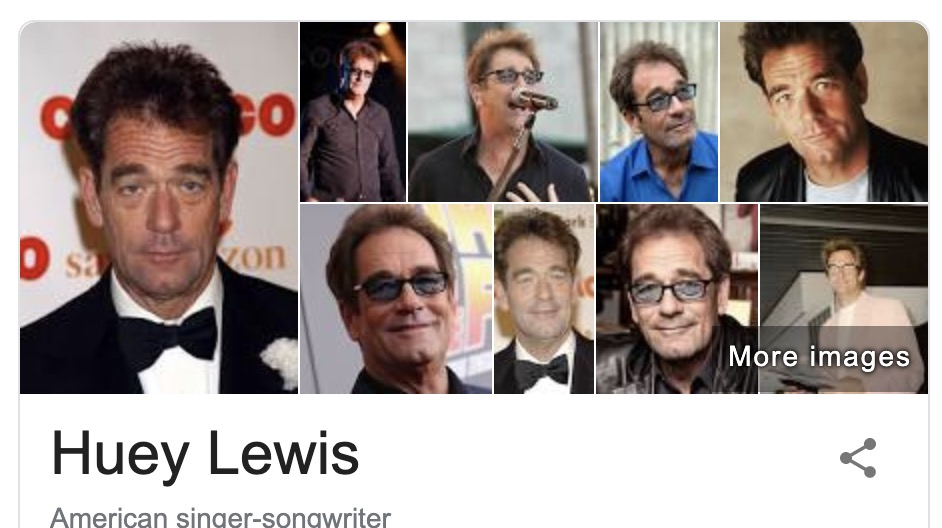

没错，是个男的！而Carol说是她和Susan的“朋友”。所以这里的Tanya是位女生，但是Ross既然能认错性别，说明Tanya打扮的很像一个男人。其实就是调侃Carol和Susan是lesbian这个梗。

---


这个角度的central park真的很少见

---


 来到本集的主线，Paolo去找Phoebe按摩，占Phoebe的便宜

 - `make a move on me / make a pass at me / hit on me`意为`占我便宜`

Phoebe还在后面用了两种不同的表达方式来表达`被占便宜`


---


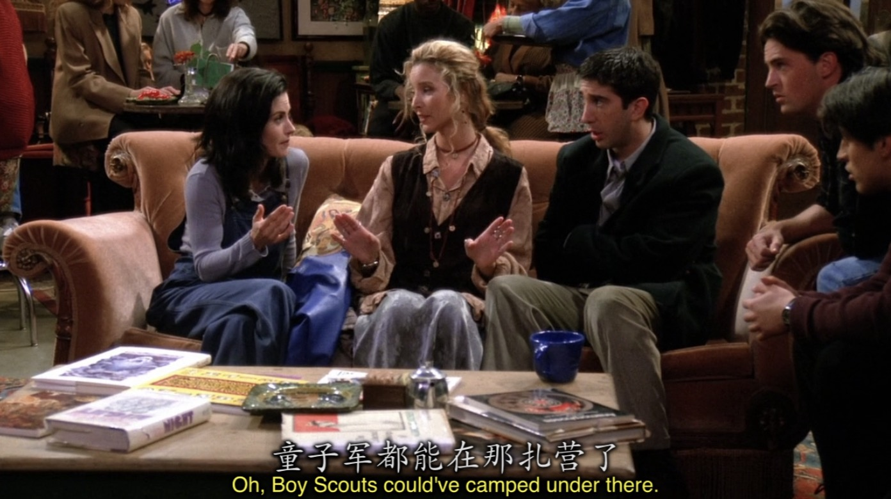

大家应该明白这个梗哈

这时候我们知道Ross喜欢Rachel但是因为Paolo，Ross只能苦苦看着。现在这么好的机会Ross当然不会放过。

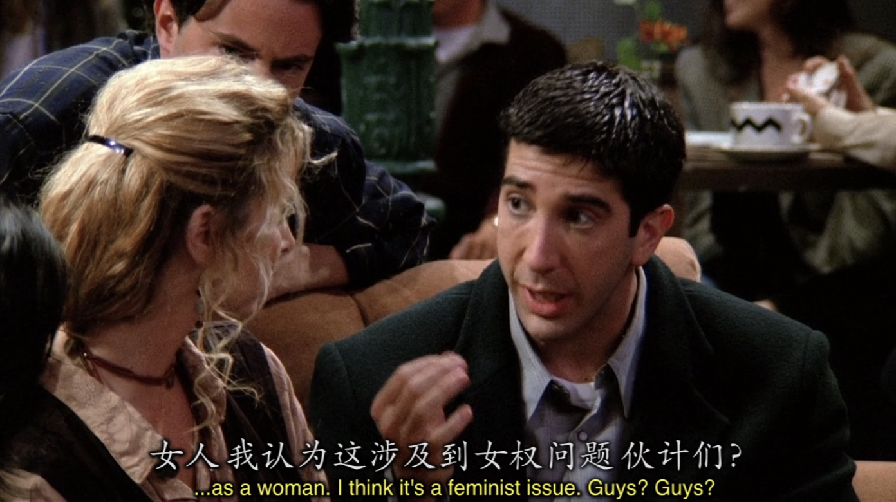

---

```
Chandler: What are you still doing here? She just broke up with that guy!
	      It's time for you to swoop.
```

- `swoop`意为`俯冲`的意思，在这里非常生动形象的表达了`趁虚而入`的意思。

---

Ross在第一时间出现在分手的Rachel面前


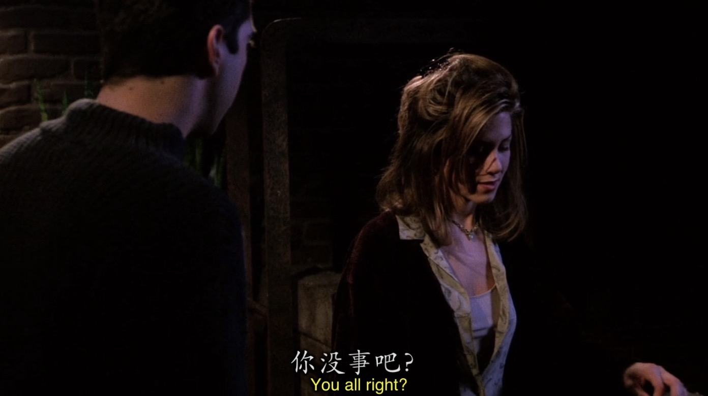


本来觉得在Rachel最需要安慰的时候，他的出现会让Rachel对自己有好感，但是没想到Rachel却这么说

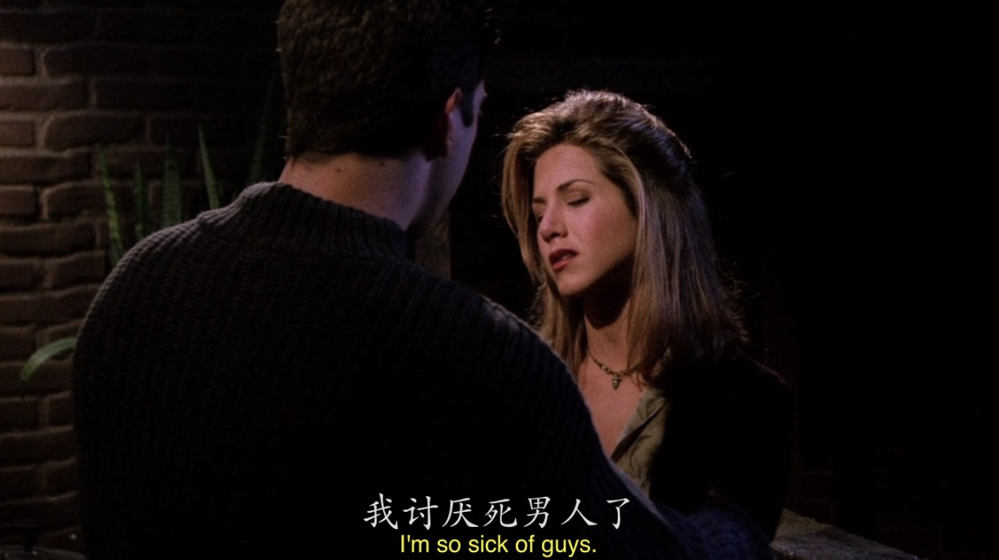
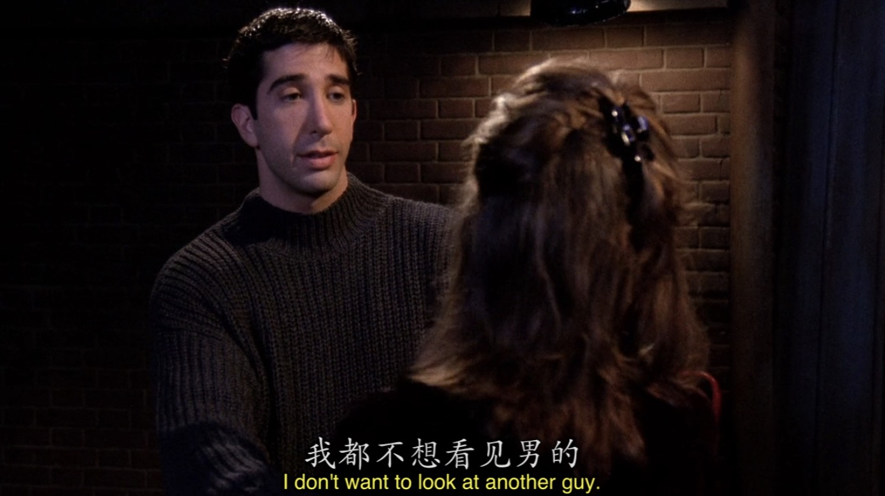


Ross不甘心，还再游说Rachel，但Rachel在交谈之中无意间说漏了嘴，告诉了Ross他将有个儿子。


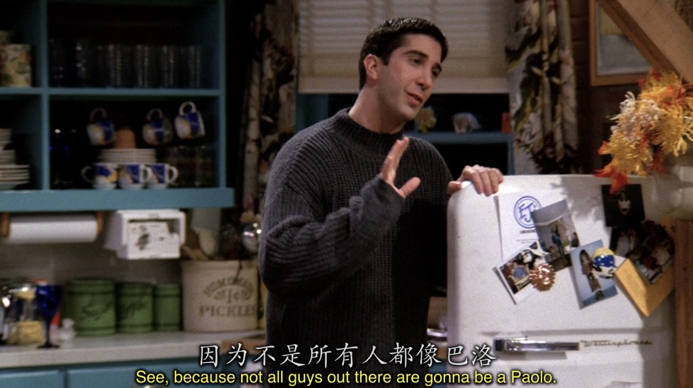


## Vocabulary

- scrape ***v.*** 刮去，刮掉，擦干净, 勉强通过， 节衣缩食 |  ***n.*** 嘎吱声， 擦痕， 窘境
- uterus ***n.*** 子宫
- compass ***n.*** 指南针
- unleash ***v.*** 解除...的束缚， 宣泄， 发动
- distraught ***adj.*** 心烦意乱的
- usher ***n.*** 传达员， 迎宾员 | ***v.*** 迎接
- balcony ***n.*** 阳台
- gesture ***v.*** 示意， 用手势动作示意 | ***n.*** 示意
- enormous ***adj.*** 巨大的
- sophisticate ***adj.*** 精于世故的， 精确的