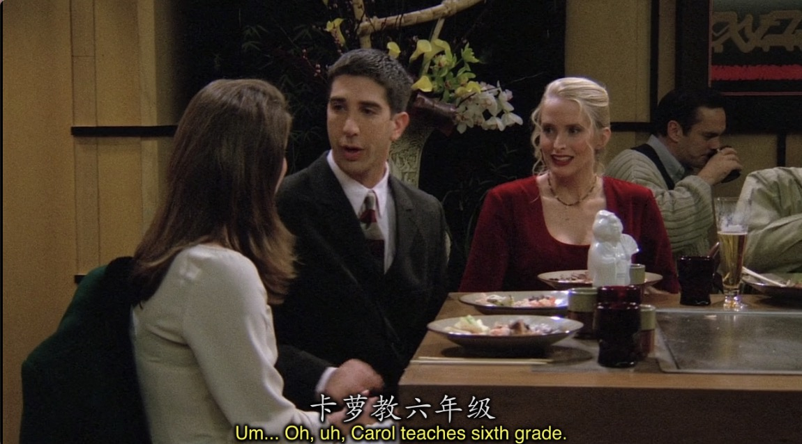
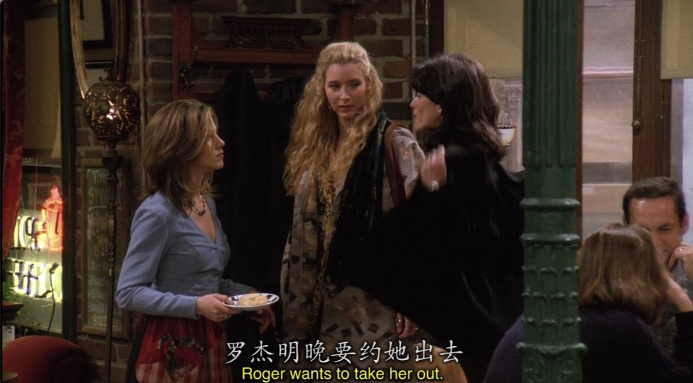
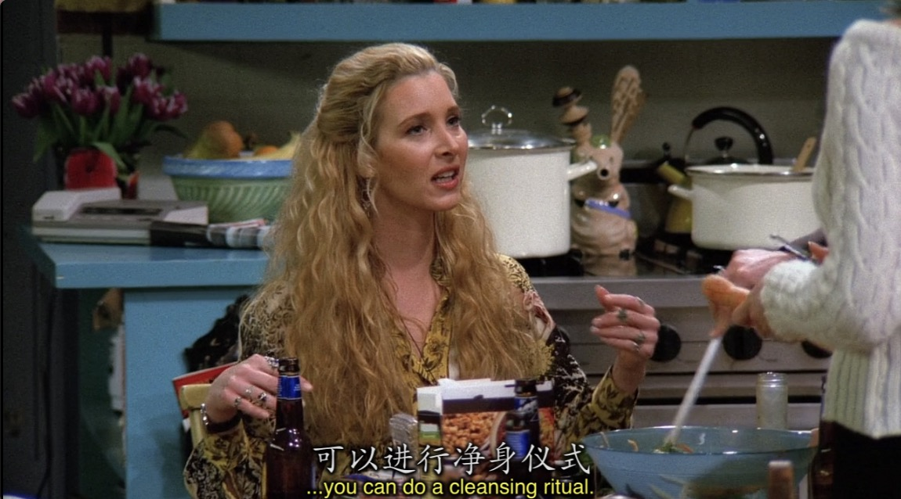
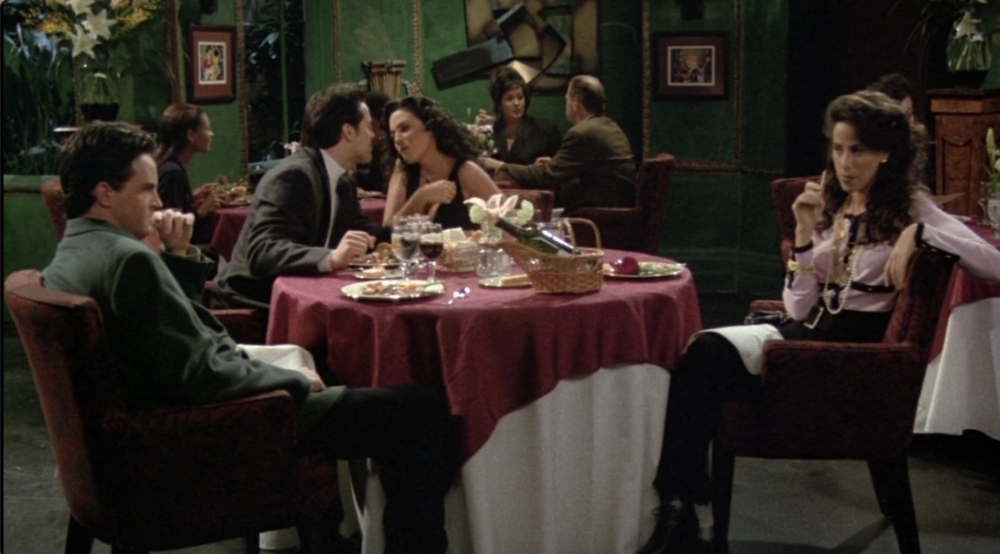

# Season1 Episode 14 - The One with the Candy Hearts

> 声明：
>       
>      所有内容只用于学习，如有侵权请告知。
>
>      如想转载请标明出处(github.com/hanqizheng)
>      
>      先看一遍原剧集再来阅读效果更佳
> 
>      希望可以Star支持一下😄
>
> 

## Key word:  *Valentine’s Day*

## 概要

又是一个重要的节日, 情人节。

我们不能忘记整个第一季是以Rachel和Ross的感情为主线的(其实是贯穿整部的/对，情景喜剧也有主线)。而在情人节Ross以及众人的情人节是怎么过的呢？～又

请继续看～

## 正文

```en
Joey: I'm telling you Ross. She wants you!

Ross: She barely knows me. We just live in the same building.
```

- `bare`这个词是一个常常被我们忽略但是却在口语中及其好用的一个词。它意为`裸露的， 空的， 仅仅的`。`barely`作为一个副词它经常用来表示*程度*，就像这里，表示`基本不知道`。

---


```en
Ross: Come on, I think it's insane!
```

- `insane`这个词，是我在美剧见过使用太多太多次的词了。表示`疯了， 精神失常`。一般我们说`你疯了吗？`可能会说`Are you crazy?`这时候当然就可以换成`Are you insane??`

Chandler和Joey在兄弟的立场上觉得Ross应该不要再等待Rachel了（因为上集Rachel和Paulo分手后说她暂时不想再有relashionship了）。

正好在咖啡店遇到的美女是和Ross住同一栋楼的，两兄弟就鼓励Ross迈出这一步！



---




```en
Monica: Roger wants to take her out tomorrow night.

Rachel: No! Don't you remember why you dumped the guy?

Phoebe: Because he's creepy, and mean, and a little frightening.
        Still, it's nice to have a date on Valentine's Day.
```

- 复习一下我们上一篇提到的`creepy`，`creep`有动词`慢慢发展， 悄悄进行`的意思，也有`讨厌鬼，马屁精`的名词含义。




---

```en
Monica: Hi~

Rachel: What you guys doing tomorrow night?

Joey: Actually, tomorrow night depends on how tonight goes.

Chandler: Oh, tonight, listen...

Joey: No no no! Don't you dare bail on me.
```

- `don't you dare do sth.` 带有一点威胁的感觉，表示`你敢！！`的意思。还有一句关于dare的用法是，`How dare you!`意为`你怎么能？！`有点不可思议且很生气的感觉在里面。
- `dare`意为`敢，竟敢`。

---



```en
Chandler: What a crapy night!
```

- 这里有个词`crapy`, 长得很像`creepy`，都是贬义词，但不要混淆了。crapy源自`crap`。crap意为`胡扯，胡说，废物`，也算是脏话了，但是没有fu*k那么脏，类似于靠。
- 口语里经常说`What a crap!`。是一个感叹句，用于表示对某一段话的极度不认同，可以理解成`真他妈能扯`类似的意思。
- `crappy`则表示`烂， 很烂， 非常烂`的意思。


---

```en
Chandler: How can I dump this woman on Valentine's Day!

Joey: I don't konw, You dumped her on New Year's.

Chandler: Oh man, In my next life I'm coming back as a toilet brush.
```

- 这里我好像分享一下特别有美式特点的发音连读和省略，但是。。。没法发语音啊
- 这里的 In 发音成 类似 ni my
- next 的 t基本没有发音了，连清辅音的t发音都没有，直接读成nex
- back as 连读， back基本可以只发 ba 的音， k和as连读成 ks，类似与 可泽(但不是发ze 是日的ze) you know what I mean right?

---

```en
Chandler: I just don't think that things gonna work out.
```

- 记住这句话，如果你需要分手，你会用到的。

---

```en
Ross: Let's say you and I give it another shot.
```

- `再来一次机会`可以不要再用`another opportunity`了。`give another shot`

---

## Vocabulary

- pathetic ***adj.*** 可怜的， 严重不足的， 无用的
- needy ***adj.*** 粘人的， 穷的(主要是粘人的)
- vulnerable ***adj.*** 脆弱的， 地位不稳的， 易受伤的
- megnet ***n.*** 磁铁
- chant **vt.&vi.** 吟唱， 念诵， 反复唱
