# Season1 Episode 16 - The One with Two Parts: Part 1

> 声明：
>       
>      所有内容只用于学习，如有侵权请告知。
>
>      如想转载请标明出处(github.com/hanqizheng)
>      
>      先看一遍原剧集再来阅读效果更佳
> 
>      希望可以Star支持一下😄
>
>      本集所有的补充内容均来自B站up主Friends101

## Key word:  *Ursula*

## 补充

Episode 16 & Episode 17的名字是`The One with Two Parts`

所以这两集的人物都是俩俩成对出现的

**会有很多和其他经典美剧的梦幻联动**

Phoebe & Ursula 这对双胞胎姐妹

Monica & Rachel 互换身份

Ross & Susan 一同去参加生育课

Jamie & Fran 是错认Phoebe为Ursula的两个顾客，其实有联动。[点这里](#Fran)


## 概要

- Chandler和Joey在一家餐馆遇到了Phoebe的孪生姐姐Ursula，Joey想和Ursula交往，但这让Phoebe很伤心。
- Ross陪着Carol去上孕产课，和老冤家Susan各种尴尬
- Chandler的Boss让Chandler开出自己的员工Nina，但是Chandler不好意思开口，就说Nina有精神病。

## 正文

---

```
Chandler: This is unbelievable. It's been like half an hour.
          If this was a cartoon, you'd be looking like a ham right now.
```

- 这里首先是一个现在完成时`It has been like half an hour.`
- 然后来分析一下这句话`If this was a cartoon, you'd be looking like a ham right now.`
  - 猛的一看像是if引了一个主将从现，但是仔细看动词却分别是`was和would`。显然**不是主将从现**
  - 再来看看这句话的意思`如果这要是在卡通里，你早就变成一根火腿了！`，这里显然是假设的不可能发生的事情，所以我们当然一下子就能想到`虚拟语气`。对，这句话就是一个if引导的虚拟语气，
  - > IF的虚拟语气有三种：
    >
    > 内容 从句 主句
    >
    > 与现在事实相反 动词过去式（be用were） would/could/should/might+动原
    >
    > 与过去事实相反 had+动词过去分词 would/could/should/might+have+动分
    >
    > 与将来事实相反 should/were to+动原 would/could/should/might+动原
    >
    > 下面三句依次是上面三种情况的例句：
    >
    > - If i were you ,I would/could/should/might do that.
    >
    > - If i had know that yesterday,I would/could/should/might have told you .
    >
    > - If it should rain ,the crops would/could/might be saved.
  - 再来理解一下Chandler这个梗，为什么说Joey变成一根火腿了。美国动画片中经常出现这种画面：某人饥肠辘辘，看啥都像吃的，例如汤姆猫看见小鸟，下一个镜头就是小鸟（在他眼中）变成了一只烤鸡。
  - `be looking like`是一个固定用法：`看起来像...`
  - 而这里的火腿，并不是我们通常意义上理解的王中王，因该是下图这种
  

---

等了好久的Chandle和Joey不耐烦起来开始叫服务员，这时候服务员一回头他们俩惊呆了，这不是Phoebe吗？

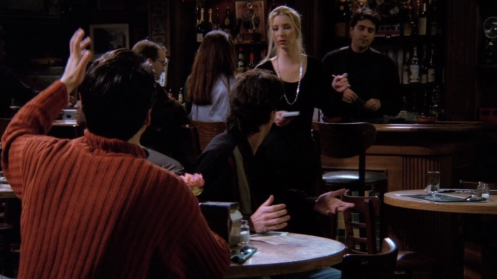


---

```
Chandler: Wait, wait! What are you doing here?

Ursula: Yeah, umm, I was over there and then you said, "Excuse me hello miss." So now  I'm here.

Joey: No no. How come you're working here?

Ursula: Because it's close to where I live, and the aprons are really cute.

Chandelr: Can we start over?

Ursula: OK.

Chandler & Joey: No no no no no!!
```

Chandler 和 Joey以为是Phoebe所以就很疑惑为什么Phoebe在这里当服务员。

- `How come...`是一个很典型的问`为什么`的句式，和`Why`一样都是问`为什么`,**但`How come`还表示`怎么会`的意思**，后面跟的句子要是`陈述句语序`.
- `How come you're working here?`这里的疑问句应该是`Are you working here?`但是因为是在`How come`后面要跟陈述句语序所以变成`you're working here.`
- 要是换成`Why`引导则这句话变成`Why are you working here?`
- `start over`表示`从头来过`。比如很多情侣闹分手然后和好的时候男生就可以问`Can we start over?`

### 这里补充一点

Ursula Buffay 是90年代经典的美剧之一《Made about you》中在Riff餐厅一个经常忘记顾客要点什么的服务员。

这里看老友记中的细节，Chandler和Joey正是在Riff餐厅用餐。所以这也算是老友记和《Made about you》一个联动。

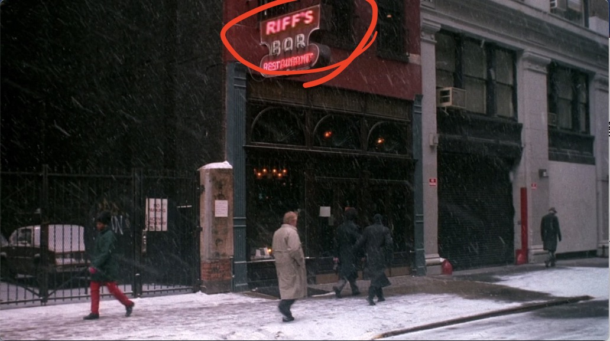


<span id="fran"></span>

同时这个和《Made about you》的联动也带来了这部剧的女主角Jamie和她的好朋友Fran。

 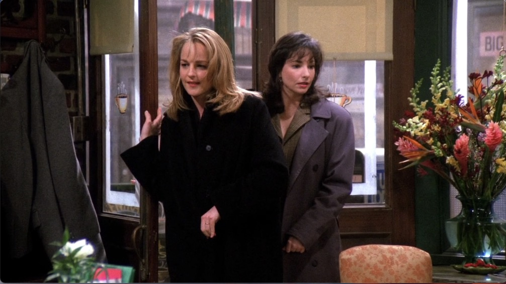

 当时她们出场的欢呼声我以为是某个有名的女演员客串，原来还有这么大的一个联动在里面。


---

```
Ross: I don't know whether he is tesing me or just acting out, but my monkey is out of control!

Ross: And like three days in a row, he got to the newspaper before I did and peed all over the crossword。 
```
Marcel依旧根本不鸟Ross，各种捣蛋。

- `whether...or...`意为`不管...还是...`这里要注意是有就近原则的，也就是句子中的动词形式必须和`or`后面的主语保持一致。
- `in a row`表示`连续`
- 除了上面提到的`in a row`，还有比较地道的表达`连续`的意思的有`one after another`.或者`3 days in a row === 3 days running === 3 days consecutively === 3 consecutive days`

---
Pheobe和Ursula关系不好也是老友记中很多梗的一个前提，为什么会关系不好呢？因为她俩是姐妹，而Phoebe有一种一直活在姐姐阴影下的感觉。后来Ursula还抢Phoebe的男朋友，然后和那个男的分手，然后导致青梅竹马的男朋友再也不理Phoebe因为只要他看到Phoebe就想到了伤他的Ursula。

就是这样Ursula让很多对于Phoebe来说很重要的人都离开了Phoebe，所以Phoebe才对Joey和Ursula的交往耿耿于怀。


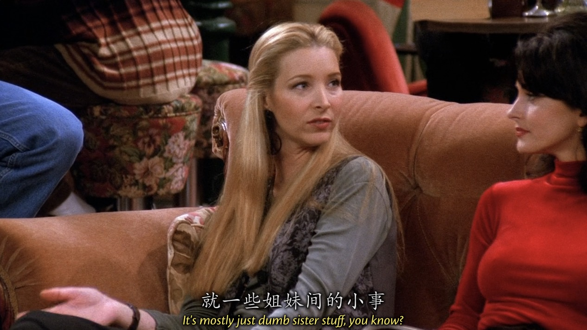


---

转到助产课这边，气氛逐渐尴尬。
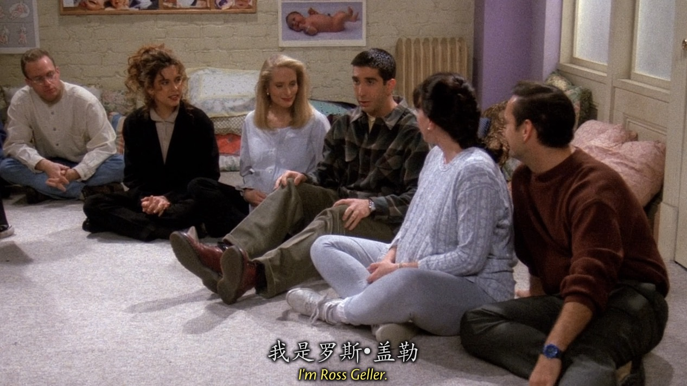

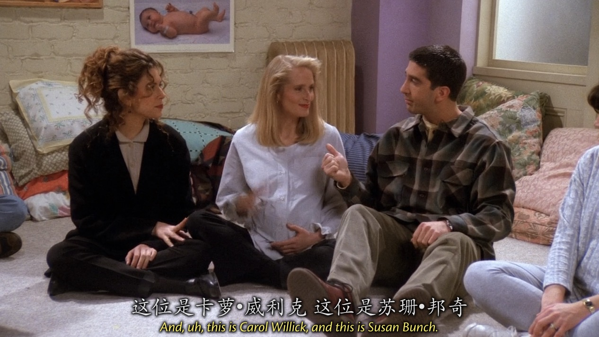


---

转到Chandler的公司，Nina已经俩礼拜拖延工作了，但是Chandler因为Nina长得好看实在不好意思批评她。

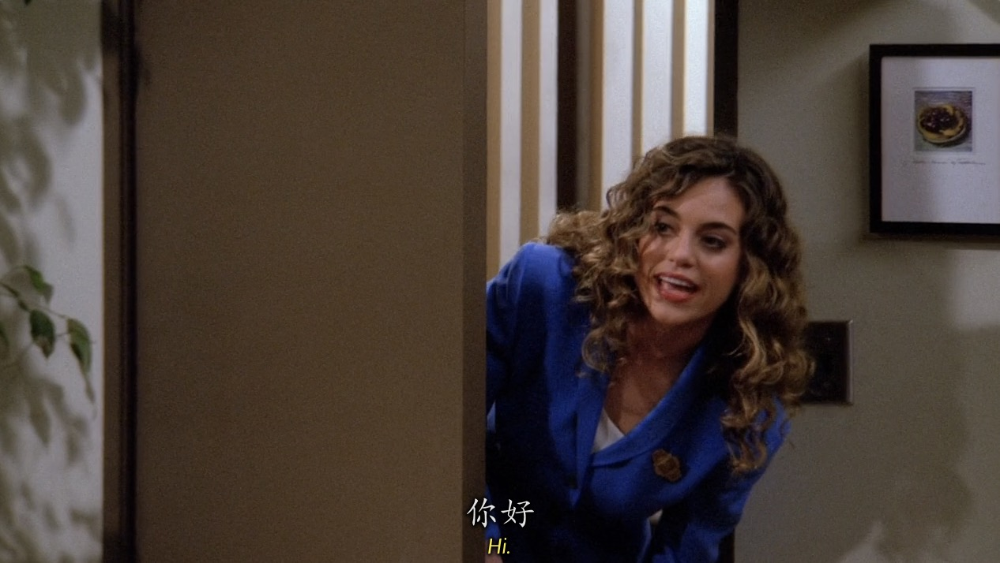

---

```
Ross: It dosen't matter! You don't dig your pen in the company ink.
```
- 这句话其实对应着一句中国的俗语`兔子不吃窝边草。`


---

### 补充

```
Chandler's Boss: The Annual Net Usage Statistics are in.

                 It's pretty ugly.

                 We haven't see an ANUS this bad since the 70's.
```
- 这里Chandler的Boss说到公司的`Annual Net Usage Statistics`，应该就是某种年度数据统计，但是这里给出了这个统计的缩写`ANUS`
- `ANUS`在`美语`里是`肛门`的意思。


---

### 补充

这里Marcel把Monica的电视调到了西语频道

电视里正在演出的是ABC在1989 - 1998年播出的以非洲裔美国人为主演的喜剧《Family Matters》

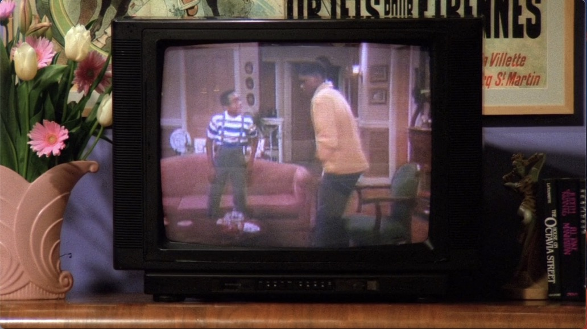

图中左边这个黑人小男孩就是该电视剧中一个小角色Urkel，后来成为了主角中的主角。剧中的Urkel是一个典型的书呆子

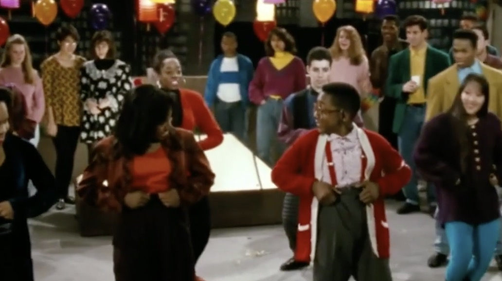

顺便说一句老友记楼顶的布景和这部剧用的是一个吗？😂也太像了。

而Urkel在后续的剧集通过能够自由操控改变自己的基因，拥有了双重人格，一个很酷，追到了喜欢的女生，一个就是原来的自己，一个书呆子。**而这种双重人格也符合这集的标题：Two parts**。

可以看出来老友记的细节真的是太好。

---

Joey过来请求Phoebe允许自己和Ursula约会，作为好朋友的Phoebe同意也不是不同意也不行，最后只能忍着自己的感受同意了，因为她觉得不能因为自己讨厌Ursula就连带Joey一起讨厌。

Joey走后Ross询问Phoebe Are you okay？

### 补充

然后就又回到电视上，这时候出现的是《Laverne & Shirley》 

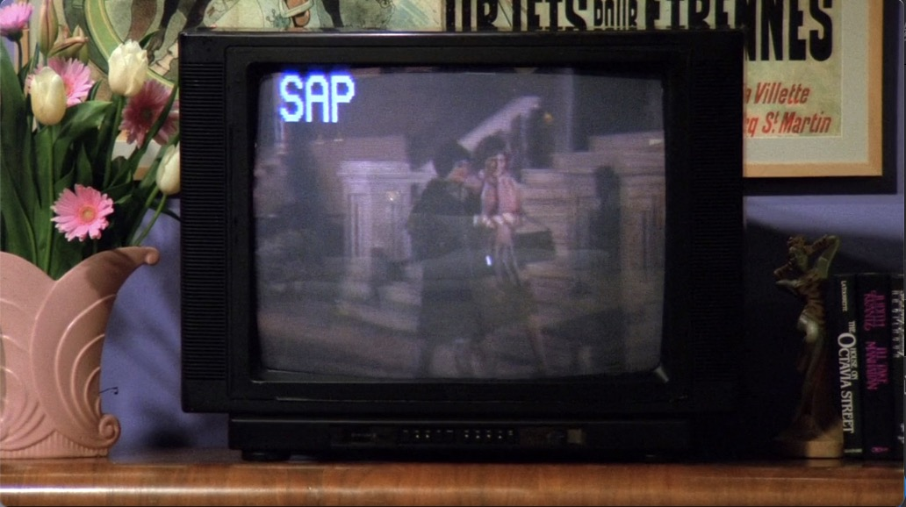

《Laverne & Shirley》是ABC 70年代末的一部喜剧，衍生自70年代的神剧《Happy Days》

主角就是两位好友兼舍友Laverne和Shirley

也和本集的主题Two parts呼应

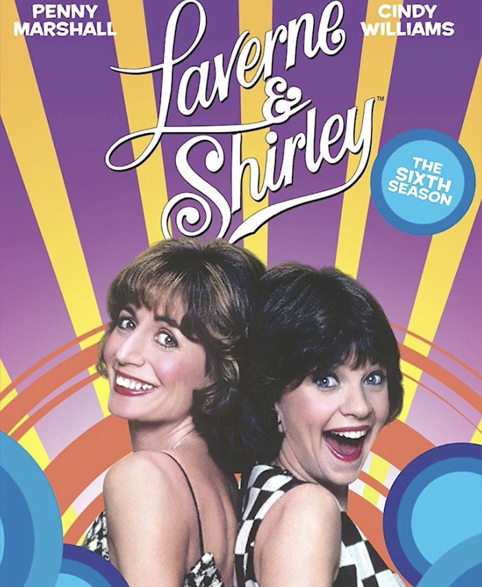


---

Ross跟Susan这对欢喜冤家怎么能少了梗呢，真是笑死我了。


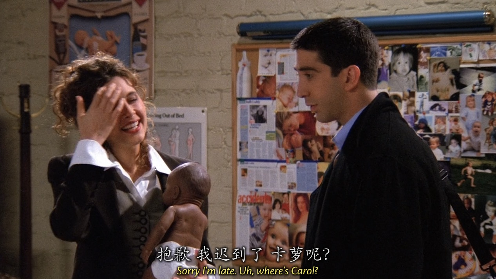


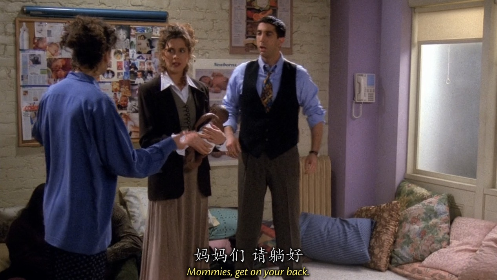


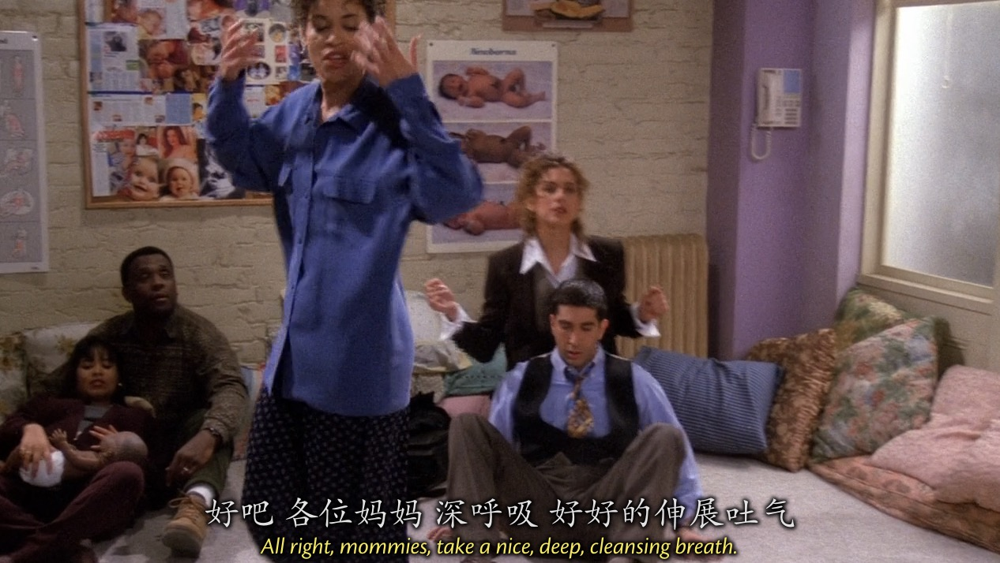
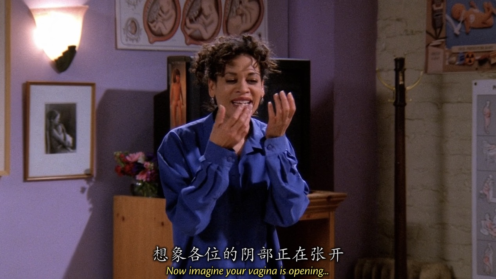
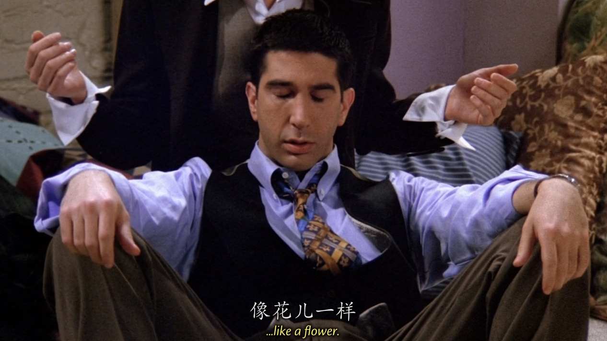


---

回到Phoebe这边，众人听了Phoebe的陈述后觉得她应该和Joey谈一谈，让Joey明白自己的想法。但是当Phoebe走到Joey房间的门口，开门的确是...

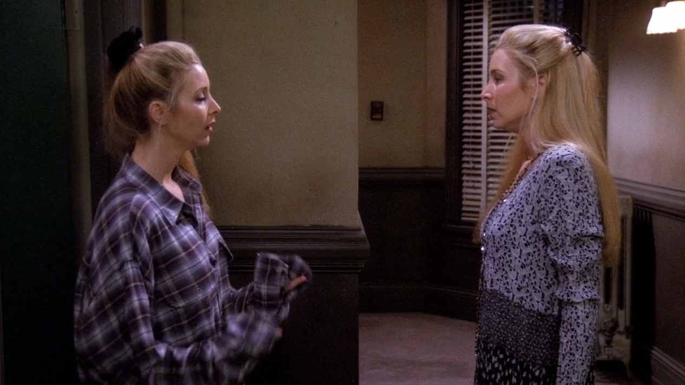

而且Ursula还很挑衅的说了一句`May we help you？`直接用的是`we而不是I`


# Vocabulary

- apron ***n.*** 围裙
- crossword ***n.*** 拼字游戏
- remote ***adj.*** 遥远的，远程的 ｜ ***n.*** 遥控器