# Season1 Episode 17 - The One with Two Parts: Part 2

> 由于视频文件过于庞大，不方便上传，希望在阅读笔记之前，自己要有《老友记》的资源
>
> **先将这一集看一遍**，然后再开始根据个人的学习习惯阅读~~

## Key word: Friendship


## 前情提要

Joey 喜欢上了Phoebe的孪生姐姐Ursula，为此Phoebe很困扰，因为Ursula总是会做出一些过分的事然后转身离去。

Phoebe很害怕Ursula伤害Joey从而让她失去Joey。

Rachel在拖了好久之后去阳台拆圣诞节装饰用的彩灯，结果不慎掉下阳台崴到了脚，于是Monica带着Rachel去医院


## 正文

Monica带着崴到脚的Rachel来到医院，在填表的时候才得知Rachel没有`医疗保险`。

要知道在美帝如果没有医疗保险看病简直像被洗劫，是非常非常贵的。

据我的留学朋友透露，他在美帝突发心脏病（当然是那种先天性的，可能多半是胸口疼之类的症状，和咱们下意识那种一发病就捂着胸口倒地不起那种还是有很大区别的。）

就里里外外输了三天液开了些药，花了2000多刀（折合人命币1w4左右）

所以还会看到很多留学生调侃自己遇到什么紧急情况最先说的不是救命，而是别叫救护车，我自己能挺到医院。

```
Monica: Okay, insurance?

Rachel: Oh yeah, check it.
        Definitely gonna want some of that.

Monica: You don't have insurance?

Rachel: Why? How much is this gonna cost?

Monica: I have no idea, but  X-ray alone could be a couple hundred dollars.

Rachel: W..What we gonna do?

Monica: There's not much we can do!
```

- 询问价格用到了`how much + 一般疑问句`。`Is this gonna cost`变成陈述句就是`this is gonna cost...`
- 说我不知道可以不要再说`I don't know.`了，可以说`I have no idea.`或者是`You got me.`第三种一般是带着半开玩笑的语气说的所以要注意语境。
- `单单一个...`这里用了`alone`作为形容词修饰前面的`X-Ray`。
- `什么都做不了`这里是用了一个`There be句型`，直译过来`我们能做的并不多`。

---

```
Monica: Hi, I'm gonna need a new set of these forms.

Nurse: Why?

Monica: I'm really an idiot.
        You see, I was filling out my friends form and instead of putting her information
        I put mine.

Nurse: You are an idiot.
```

- 注意这里的量词，`一份，一叠，一塌`用`a set of...`，自然这个量词表示的是一个复数形式，所以后面要跟名次的复数。
- `idiot`是我们在前面学到的一个表示`傻瓜`的词，我再给出几个`傻瓜`。
  - `dumb`  **adj.**  傻的，呆的
  - `thick`  **adj.**  这个词本意是`厚的、 浓密的`。但是在`英式英语`里是一个相对常用的表示`脑袋不够灵光的`.
  - `moron`  **n.**  傻瓜
- 这里Monica表示`我填表的时候把本应该填她的信息却填成我自己的了。`要注意她用的时态是过去进行时，表示过去正在进行的一件事。
  - 比如朋友聚会你在给他们讲述一件过去的事情，`我正看电视呢结果电视给炸了！`就可以用到过去进行时。
  - The television exploded when I was watching it.
- 注意这里填写表格**不要再用**`write`了，是`fill`

---

转会Central Perk，Ross正在讲述他梦到把自己孩子当球踢...可以看到Ross对于当爸这件事挺恐慌的。

```
Chandler: You're gonna make a great dad!
```

- 这里表达`成为一名...`的时候最常用的就是`be`。但这里用了一个`make`值得我们学一下。

--- 

```
Chandler: So what are you gonna do?

Joey: What can I do? I don't want to screw it up with Ursula.

Chandler: And your friend Pheobe?

Joey: Well if she's my friend, hopefully she'll understand. Wouldn't you guys?

Chandler: If you tried that on my birthday, you'd be staring at the business end of a hissy fit.
```

也许这就是Phoebe担心的事吧，Joey如果和Ursula有一段Relationship那么就会遇到这样的尴尬问题。

- 这里要注意Chandler说的这句`如果你敢这么对我，你就等着我发飙吧！`
  - `business end of sth.`表示某事会遇到麻烦，而这个sth.**就是具体描述的麻烦**。这里的sth.是`a hissy fit`。
  - `hissy fit`是一个用来表示`angry`的短语，但是不能随便用，**一般是女生用这种表达方式**。男生直接就是`get angry`就好了
  - 这个`hissy fit`从Chandler的嘴里说出来，**其实也进一步体现了前面大家都觉得Chandler有gay的quality**。我感觉这种quality换成咱们常用的表达形式就是`有的时候说的话或者做的事有点娘`。

---

大家如果看过`武林外传`的一定会注意到有的集会有演员`友情出演`。说白了就是客串。

这应该算是情景喜剧中一个比较有趣而且很吸睛的地方。

老友记里有太多太多超级明星的客串了，这一集就是`George Clooney 乔治·克鲁尼`客串了医院的cute doctor No.1


---

两位Cute doctor约了Rachel和Monica然后Rachel竟然答应了，要知道这时候Rachel以Monica的身份使用了医疗保险。

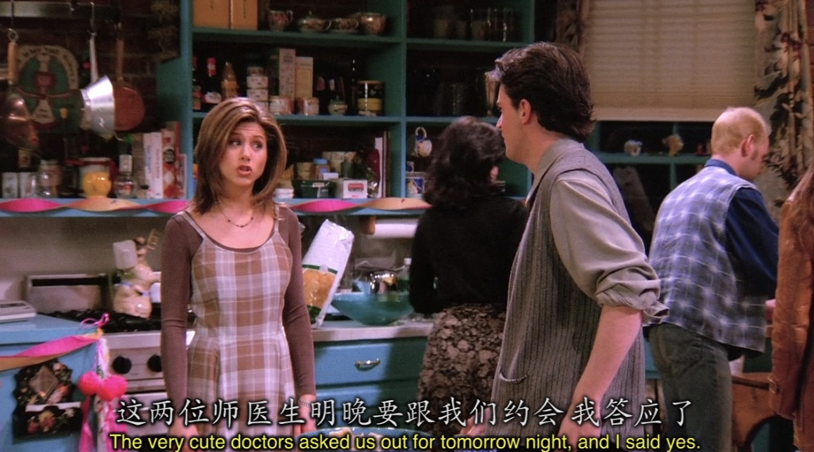

---

```
Monica: I say we blow off the dates.
```

- 这里的`blow off`表示`缺席`

---

```
Monica & Rachel: Surprise!!!!!

Ross: What the hell are you doing? You scared the crap out of me.
```

- Ross这里的`You scared the crap out of me.`表达`吓屎我了`。`crap`在口语中是一个非常非常常用的词！
- 有的时候我们可以直接来一句`crap!`表示`你他妈说的是个j8！`。也算脏话的一种。而单一的一个crap也可以表示`靠！`的意思。
- crap还有💩的意思。所以Ross这句话真的是`吓屎我了`。

---

Ross对自己要当爸还没有心理准备，于是找自己的老爸寻求一些提示。

```
Ross: Dad, before I was born, did you freak out at all?
```

- 对比上面的吓屎我了，这里的`freak out`用起来更频繁，也表示`吓到`，但还有一层意思是`抓狂`.

---

回到Monica这里交换身份还在继续。

> 其实当年Jennifer Aniston(Rachel的扮演者)当年就是试镜的Monica。

还有看到身份交换就想到武林外传里佟掌柜和郭芙蓉在面对钱夫人的时候也有交换身份的情节，只能感叹一句这才叫致敬，某些情景喜剧真的抄袭无下限。

两人开始了疯狂互黑


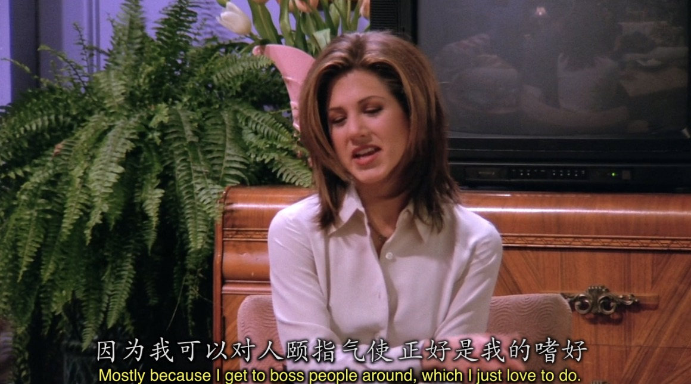
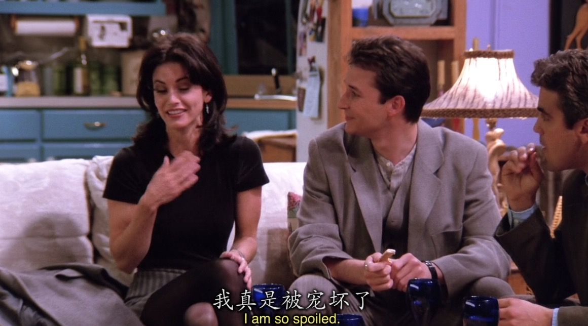

```
Rachel: Mostly I get to boss people around which I just love to do.
```

- 这里的`boss`是一个动词， `boss sb around`意为`指使某人`。

---

回到Ursula和Phoebe

Ursula的人设就是很差劲的人，Phoebe不止一次想和Ursula缓和关系，但是Ursula一直不领情。

Phoebe还给Ursula准备了生日礼物，当然Phoebe也可能只是觉得空手去找她谈Joey的事不太好。

这里Phoebe送Ursula的礼物也很值得注意一下，是她上一集里提过的小时候Ursula摔坏的她最心爱的玩具。

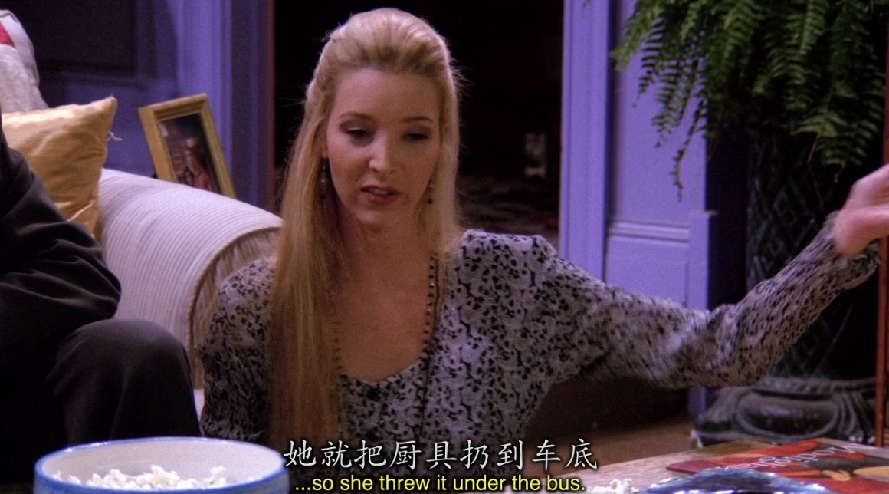

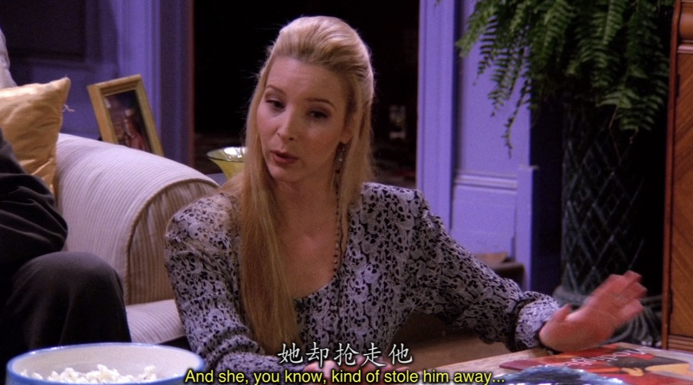
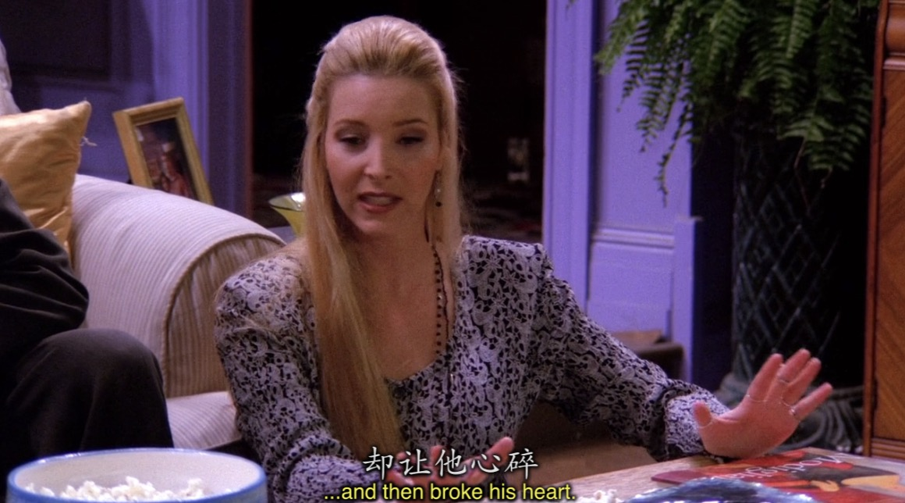


而Ursula却把Joey送她的毛衣借花献佛。

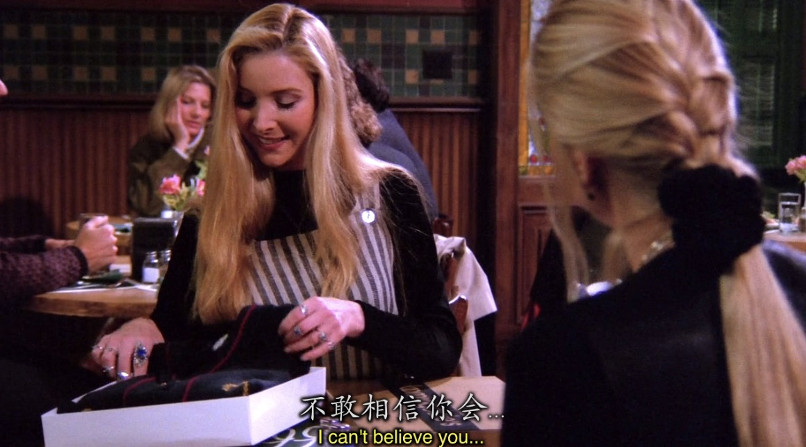
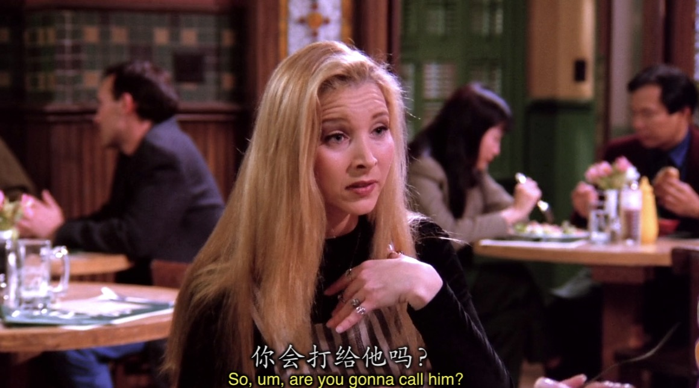
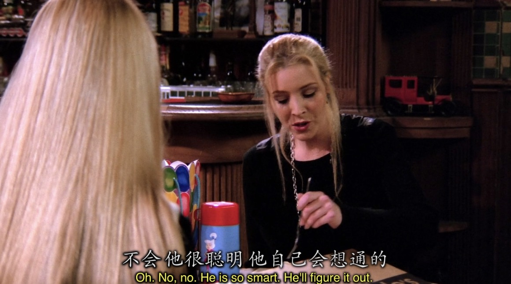


Usula就这么突然不再和Joey联系，也应证了之前Phoebe对她的形容


---

Marcel在医院醒来的那一刻抓住了Ross的手，那一刻Ross对即将成为父亲的恐慌都释然了，因为他对Marcel做到了一个父亲应该做的。He's gonna be fine.

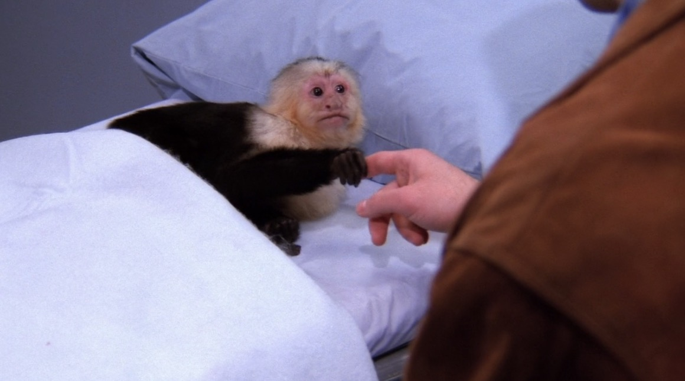

---

在最后的短剧中全是西班牙语，我当时以为是自己资源的问题，可能有一段的配音和字幕都混了。看了4遍我才我先原来这是在呼应Marcel之前把Monica家电视调成了西班牙语的情节。

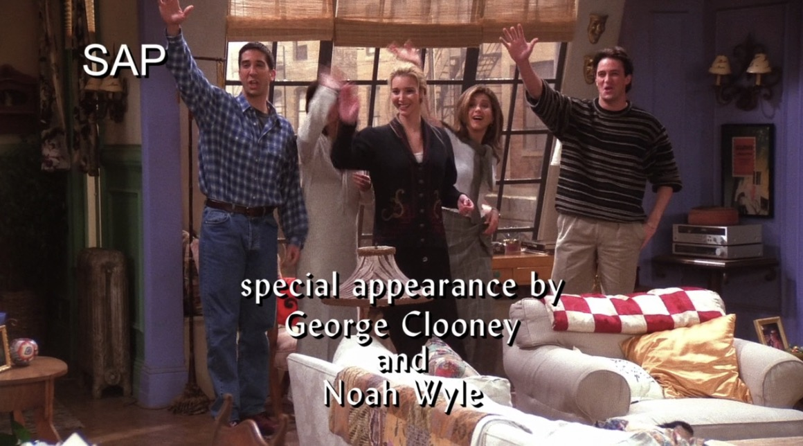


## Vocabulary

- insurance **n.** 保险
- fraud **n.** 诈骗，欺骗，骗子
- panic **n.** 恐慌 **vi & vt.** 感到恐慌，使恐慌
