# Season1 Episode 18 - The One with All the Poker

> 声明：
>       
>      所有内容只用于学习，如有侵权请告知。
>
>      如想转载请标明出处(github.com/hanqizheng)
>      
>      先看一遍原剧集再来阅读效果更佳
> 
>      希望可以Star支持一下😄
>
> 

## Key word: poker

这一季应该是老友记全集里我看的次数最多的一集了。甚至能背下来台词。

这一集也是非常经典的一集，是六人玩扑克的一集，而且从这一集开始，第一季的主线Rachel和Ross之间的关系也开始发生了微妙的变化。

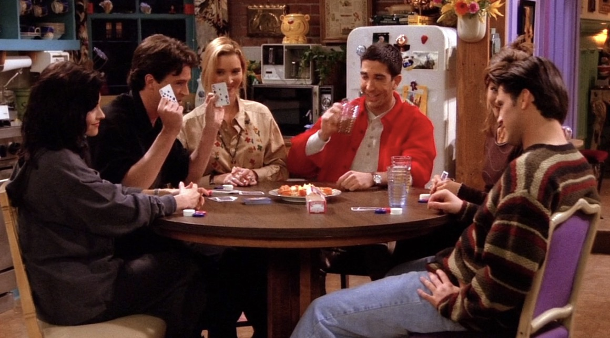

## 正文

开场是以一段whistle开场，六个人正在以流水线的形式为Rachel准备简历。

我有查一下他们吹的是哪首歌，答案就是`Colonel Bogey`。

```
Ross: Rach, we're runnig low on résumé over here.

Monica: Do you really want a job with Popular Mechanics?

Chandler: Well if you're gonna work for mechanics, those are the one to work for.
```
- `run low`表示`快要用没有了，快要用光了`。我们可以表示手机快没电了，也可以表示厕所快没纸了。
- `resume`这个词应该不陌生，它有两个意思,`继续  v.  | rəˈzum |` & `简历 n.  | ˈrɛzəˌmeɪ |`两种含义的读音是不一样的。
- `those are the one to + v. + for`表示`那些事是值得...的`

可以看出Rachel是海投啊，根本没有挑公司，普遍撒网重点捞鱼。

---

```
Rachel: I can't be a waitress anymore okay? I mean it.

        I'm sick of the lousy tips. I'm sick of being called 'Excuse me?'.
```

- `I mean it.`这句话在口语中非常常见，给我的感觉是他给人传达的语气是非常认真严肃的。意为`我是认真的，我真是这么想的。`
- `be sick of doing sth.` 表示`厌倦做某事`。还有一个很常用的厌烦`be tired of doing sth.`

---

```
Chandler: Could you want her more?

Ross: Who?

Chandler: Dee, the sarcastic sister from What's happening!
```

这一集我们能看到好几处Chandler经典的`Could sb. do sth. more`句式。这应该是Chanlder的口头禅了。

这里Chandler说了一个梗如果没有看过What's happening应该不会明白观众为什么笑这么大声。

下面我给大家放一下Dee的图


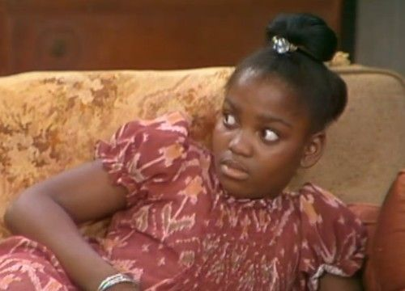

---

```
Ross: Oh God! You shuold've seen him. "read 'em and weep"

Ross: 你们真应该看到他当时的样子， 他(Joey)说：”看到绝对哭！“

Chandler: And then he did.

Chandler: 然后他(Joey)确实哭了。
```

这里引出了本集的关键Poker，说到Joey昨晚打牌把3看成了8然后哭了。

要注意这里的read 'em and weep是一首歌，Joey当时就是想引用这首歌来嘲讽一下即将输牌的Ross和Chandler没想到自己却被反杀。

---

```
Rachel: How come you guys have never played poker with us?

Chandler: There just don't happen to be any women in our game.

Joey: Yeah, we just don't happen to know any women that know how to play poker.

Monica: Oh please, This is such a lame excuse.
```

这段对话我们注意两个比较有趣的句式

- `How come + 陈述句`是表达一种对陈述句所描述的这件事情的`怀疑，抱怨，不解，好奇`的情绪。这里就是Rachel很纳闷为啥没人叫她玩Poker。
- `There just don't happen to be...`分析一下这个句子
  - 其实主体框架是一个`There be 句型`然后搭配了`happen to do sth. / just happen to do sth.`
  - `happen to do sth. / just happen to do sth.`表示`碰巧做某事`
  - 那么There be表示`有`所以结合起来就是`碰巧有...`，在这里是一个否定形式`碰巧没有`
  - 可以看到Joey也用了`just happen to do sth.`句式结合`know`表示`碰巧不知道...`
- `lame` **adj.** 意为`缺乏说服力的，烂的，逊的`。一般还有个更常用的就是`suck`。

---

```
Chanlder: Okay now we draw cards.

Monica: So I wouldn't need it right? Because I have a straight.

Chandler: Okay Phebs how many do you want?

Phoebe: Okay I just need two. The 10 of spades and 6 of clubs.

Rachel: Oh I have 10 of spades. Here you want it?

Ross: You can't do that.

Rachel: Oh no no no no.. I don't need them, I'm going for fours.
```

可以看到这段对话出现了很多Poker的专用术语我们来一个一个说一下，具体的术语我都会总在[Poker tip summary](#id)里了。

- `draw cards`意为`起牌， 抽牌`
- `straight`在Poker里意为`顺子` emmmmm我也不太会玩扑克，顺子应该是几张连续的牌吧？
- `10 of spades and 6 of clubs`意为`♠️黑桃10和♣️梅花6`
- `fours`意为`4张4也可能是对4，我这个不太确定`我的方言称4张相同的为圆，三张相同的为炸。

---

```
Phoebe: I see. So emmmm, you were lying.

Joey: About what?

Phoebe: About how good your cards were.

Joey: Huh, I was bluffing.

Phoebe: Aha, and what is 'bluffing'? Is it not anther word for lying?

Chandler: Ohhh, Rach we've got to settle.
```

- `bluff`是Poker中常用的手段，也就是谎称自己的牌有多好或者多坏，该词意为`虚张声势`。
- `settle`在poker game中意为`定局，也就是最后输赢算总账`.

---

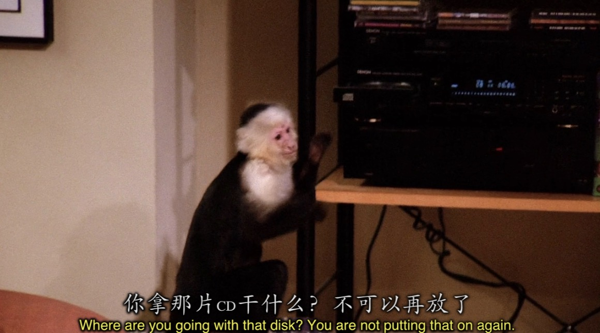

Marcel放的这首歌我查了一下叫做`The Lion Sleeps Tonight`这首歌可以说是听一遍就会的魔性歌曲了😂。

在未删减版的episode 18 中Ross，Joey， Chandler更是听到这首歌开始跳魔性的舞蹈。。。。。

在后面的某一集六人在片场遇到失散已久的Marcel还合唱这首歌唤醒Marcel的记忆。

---

```
Rachel: You believe what a jerk Ross was being?

Monica: Yeah I know. He can really get competitive.

Phoebe: Ha, haha.

Monica: What???

Phoebe: Oh, "Hello kettle, this is Monica, you're black!"

Monica: Please! I am not as bad as Ross.

Rachel: I beg to differ. The Pictionary incident?
```

第一场Poker以男生大获全胜告终

Ross还在最后对Rachel说了经典的"When I'm playing poker, I'm not a nice guy“语录

其实两人之间的某种化学反应早就已经在Poker game上有了微妙的体现

- `jerk`意为`混蛋`，骂人的话。还有`asshole | loser | piece of shit`等都是形容一个人很差劲的。
- `the kettle blcak`是一句谚语对应到咱们中文中的谚语就是`五十步笑百步`。
- `pictionary`意为`你画我猜`...

---

```
Rachel: Guess what guess what guess what!!

Chandler: Uh okay. The fifth dentist caved? And now they're all recommending Trident?
```

- 这里的梗是当时很火的一个电视广告，是口香糖公司Trident的，内容大概是五个牙医是否推荐自己的患者嚼Trident口香糖来保护牙齿，然后五个牙医依次回答Yes，但是一只松鼠🐿️从窗外进来钻到了第五个牙医的裤子里咬了他一口，第五个牙医大喊了一句NO!!!!!
- 感兴趣的话这里是[广告链接](https://www.youtube.com/watch?v=xAVALXH9nxU)可以看一下。

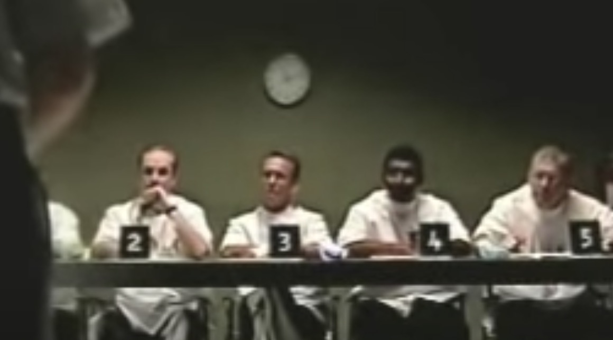

---

```
Monica: You know what?

        This is not over.

        We will play you again, we will win and you will lose, you will beg and we will laugh.

        And we will take every last dime you have.

        You will hate yourself forever!
```

这句话太带感以至于我当时把它背下来了。

---

转到本集最后一局Poker也是最精彩的一局。

Rachel和Ross在局上针锋相对，或者是有点儿俏皮的互相打闹。

其实Rachel下意识的已经对Ross有感觉了(个人观点)

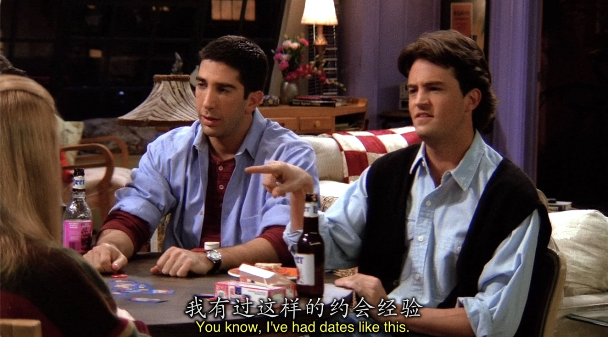

---

Chandler在这里又来了一句`Couldn't be more out.`

Rachel在局间得知自己的面试没有通过，然后回到Game中整个气氛都变了，Rachel和Ross的火药味弥漫在空气中

其他人见势不妙，全部搬凳子向后撤


两人疯狂加注看得旁人是热血沸腾又捏把冷汗

最后Ross输了，但感觉是他故意的，Rachel说完Full house后Ross沉默了几秒钟。最后他说了一句

```
Ross: BUT, look how happy she is.
```

---

最后又来了一次Pictionary

Monica生气感觉是有道理的，这么简单的大家就是死活猜不出

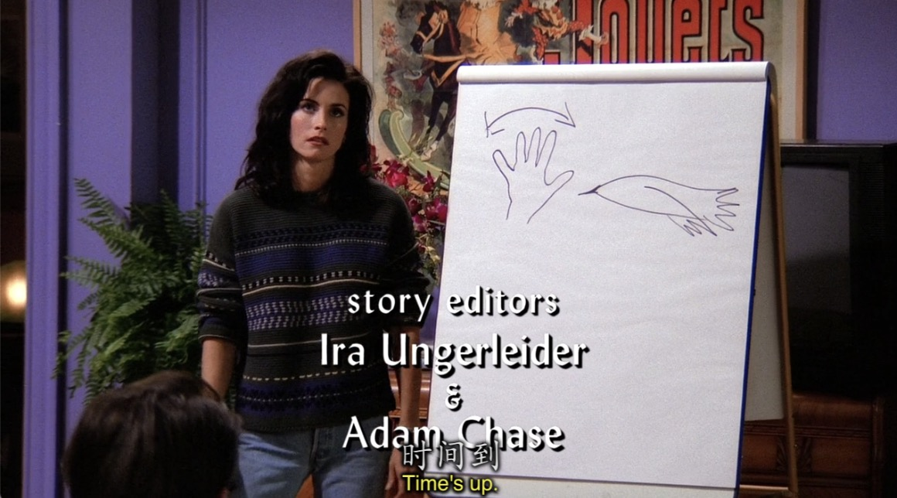
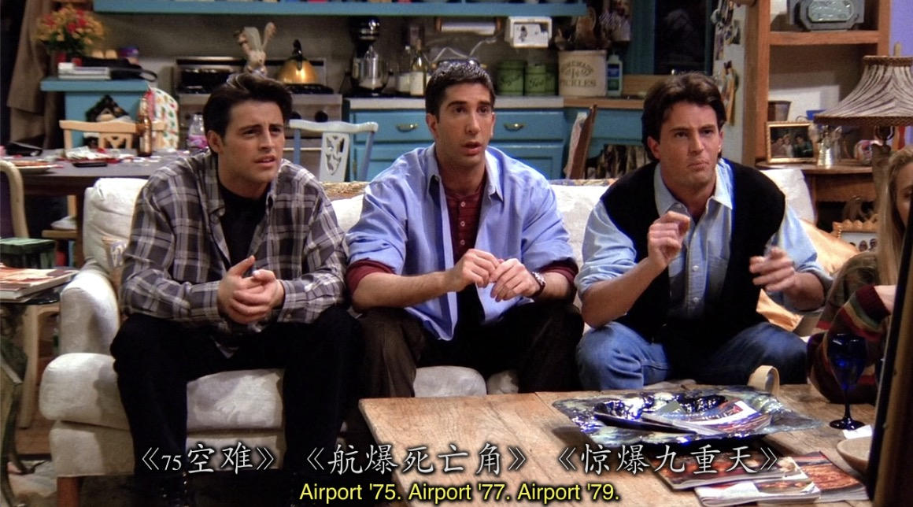
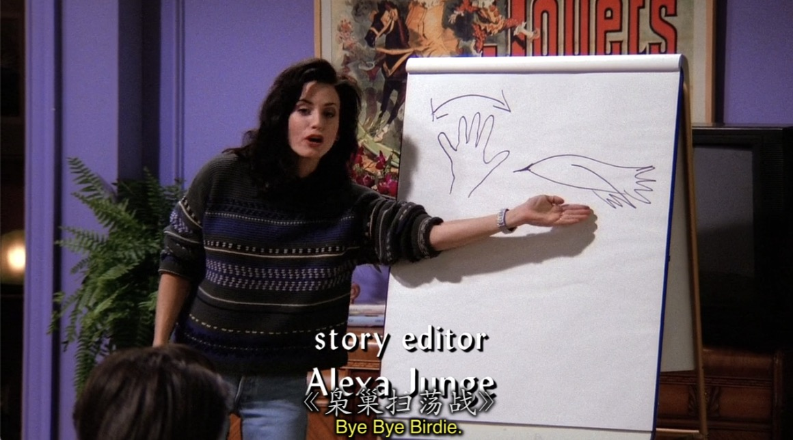


Rachel画的这个一眼难尽😂，而且答案还那么难众人直接抢答

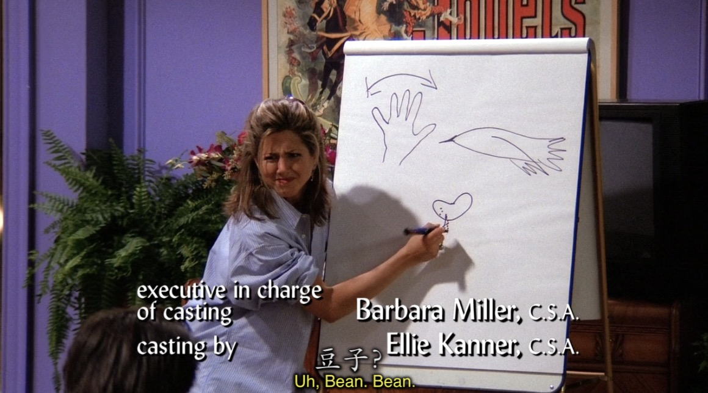

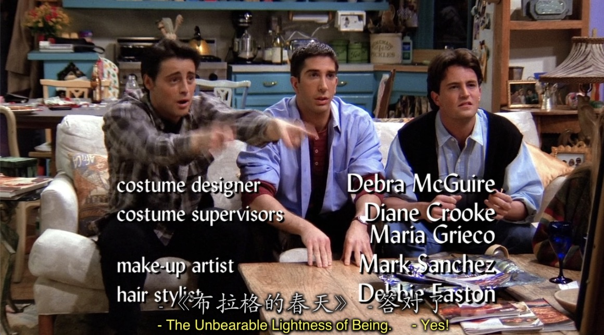

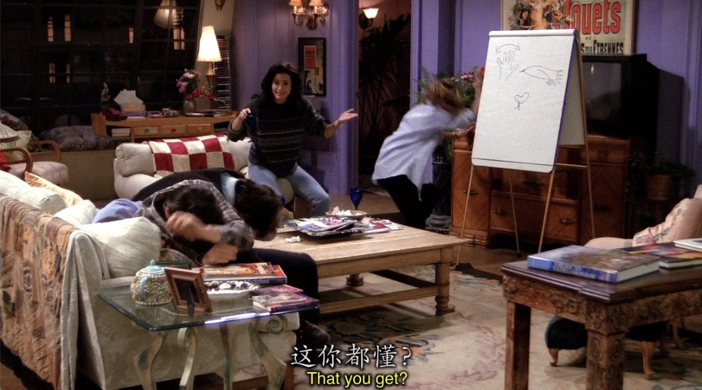


---

<span id="id"></span>
## Poker tip summary

- `draw cards`意为`起牌， 抽牌`
- `straight`在Poker里意为`顺子` emmmmm我也不太会玩扑克，顺子应该是几张连续的牌吧？
- 梅花♣️ - clubs ｜ 黑桃♠️ - spades ｜ 方片♦️ - diamond ｜ 红桃♥️ - heart
- `fours`意为`4张4也可能是对4，我这个不太确定`我的方言称4张相同的为圆，三张相同的为炸。
- 每张牌的读法1 - 10就是简单的 number of (culbs/spades/diamond/heart)
- 11(J) - Jack | 12(Q) - Queen | 13(K) - King
- `bluff`是Poker中常用的手段，也就是谎称自己的牌有多好或者多坏，该词意为`虚张声势`。
- `settle`在poker game中意为`定局，也就是最后输赢算总账`.
- `shuffle`意为`洗牌`
- `flush`意为`同花顺`，应该是同一个花色连续的几张牌
- `fold`在poker中意为`投降， 退出， 认输`。记得在游戏王中，盖牌也是认输的意思。
- `full house`意为`三张相同加二张相同的牌的5张牌组合`


---

## Vocabulary

- proofread **vt. & vi.** 校对
- lame **adj.** 缺乏说服力的,瘸腿的 **vt.** 使...瘸腿
- cave **n.** 洞穴 **v.** 投降
- dime **n.** 美国的10分硬币， 少量的钱
- fly **n.** 苍蝇， *裤子拉链*