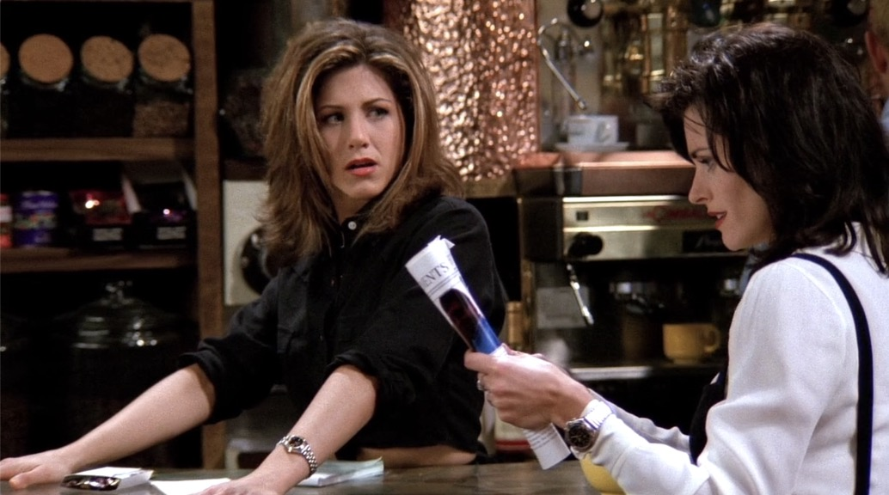
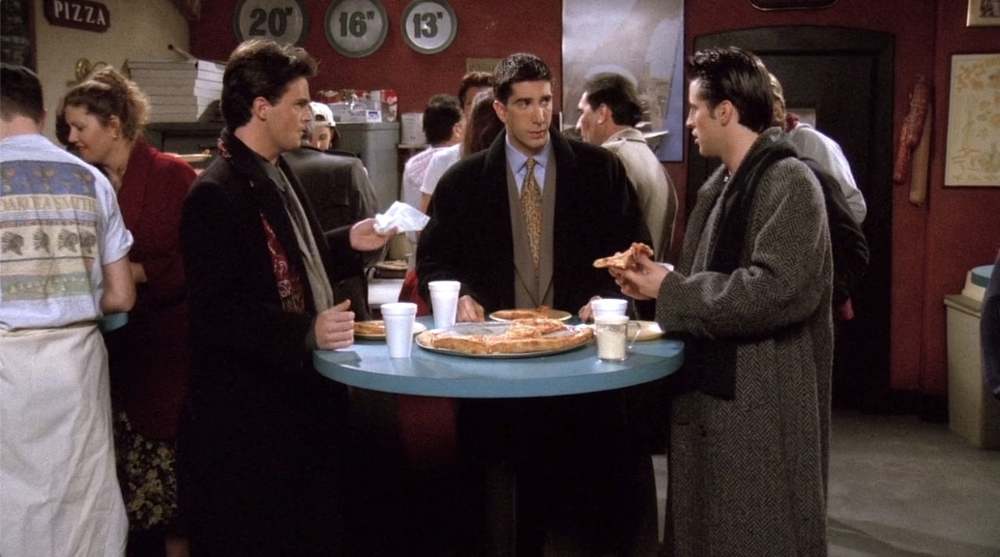
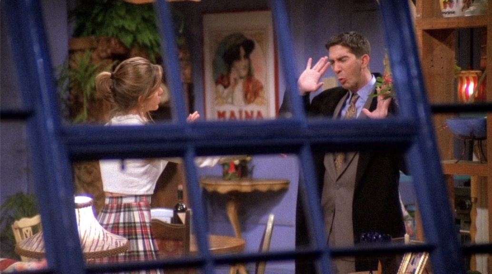
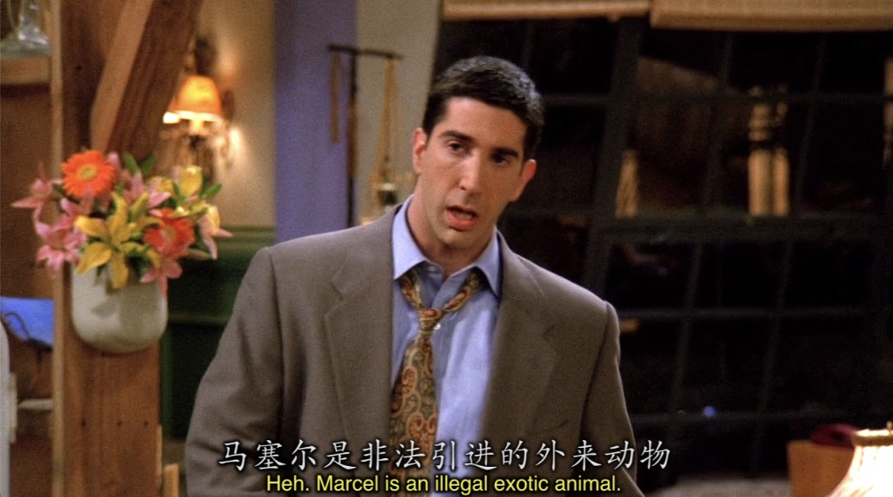
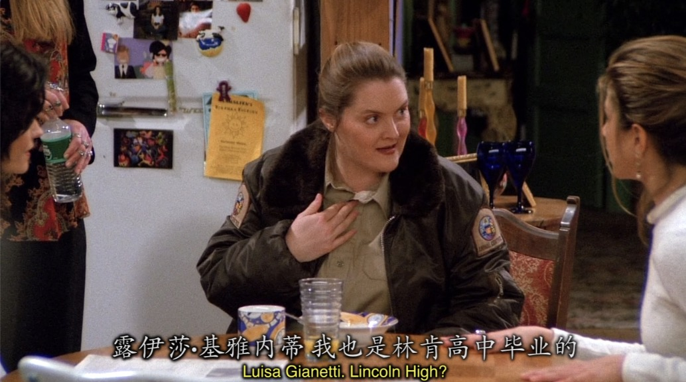

# Season1 Episode 19 - The One Where the Monkey Gets Away

> 声明：
>       
>      所有内容只用于学习，如有侵权请告知。
>
>      如想转载请标明出处(github.com/hanqizheng)
>      
>      先看一遍原剧集再来阅读效果更佳
> 
>      希望可以Star支持一下😄
>
> 

## Key word: monkey get away

## 概要

- Barry(Rachel逃婚的对象) & Mindy(Rachel的好朋友，也是自己婚礼的伴娘) 订婚了，Rachel又陷入了沉思
- Ross摆脱Rachel照看Marcel一天但是Marcel却跑丢了

## 正文

---



```
Monica: That's Mindy?

        Wow, she is pretty.....lucky.....to have had a friend like you.
```

- 这里Monica想说的是Mindy在杂志上看起来好漂亮，用了`pretty`这个词。在口语中如果我们用烦了`beautiful`,pretty是不错的选择。
- 但是Rachel的死亡凝视让Monica不得不两次改口
- `pretty`原本是`形容词`但是后面跟上`lucky`这个形容词的时候就变成一个`修饰形容词的副词`
- 显然Rachel对这个依旧是在夸赞Mindy的答案不满意
- 于是Monica继续加了一句`to have had ...`注意这里Monica用的是现在完成时表`已经拥有你这个朋友`。

---

```
Rachel: Hey guys, How was the movies?

Girls: Oh, so wonderful. It was so good!

Boys: Suck fest. Total chick flick.
```
- emmmm, 我把这段对话截出来就是为了给一个怎么形容某场电影，某个活动之类的回答句式。
- 这里的`fest`不要陌生，也不要看成`fast`，这个fest就是我们之前说的`festival`节日的意思
- `chick`本意是`chicken`，家禽鸡🐔的意思，但是还有另一层意思而且还非常常用，就是`女性`,但我不知道这个词会不会有些冒犯
- `filck`是`电影`的另一种说法


---

```
Joey: Hey, I don't need violence to enjoy a movie, just so long as there's a little nudity.

Monica: There was nudity.

Joey: I meant feamale nudity.

      Allright, I don't need to see Lou Grant frolicking.

Girls: Hugh! Hugh Grant!
```

这里我还专门去搜了一下他们看的是哪部电影。

因为老友记第一季播出的时间是1994.9 - 1995.5，现在又是第20集所以是后半段了，也就是1995年。

只是猜测，《四个婚礼和一个葬礼》

---

他们三人吃的这种Pizza店在当时来说是非常普遍的快餐店，可以看出是站着吃的。




---

```
Monica: Wait! He pooped in my shoe? Which one?

Rachel: I don't know, the left one.

Monica: Which ones!

Rachel: Oh! Those little clunky Armish thing you think go with everything.
```

- `go with everything`意为`百搭`

---

Ross把今晚当作自己翻身的一晚，但是没想到Rachel却把Marcel弄丢了。



而且Rachel还把Animal Control的人找来了。



没想到Animal Control的Luisa是他们之前的高中同学，但是在高中没有被善待就打算用这次抓走Marcel作为报复。



--- 

emmmmm 这一集真的没啥可写的


## Vocabulary

- embargo ***n.*** 贸易禁令，官方禁令 ***vt.*** 禁止， 禁止...的贸易
- fest ***n.*** 节日，盛会
- nudity ***n.*** 裸体
- woo ***vt.*** 追求，争取...的支持
- poop ***n.*** 💩 | ***vt.*** 拉💩
- clunky ***adj.*** 笨重的， 过时的
- creature ***n.*** 生物， 动物， 也可以形容人
- tranquilizer ***n.*** 镇静剂
- outfit ***n.*** 全套服装， 公司， 团队

