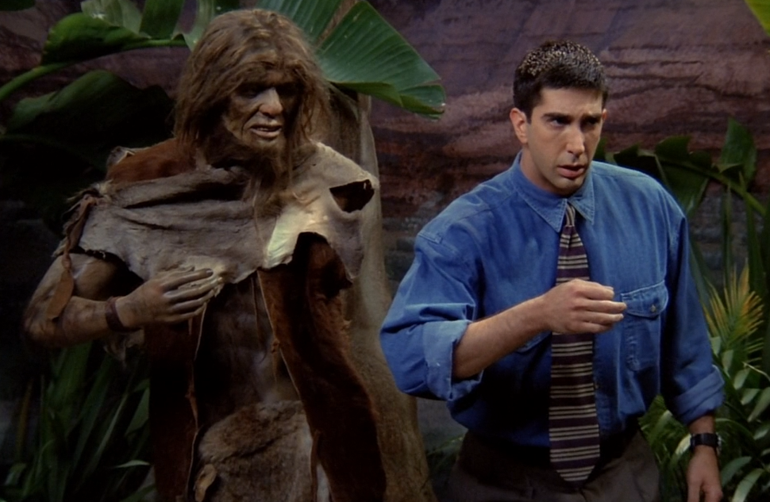

# Season1 Episode2 - The One with the Sonogram at the End

> 声明：
>       
>      所有内容只用于学习，如有侵权请告知。
>
>      如想转载请标明出处(github.com/hanqizheng)
>      
>      先看一遍原剧集再来阅读效果更佳
> 
>      希望可以Star支持一下😄
>
> 

#### [干货传送门](#id)

**本集关键词：yeah, well, see**

## 正文

其实大家如果先前看过《老友记》的话会发现每一集是有固定格式的。

大概是在`片头曲前`会有一个相对简短的小片段，可能和主要剧情有关，可能没有。主要是用来搞笑的。

然后是`正片`

然后是在`正片结束后`会再来一个`小片段`，多是和正片有那么点关系的。主要也是搞笑。

---

那么这一集的在开始前的搞笑片段就值得我们每一个人，`尤其是男生`好好的学习一下。废话不多说，直接开始！

```
M: What you guys don't understand is for us,
   kissing is as important as any part of it.
```

敲黑板划重点了！！！`kissing`在女生看来是所有环节中最重要的！！

这句话的句式很有意思，首先找到了句子的谓语部分，是`is`？还是`don't understand`?

应该是`is`，因为如果谓语是`don't understand`的话，那么后面的`is for us`就是`understand that`引领的宾语从句，可是句子中直接是`is`开头没有主语，所以错误。

那么既然`is`是整个句子的谓语，则`What you guys don't understand`这句话就是一个`主语从句`。不要畏惧什么从句，只是句子对应的那一部分变成了一个句子，自然就是什么什么从句了。这里可以改写成`you guys don't understand what`，这里的`what`做`understand`的宾语然后疑问句被提前。

按理说`is`后面应该跟表语或者宾语，但是却跟了一个`for us`,再后面才是`kissing is as...`这么一个句子，所以这里的`for us`可以理解为状语，就是补充说明的功能。

后面的`,kissing is as important as any part of it.`是一个省略了`which`的定于从句。

所以整句话可以写为
```
For us, what you guys don't understand is, which kissing is as important as any part of it.
```

---

Joey 觉得Monica只是在搞笑所以跟了一句`Yeah, right?`来调侃。其实这里就已经说明，**男生和女生（我是指片中的这六位）对`sex`的各个环节的认知都不一样**。

```
Ra: Everything you need to know is in that first kiss.
M: Absolutely!
```
Rachel这句话更是要记在小本本上好好体会。

- `first kiss`意为`初吻`，但是不要认为初吻就仅仅是指你一辈子中的第一个吻，come on,都9102年了，你是接下来要出现的`cave people`吗？`初吻`在这里基本上是代表你和你的`boyfriend or girlfriend`的整个关系中第一次接吻。

---

男生们在听了女生们的观点以后当然也要发表一下自己的观点。
```
C: Yeah, I think for us, kissing is pretty much like an opening act,
   you know, I mean it's like the stand-up comedian you have to sit through before
   Pink Floyd comes out.

C: yeah, 在我看来kiss更像是一个开场戏，我意思是
   你必须坚持过整个搞笑艺人的那一段才能等到Pink Floyd出场。
```
当然，这个观点由Chandler说出来就变得需要你转个弯才能看懂。Chandler在这里把kissing比喻成开场戏，而且我们需要注意的是这里他使用的是`have to`这个词，就可以很明显的看出他对kissing的态度，是必须去`sit through`的环节。

这里`kisssing`被比喻成了`comedian`，而后续的`sex`则被比喻成了`real show or Pink Floyd`。

- `sit through`表示坚持看完，忍耐这看（听）完的意思
- `comedian`意为搞笑艺人，说相声的就可以用`comedian`
- `pretty much`是在口语中使用频率非常之高的一个表达，表示一种程度，尤其是和`like`这样的词汇搭配，使用起来非常方便又灵活，可以看作一个副词来修饰一个动词，表示你某个动作的程度。

---

Ross听了Chandler的话以后想点赞。
```
Ro: Yeah, It's not that we don't like the comedian,
    it's just, that's not why we bought the ticket.

Ro: yeah， 这并不说明我们不喜欢搞笑艺人，只是，那不是我们买票的原因。
```
让Chandler一带后面所有的对话全部都来了一层比喻，md。Ross赶紧表示自己很同意Chandler的观点且做了一些补充。这里其实Ross想要表达的意思是`这并不代表我们不喜欢kiss，只是那不是sex的关键`，所以可以看出男生**更偏向认为sex本身才是sex的重点而不是什么kiss**。

在这里可以看到上一集我们说过的`just`，真的是特别常用。

---

```
C: You see, the problem is though after the concert's over,
   no matter how great the show was, you girls always looking for the comedian again.
   You know, I mean we're in the car, fighting traffic, 
   basically, just trying to stay awake.

C: 你看，问题是show结束之后，不管是一场多么精彩的show，
   你们女孩子却还在找那个搞笑艺人。
   我意思是我们在车上，外面堵着车，我只是想保持清醒。
```
这么翻译下来真的很怪。

- `You see`在这里我直接翻译成了`你看`，这个你看不是真的让你看什么，想一下比如你在和某个人讨论某个事情，你会下意识的说一句，你看，这个应该咋咋咋，大概就是这个意思，体会一下。`see`这个词在口语中也是经常使用
    比如表示`我懂了`,`Oh! I see`.记得阿凡达最经典的那句台词不就是`I see you.`当然人家一语双关了~~~
    但是也可以就是一个类似于`you know`一样的，在整个句子中没有实际含义的东西。

这段话就更值得我们揣测一下了，我这里就直接给出真正的含义了（我只是个纯洁的孩子）。Chandler其实是想说，知道吗？问题是在于每次我们都`having sex`结束了，女孩子却还想`kissing`。我只是硬撑着困意（你知道男生after sex以后很困~我真的是个纯洁的孩子），强装淡定罢了。

---

```
Ra: Yeah, well, word of advice:
    bring back the comedian otherwise you're gonna find yourself sitting at
    home and listen that album alone.
```
女生们听了这些肯定很不爽。。。。所以Rachel就反击到,well~well~well~,我给你们个建议，最好把那个comedian请回来，否则你会发现下一次你是一个人在家里孤独地听那张专辑，而不是和女生一起去现场看演唱会。

**到这里可以看下出现了多少次Yeah这个词**

- `yeah`这个词既然作为一个语气词，当然会出现非常多的频率，他的使用场景也非常之广，当然大家都知道`自己很爽的时候可以用Yeah`(别想歪)
  还有照相的时候yeah一下。
  其实yeah在一个相互表达观点的对话中也是非常好用的一个词用来表达`赞同对方观点`的意思
  甚至有的时候`yeah`都没有具体的含义，这个需要结合语境。

---

画面转到Ross的博物馆，这段笑死。尤其是这个当Ross听到他的前妻Carol（是个lesbian）怀孕的时候。


```
Ro: So, what's new? Still a...

Carol: A lesbian?

Ro: Well~
```
- `well`这个次在上面也是出现过很多次，在口语中也是非常常用的一个词
  可以在对方说完话后你接一句`Well~`可以是尴尬，可以是无奈，可以是疑惑，这个跟语境不同而定，真的是一个非常灵活的词汇。

---

场景转会Monica的公寓，Monica正在`神经兮兮`地打扫公寓，这里要说明一下，在设定上Monica的父母是及其`重男轻女`的，他们对Monica的双标`drive her crazy`。

```
M: Are you through with that?
```
这里有一个很地道的表达：

- `through with`表示完成，可以是喝完，吃完，写完，总的就是完成某件事情可以用`through with`终于可以替换掉`finish`了。

---

```
M: whose little ball of paper is this?
```
这句话和上面我们分析的那一句很像，也是一个`主语从句`

---

```
C: Oh, that would be mine.
   See, I wrote a note to myself and then I realize
   I didn't need the note so I balled it up and
   now I wish I was dead.
```
这里又看到了`see`，在这个语境下就是和`you know`一个作用，没有实际意义。

- `ball` 做动词，`ball sth up`把什么团成球

Monica 这么反常也是可以理解的，毕竟一会就可以看到不管再怎么做，她父母尤其是她妈，真的是360无死角找Monica的岔。

---

alright 然后没什么知识点可以说的直接跳到Monica父母空降她家那里吧。

```
Ross dad: You remember the Lagwind?
          The big one had a thing for you, didn't she?

Ross mom: They all had a thing for him!
```
这么一段简单的对话就能和刚刚他们和Monica的对话形成鲜明的对比，是真的完全两个态度。

- `have a thing for sb.`对某人有意思，喜欢某人。上一期我们学到的是`have crush on sb.`

---

```
Ross dad: Look, they are people, like Ross,
          who need to shoot for the stars.

Ross dad: 听着，人啊， 比如Ross，生来就是要成功的。
```
还是无脑吹自己的宝贝儿子~~~

- `look`，这个词太太太太重要，如果经常看美剧会知道这个词，**他表示`听着，听我说`**。
- `shoot for the stars`表面意思是`射天狼`，但其实就是同杜甫那样，用`射天狼`的举动来表示`取得成功`。
  

--- 

这里有个细节就是通过Ross dad的餐盘变化来反映他们已经无脑吹Ross多长时间了，也可见Monica已经在崩溃的边缘试探，所以接下来Monica不得不想办法转移他父母的输出对象。

```
M: I know this is going such unbelievably selfish on my part,
   but were you planinig on bring up the whole child/lesbian thing?
   Because I think it might take some if the heat off me.

M: 我知道这是令人难以置信的自私，但是你不打算把Carol的事情告诉爸妈吗?
   我觉得这样可以帮我转移点注意力。
```
- `take heat off sb.`帮某人降温，其实就是帮某人转移注意力，蛮地道的一个表达。

就在Ross坦白了他前妻怀孕，同性恋的事情以后，他妈的第一句话竟然是责备Monica知道却不告诉他们。。。。可想而知。

---

镜头跳到Central Park熄灯后独留Ross和Rachel两人的主线剧情。

```
Ra: You know, as someone who's recently been dumped. 
```

- `dump`表示被甩了

当然Ross和Rachel显然有点来电哈。Rachel靠在Ross的手上Ross都不舍得拿开。

--- 

然后急转直下，来到了Ross和Rachel的受难日。Ross要去跟前妻Carol做产检，Rachel则是要还给Barry订婚的ring。

```
Ro: She uh, familiar with our special situation?
```
- `familiar with`表示`熟悉`，熟悉我们的情况也就是`知道`的意思。

---

不管是Ross为了孩子的名字而和Susan，Carol争论，还是Rachel得知Barry和Mindy现在很相爱，其实到这里剧情上已经为Ross和Rachel的感情做了铺垫。两人基本是在同一时刻感情破裂，基本是在同一时刻发现自己生活一下子发生了巨变。难免会和对方产生共鸣。

Barry表示他真的很感谢Rachel，因为之前他们在一起的时候他并不开心，但是现在他和Mindy在一起的时候，他很开心。其实真的两个人在一起一定要开心，如果每天都是忍耐，包容，其实这段感情为吃起来也会很累很难受。


<span id="id"></span>
## 干货

**全部干货需要详细阅读全文**

- `Yeah`这个词既然作为一个语气词，包括大家都知道`自己很爽的时候可以用Yeah`(别想歪)
  还有照相的时候yeah一下。
  其实`yeah`在一个相互表达观点的对话中也是非常好用的一个词用来表达`赞同对方观点`的意思
  甚至有的时候`yeah`都没有具体的含义，这个需要结合语境。
- `well`在口语中也是非常常用的一个词
  可以在对方说完话后你接一句`Well~`可以是尴尬，可以是无奈，可以是疑惑，这个跟语境不同而定，真的是一个非常灵活的词汇。
- `You see`在这里我直接翻译成了`你看`，这个你看不是真的让你看什么，想一下比如你在和某个人讨论某个事情，你会下意识的说一句，你看，这个应该咋咋咋，大概就是这个意思，体会一下。`see`这个词在口语中也是经常使用
    比如表示`我懂了`,`Oh! I see`.记得阿凡达最经典的那句台词不就是`I see you.`当然人家一语双关了~~~
    但是也可以就是一个类似于`you know`一样的，在整个句子中没有实际含义的东西。

### vocabulary

- cave people 原始人
- carpet **n.** 地毯，毛毯
- paranoid **adj.** 属于偏执狂的，妄想狂的
- fluffy **adj.** 松软的，毛茸茸的，轻柔的，无聊的
- ammunition **n.** 弹药，军火
- chaotic **adj.** 混沌的，一片混乱的
- twirl **vt.** 快速转动 **n.** 扭动，旋转
- stomp **n.** 跺脚，重踩
- dread **vt.** 害怕， 担心 **n.** 恐惧 畏惧 **adj.** 可怕的
- terrific **adj.** 极好的，异乎寻常的，了不起的