# Season1 Episode 20 - The One With the Evil Orthodontist

> 由于视频文件过于庞大，不方便上传，希望在阅读笔记之前，自己要有《老友记》的资源
>
> **先将这一集看一遍**，然后再开始根据个人的学习习惯阅读~~

## Key word: Barry

## 概要

上一集的结尾Barry冲进Monica的公寓打断了Ross和Rachel的谈话，告诉Rachel他不能和Mindy结婚，他还对Rachel有感觉。

这一集Rachel就在要不要和Barry复合的想法上犹豫不决。

## 正文

```
Chandler: I can't believe you would actually say that.

          I would much rather be be Mr.Peanut than Mr.Salty.
```

- 这里第一句话一般是说成`I can't believe you actually said that.` 这里Chandler加了一个would我确实不知道为什么，有知道的小伙伴嘛？
- `would rather ... than ...`

---

刚上来Chandler就讲述了他昨天的约会，他的形容是`unbelievable`。

```
Monica: So have you called her yet?

Chandler: Let her know I like her? Are you insane?

Girls: Guys, it's gross.

Chandler: It's the next day! How needy do I wanna seem? Am right?

Guys: Yeah, let her dangle. Yeah, definitely.

Monica: I can't believe my parents are pressuring me to find one of you guys. 
```

- `insane`表示`疯了`这个我们在前些日子学过了。再补充几个与crazy同义的单词。
  - `mad ｜ nuts | bonkers(相对英式一点) | mental`这几个词都是形容词，用于形容`人`疯狂了。
  - `ridiculous | ludicruous`也是形容词，但多半都是形容`人做的事`疯狂。
- `needy`这个词是从一首叫needy的歌认识的，意为`粘人的`

简短的对话体现出男女在喜欢一个人上面表现的不同，当然这仅限于剧中这几个角色，不能代表所有人。

Chandler认为不能着急打给对方，这样会让自己显得很粘人，很可悲，但是女生们则直接用`gross`形容这样的行为。

我个人观点还是喜欢谁就赶紧向他(她)表达出来，别到时候来不及了又开始追悔莫及。就算失败了，也是不浪费双方时间不膈应自己。

---

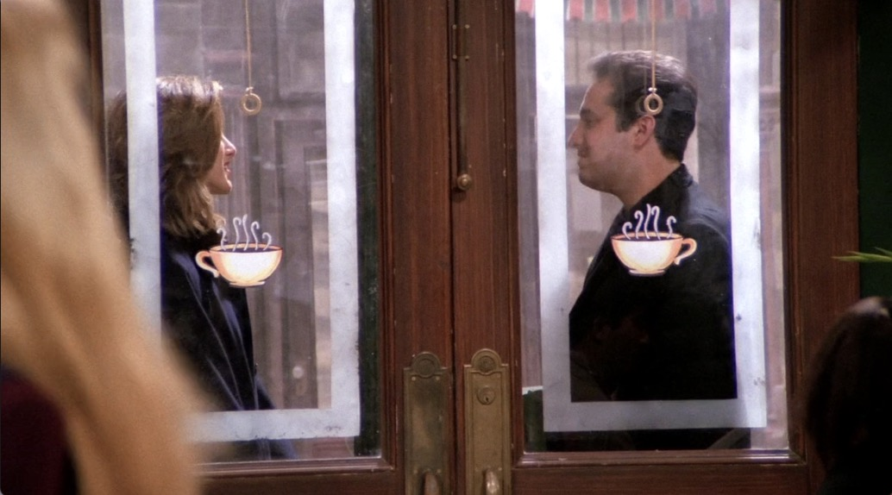

Rachel和Barry在第二天来了一场约会，Rachel却更犹豫了，因为她感觉比当时他们俩在一起更舒服，更开心了。

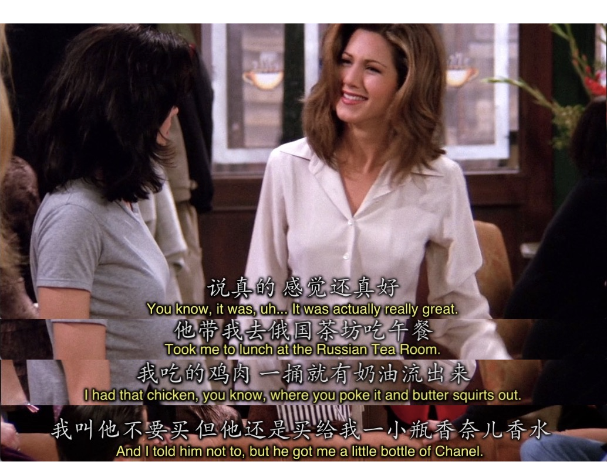

而且注意到Barry带Rachel去吃的饭，给她买的东西都是相对高级贵重的。毕竟是Orthodontist。据大学英语老师说，美国看牙是比看一般的病贵很多很多的，牙医非常挣钱。


众人还是极力劝Rachel冷静，但是明明要去跟Barry断绝关系的她却...

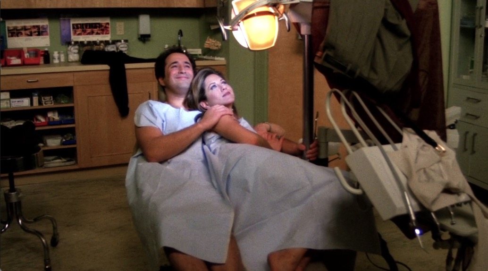


Rachel其实还是犹豫的，她的顾虑是如果自己和Barry和好了那刚刚和Barry订婚的好朋友Mindy怎么办？

但是仔细想想，Barry都和Mindy订婚了，还跟Rachel乱搞。


看Barry说的话就能感受到，婚姻对他貌似没有任何意义，婚约也是说取消就取消。但是他能为你跟别人取消婚约，他也能为别人把你的婚约取消掉。

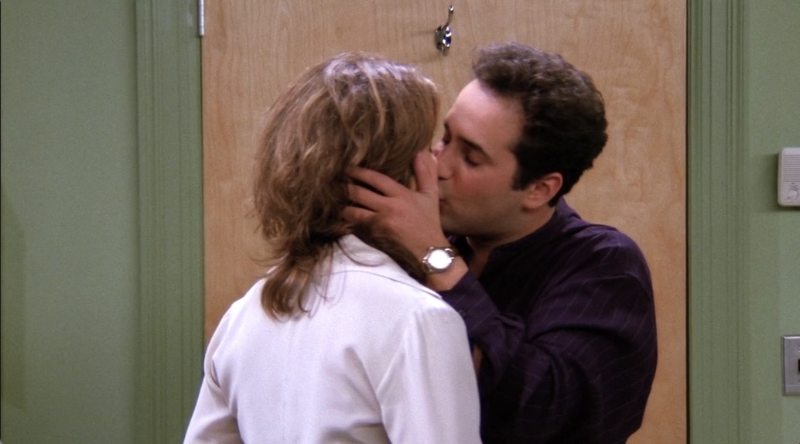
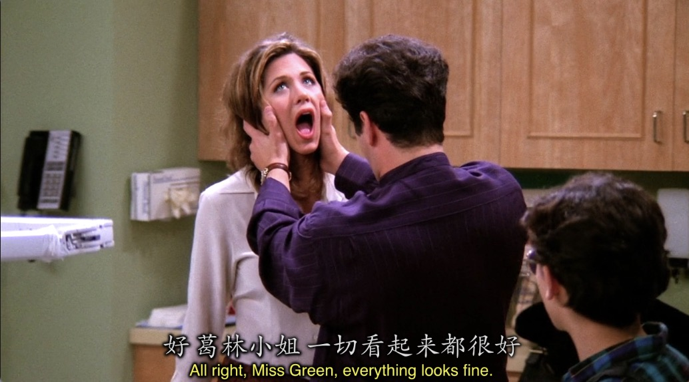

而且注意到的细节是当小朋友来找他看牙他却一把把Rachel推开故作镇定，说明他心里还是有鬼，不能让人发现他和Rachel的事，其实就这么一推应该能明白，他跟Rachel说的为她取消婚约也是屁话。

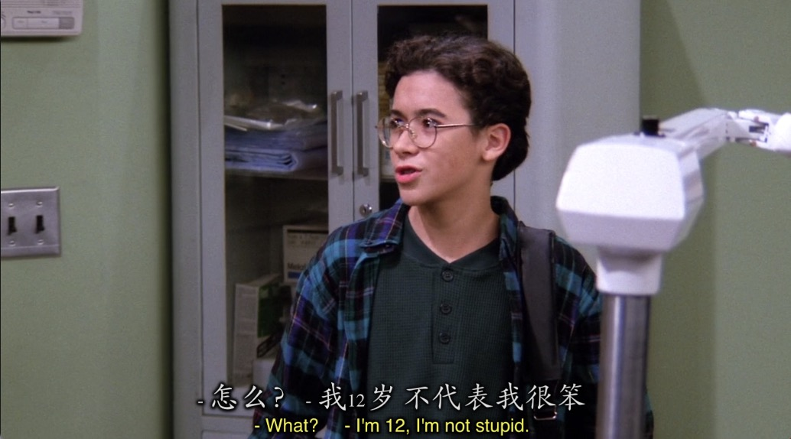

这位小朋友倒是神补刀了。

---

```
Chandler: Can I use your phone?

Monica: Yes. But future reference, ummm, that thing in your hand can also be used as a phone.
```

- `future reference`在这里翻译为`仅供参考，谨慎起见`。学～

---

```
Phoebe: Where are you going?

Ross: I just have to go!!! Do I need a reason Huh? 

      I have jam-packed schedule and I am late for keeping up with it.
```

Ross 听到Rachel说She had sex in Barry's chair.直接炸毛了。。。。本来还有一丝希望的他现在听起来Rachel完全想要回到Barry身边了。

- `jam`这个词意为`果酱`。但是用它表达很多`拥挤， 密集`的意思，比如`traffic jam`表示`堵车`还有这里的`jam-packed schedule`表示`排期满满，任务多多`

---

Mindy突然的来电让Rachel有点不知所措，她意为她和Barry的事被发现了。下一秒打电话给Barry接起来的却还是Mindy😂。

```
Mindy: So... Now I know things have been wired lately.

       But you're my oldest friend except for Lauren who I don't talk to anymore.

       Because she's bitter that she lost the weight and it turns out and she doesn't have a pretty face.
```

- `sb. be bitter that + (原因)`表示`某人因某事做出一副全世界都欠他的样子`。学一个固定句式。
- Mindy这段话说了很多，给我一种一句话说很了唱的感觉，但是我把它打出来却发现她只是逻辑清晰的用多个连词表述出来了。

---

Mindy只是想让Rachel当她的伴娘，但说着说着还是向Rachel吐露了心声。

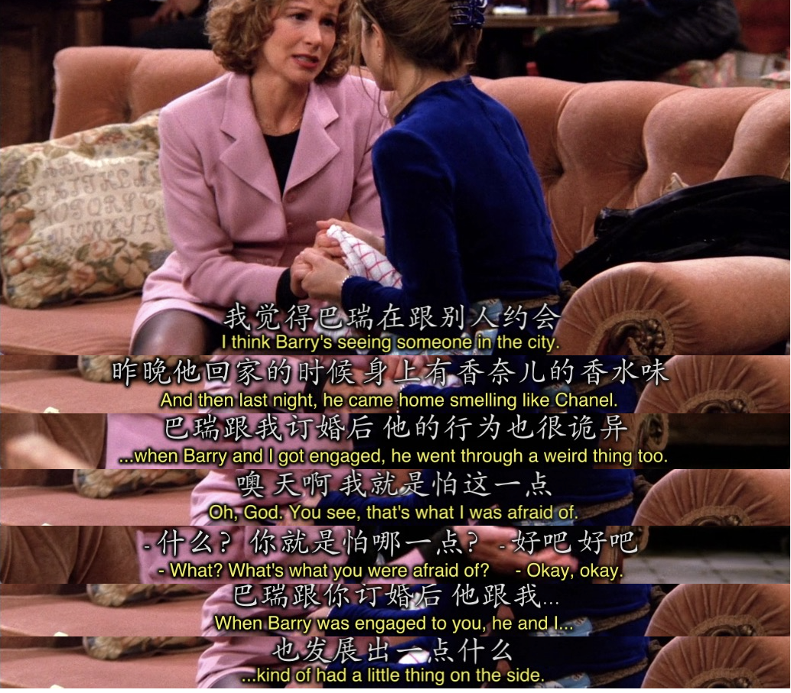

---

两人和Barry的对峙更是把这个渣男最原本的样子展示出来

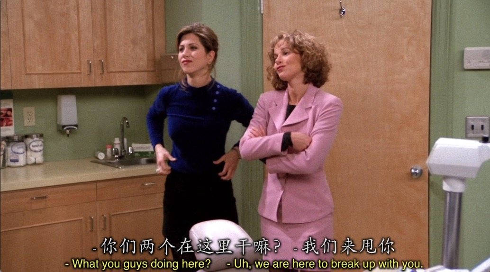


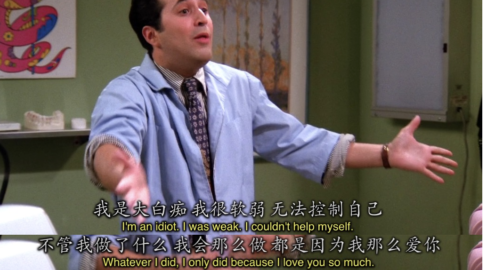

但是也许老友记🐂🍺的地方就在于，真的很现实。

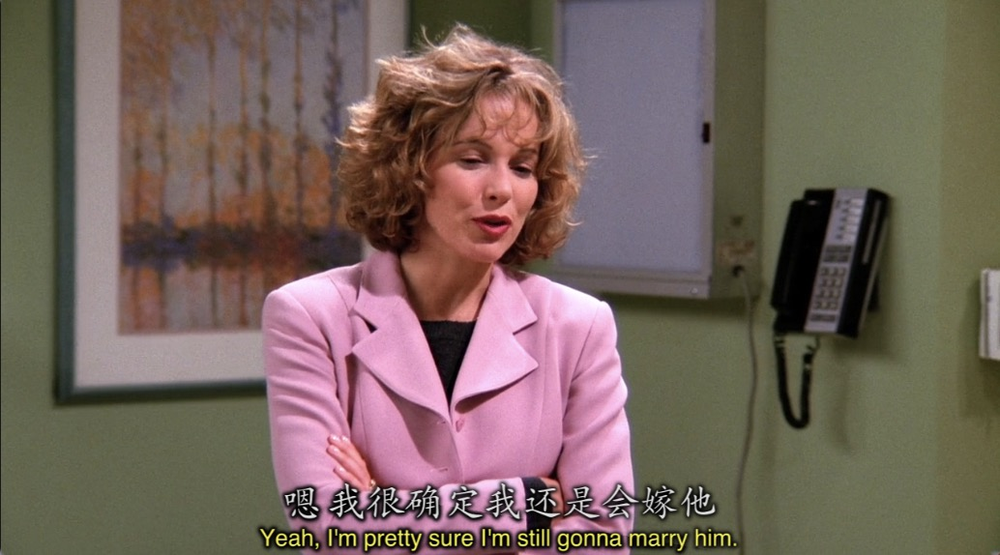

--- 

Monica和Rachel的这段对话更是表示了Rachel一点都不后悔当时逃婚的选择，因为这彻底改变了她的一生。

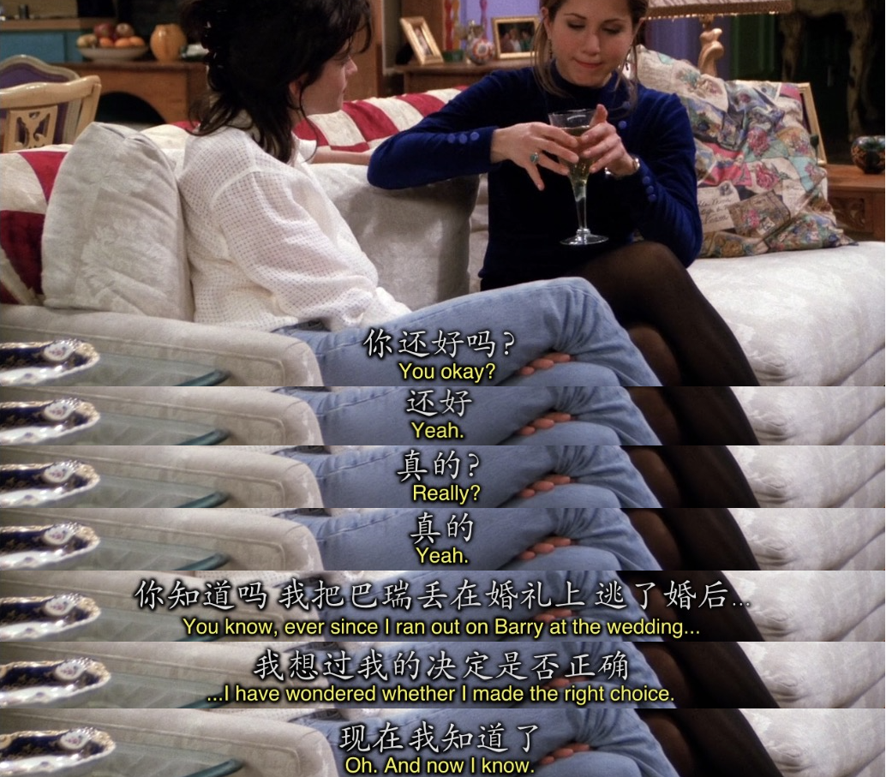

其实我想对每一个正在看这篇文章且看到这里的人说

You can be Mrs.Dr.Barry.Farber.D.D.S. 然后过着富有的生活，但是你不幸福。

Rachel舍弃了她的“牛”找到了她的Magic Beans。

如果你看过老友记的全集也一定知道Rachel从一个完全没有自己思想的富家女变成了一个从服务员干起到后面成为Ralph Lauren的采购经理。

她的一生是自己定义的，是自己想要的。

不过，也许对于Mindy来说。Mrs.Dr.Barry.Farber.D.D.S就是她想要的也说不定。 whatever.

---

emmmm，真的没有多少知识点(逃


## Vocabulary

- snack **n.** 零食
- hone **vt.** 把...磨快 ｜ **n.** 磨刀石
- snub **vt.** 冷落 ｜ **n.** 冷落
- needy **adj.** 粘人的， 过度依赖的， 贫穷的
- irony **n.** 讽刺,讽刺的事