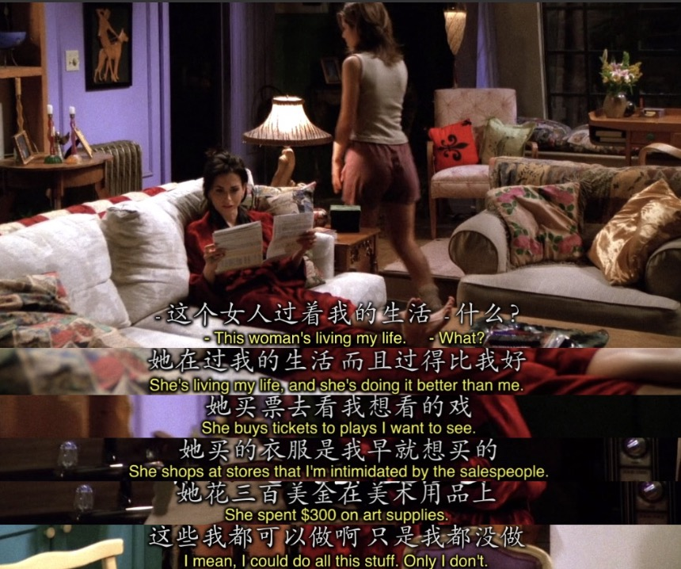
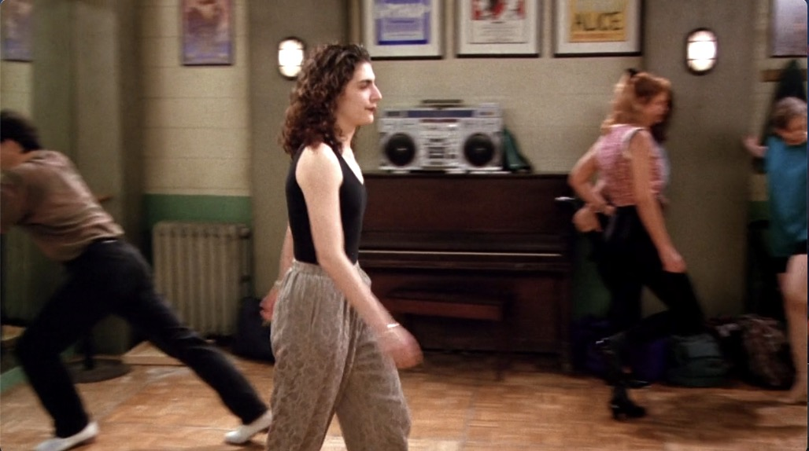
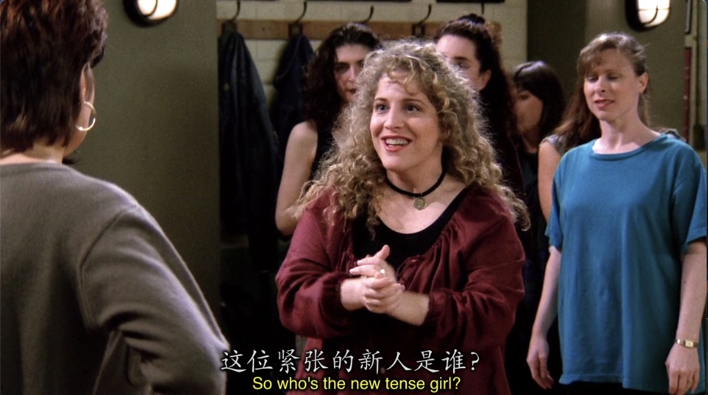
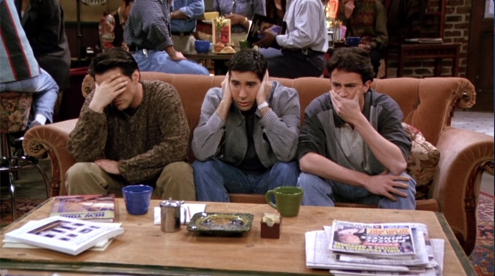
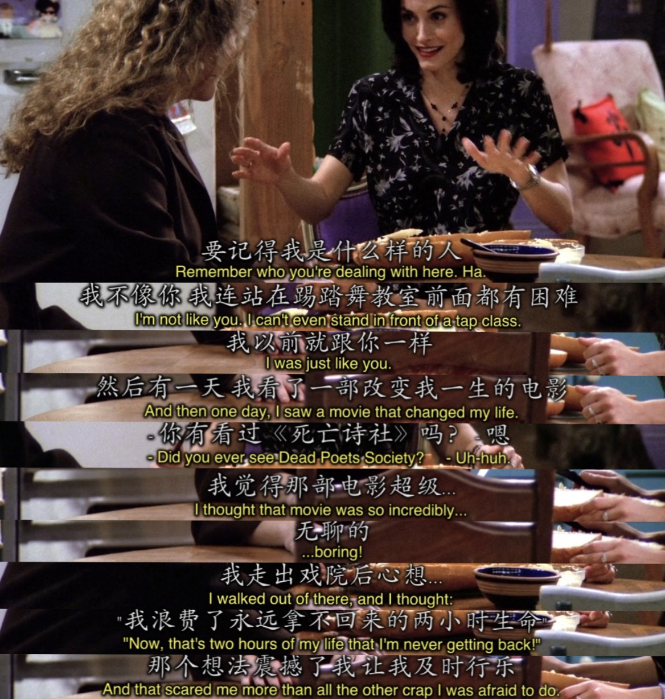
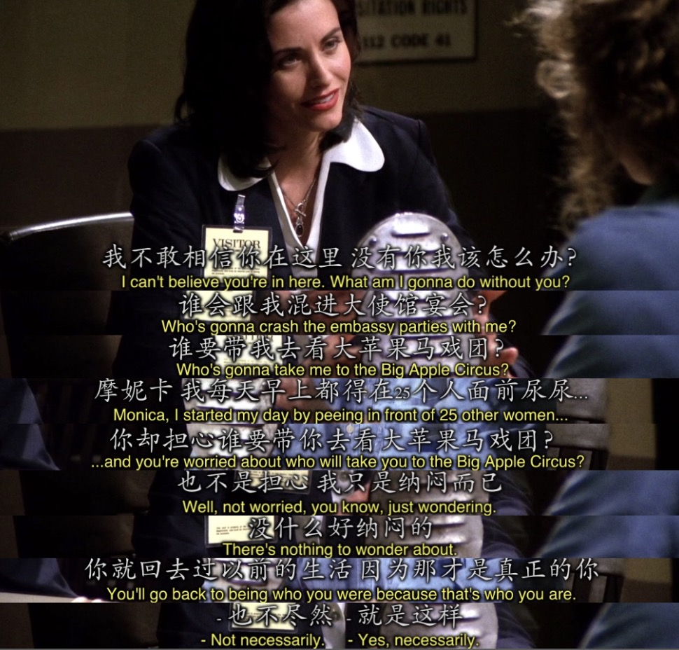
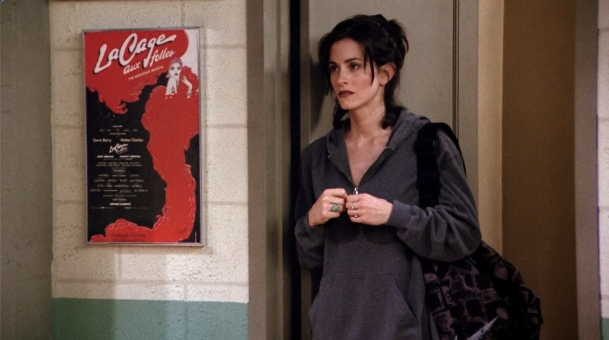
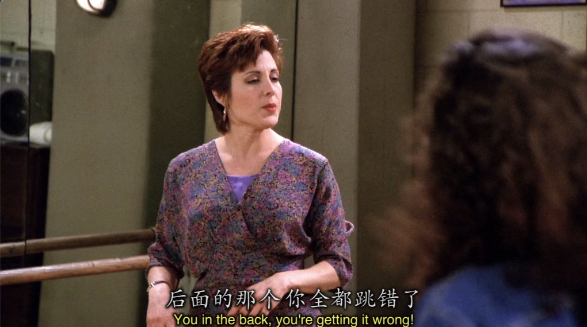
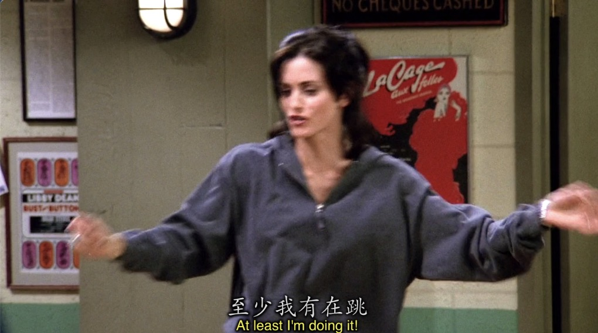

# Season1 Episode 21 - The One with the Fake Monica

> 因涉及版权且视频文件过于庞大，不方便上传，希望在阅读笔记之前，自己要有《老友记》的资源
>
> **先将这一集看一遍**，然后再开始根据个人的学习习惯阅读~~

## Key word: life style

## 概要

- 有人盗用了Monica的Credit Card。

  虽然信用卡公司说Monica只需要还她自己花的钱就好了

  但Monica决定要亲自看看这个人是谁

  当真正见到这个人的时候，Monica却...

- Marcel进入发情期，Ross不得不将它送回动物园。

## 正文

```
Joey: How'd someone get your credit card number?

Monica: I have no idea, but look how much they spent!

Rachel: Monica, would you calm down, 
        
        the credit card people says you only have to pay for the stuff you bought.

Monica: Still, it's just such reckless spending. 

Ross: I think when somebody steals your credit card

      they've kind already thrown caution to the wind.
```

一开场大家就在讨论Monica信用卡被盗刷的事情

- 这里的`how'd`全写是`how did`。这句话是一个how引导的后面跟一个一般疑问句表示询问`怎样，方法`的疑问句。
- `reckless`意为`鲁莽的， 胡乱来的`
- `throw sth. to the wind`意为`把...抛之脑后`

---

```
Chandler: Wow! What a geek! They spent $69.95 on a Wonder Mop.

Monica: That's me.
```

- 说一下`感叹句`，一般是由`what`或者`how`引导的
  - what引导:
    - 第一种就像Chandler说的这句话一样`What + a/an + n.`用于强调这个名词。其实这只是其他形式的一个变种，但是特别常用就把它拎出来单说。
    - `What + a/an + adj. + n. + 陈述句(一般只有主语和谓语)`这其实就是上面那一种的完全形式，但是口语中常常就把陈述句省略。
  - how引导：
    - 其实How引导的就一种，`How + [adj./adv.] + 陈述句(一般只有主语和谓语)`
    - How hot it is today!
    - How well she sings!
    - How time flies!
- `geek`这个词`一般形容一个人很怪，即为怪胎的意思`值得提及的是程序员中经常提到的`极客`就是`geek`音译过来的。

---

Monica看信用卡的账单看的睡不着觉



这个人买了自己平时想买但舍不得买的东西，Monica其实这会在心里一对比就会觉得自己过的`太差了`

这个太差了不是指别的，就是指自己没有好好地对待自己

- `She shops at stores I 'm intimidated by the salespeople.`
  - 首先注意Monica说这几句话的时候都是一般现在时，`表事实`。
  - `intimitate`意为`恐吓`，但这里大家也能感觉到并不是直接的恐吓的意思，Monica用了一个被动，表示`被salespeople...`
  - 然后整个一个`I 'm intimidated by the salespeople`就是一个`定语`来修饰前面的`stores`
  - 翻译下来就是`她在商店购物`，什么样的商店呢？`她在平时我被售货员白眼的商店购物`。

--- 

```
Joey: Stalin. Do I know this name? That sounds familiar.

Chandler: Well, it doesn't ring a bell with me. 
```

- `ring a/some/any bell(s)`本意`摇响铃铛`，但其实在口语中这个短语是非常常用的一个用来表达`对某事有印象`
  - It doesn't ring any bell with me. 我对这些事一点印象都没有。

---

暂停看Phoebe的盛世美颜，个人感觉这是Phoebe第一季最好看的服装，也能在整部老友记里排前三的。


惊现Lorde？？？？？？？？



---
 
Monica决定到dance class上去看看这个盗用她信用卡过着她一直想过的生活的人到底是什么样子。

于是，fake Monica出现了




---

送大家的表情包，不听不看不说.jpg



---

```
Joey: How do you get a monkey into a zoo?

Chandler: I know that one!

          No, that's popes into a Volkswagen.
```

- `pope`意为`教皇`
- `Volkswagen`是`大众汽车`,记得大学选修德语课老师还解释过为什么大众的Logo是这样的,因为Volkswagen的缩写是VW.
- 这个笑点真的有点get不到，查阅了资料
  - How do you fit a pope into a Volkswagen?
  - The answer is taking off his hat.
- 所以这个笑话其实就是`把大象放进冰箱有几步的美版吧...`emmmmmm好冷。


---

```
Phoebe: I'd say that chair's taking the brunt of it.
```

- `take the brunt of something`表示`某事首当其冲`

---

Fake Monica讲述了她为什么会这么生活，觉得生活的每一秒都不应该浪费，于是就及时行乐，享受每一分每一秒。

> 死亡诗社这部电影我在当时大学英语老师有给放过，当时没有看懂不太敢评论，但是记得电影中死亡诗社的成员有一句共同的口头禅就是`及时行乐`




---

跟fake Monica在一起之后Monica连班都不上了，还酗酒晚归。

但是"好景"不长啊，Fake Monica因为盗用信用卡被抓了。


Monica觉得让fake Monica带领刚刚找到真实的自己，现在她被抓了，自己该怎么办。



但是fake Monica说的话却很通透，不怎么办就是答案。因为现在的你根本不是真正的你，只是Monana罢了。

你要明白自己想要的是什么，而不是一味的满足自己的欲望，人的生活就是在克制中寻找放纵，在有限的放纵中让自己快乐。


---

没有Fake Monica的生活

Monica又回到了踢踏舞课堂，这一次她不再像第一次害羞的不敢上前，而是大胆的说要加入进来，然后跟众人一起跳舞。






就像Monica说的，At least I'm doing it. 至少我正在做。

相信Fake Monica真正教会Monica的是一份自信，还有就是找到自己想要的，然后去尝试，无论对错，至少你尝试了。


## Vocabulary

- reckless **adj.** 鲁莽的，胡乱来的
- caution **n.** 小心，警告 ｜ **vt. & vi.** 警告
- intimidate **vt.** 恐吓
- ethnic **adj.** 名族的，种族的，部落的
- neutral **adj.** 中立的， 不偏不倚的，平淡的，相互抵消的，中性的
- obsession **n.** 痴迷
- observe **vt.** 注意到，观察，监视
- tense **adj.** 紧张的，紧的，紧绷的
- phase **n.** 阶段，(月)相 **vt.** 分阶段进行
- vigilante **adj.** 警惕的
- astound **vt.** 使...震惊
- brunt **n.** 最痛苦的部分，最糟糕的部分
- cruel **adj.** 残忍的，恶毒的