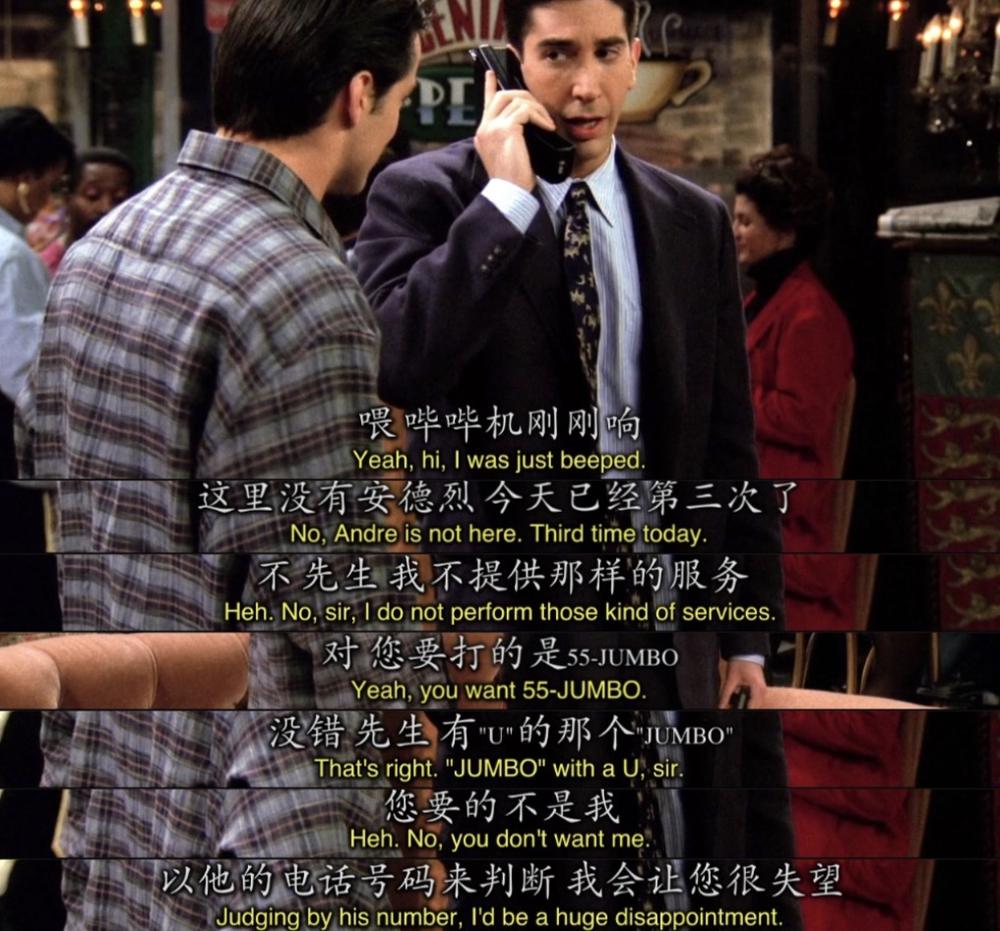
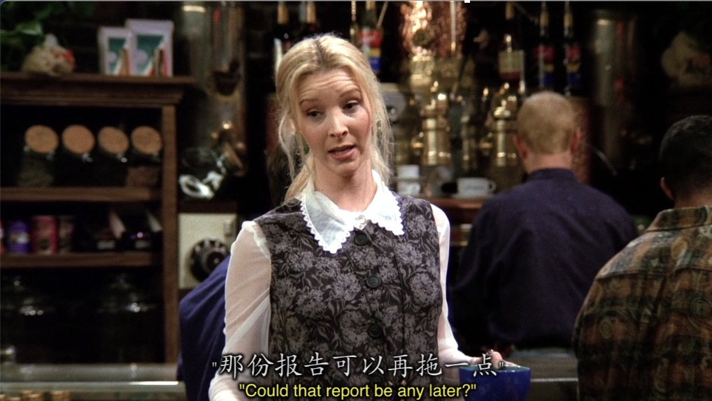
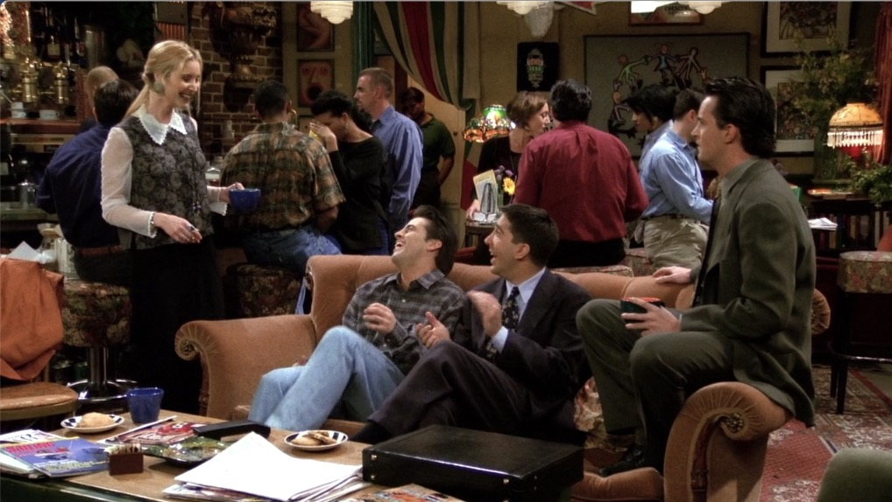
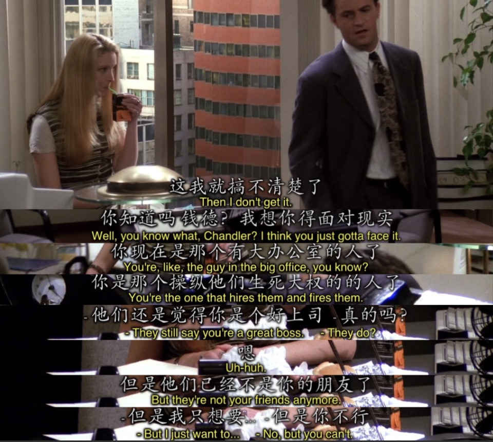
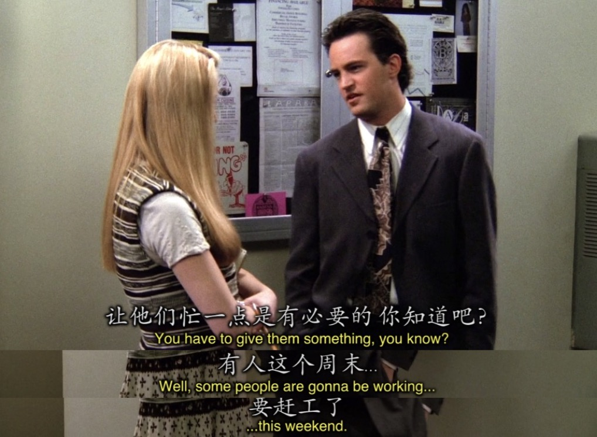

# Season1 Episode 22 - The One With the Ick Factor

> 声明：
>       
>      所有内容只用于学习，如有侵权请告知。
>
>      如想转载请标明出处(github.com/hanqizheng)
>      
>      先看一遍原剧集再来阅读效果更佳
> 
>      希望可以Star支持一下😄
>
> 

## Key word: icky


## 概要

- Monica谈了新的男朋友Ethan(relax不是陈奕迅Eason,读音略像)，但是由于Ethan比她年轻不少所以Monica隐瞒了自己的真是年龄，把自己说成22。没想到Ethan却...
- Chandler让暂时没钱可挣的Phoebe当他的助理，但他是却从跟其他员工打成一片的Phoebe那里得知大家都不喜欢自己。
- Rachel做了一个sex dream里面有Chandler和...


## 正文

先注意一下本集的Title叫做`The One With the Ick Factor`

- `ick factor`在这里翻译成`虚假的真相`

---

```
Monica: I'll see you guys later.

Rachel: Off to see young Ethan?
```

- `off to`这里翻译成了`要去`，看起来很像`going to`的效果，没错，`off to === going to`

---

```
Joey: How young is young Ethan? Young???

Monica: He's our age.

Chandler: When we were...

Monica: Okay, He's a senior in collage.
```

- `How young is young Ethan?`这句话猛的一看可能有点晕。但定睛再品，就发现两个young的意思不一样，第二个young是和`young Ethan`一同组成一个代词。这句话变形成`How young is (young Ethan)?`大家就应该明白啦。
- `senior`这个词翻译过来是`年长的，高年级的，成人的`，但还有一个意思一定要注意`毕业年级的`。它代表每个不同阶段的毕业年级，高中，大学都可以。

---

```
Monica: Okay, windows are clean. Candles are lit.
```

我没想到这么简单的一句话我竟然看了半天。

- `windows are clean.`这句话是`clean做形容词修饰window`
- `candle are lit`这句话是`一个被动式，蜡烛被点亮`
- 但是我记得`light`的过去式是`lighted`，没想到今天长知识了，`lit`也是`light`的过去式，而且他和`lighted`没有任何区别。

---

```
Monica: Am I out of control?

Rachel: Just a touch.
```

- 平时说`一点点，有一点`的时候都用的是`just a little~`现在学会一个新的`just a touch.`

---
 
```
Monica: Look, He's a great guy and I love being with him, but you know...

        Things happen when they happen.
```

- 学，`Things happen when they happen.`意为`顺其自然`。

---

Ross在这一集拿出了一个bb机(也叫呼机📟)我是96年的，在我很小很小的时候我有印象家里也有一个这样的呼机，但是基本已经不用了。

其实可以从老友记也能感受到电子产品在发展，从Ross最开始的呼机到Chandler买的第一台电脑到后面Phoebe和Rachel捡到翻盖手机等等。

另外还可以注意到Ross手中的`大哥大`。如下图。



可以从Ross说的话中猜到呼Ross的人是想嫖吧😂

---

Phoebe告诉Chandler公司里的每一个人都不喜欢他之后，Chandler显然很惊讶。

然后大家都开始模仿Chandler平时的样子



当然就有最经典的， `Could be + 比较级`的经典口头禅

Joey和Ross看到模仿之后笑个半死




---

Phoebe小课堂又来了。

不要太在意别人的眼光，自己过得很好，他们喜不喜欢不重要。



---

```
Ethan: Okay, I have no frame of reference, but I thougt that was great.

Monica: It was.
```

- 这句`我没有参考对象来用于对比，我没办法对比`来学一下表达`I have no frame of reference.`

---

想明白的Chandler



而且需要注意Chandler在这里专门用自己的语气说的这些话。


## Vocabulary

- inadequte **adj.** 不充分的，贫乏的
- subconscious **n.** 潜意识
- pirate **n.** 海盗，盗版者，非法从业者
- portion **n.** 一部分,一份
- extinct **adj.** 灭绝的，不再活跃的
- felon **n.** 重罪犯
- saucy **adj.** 风骚的， 轻佻的， 情色画面， 鲁莽的
- amuse **vt.** 逗...笑， 被...逗笑
- rumor **n.** 传言， 谣言