# Season1 Episode 23 - The One With the Birth

> 因涉及版权且视频文件过于庞大，不方便上传，希望在阅读笔记之前，自己要有《老友记》的资源
>
> **先将这一集看一遍**，然后再开始根据个人的学习习惯阅读~~

## Key word: Ben


## 概要

随着上一集结尾处Carol给Ross的呼机发话，孩子要生了。所以这集是一些在医院发生的趣事

- little Ben的出生以及为什么最终起名为Ben
- 震惊！Joey小天使帮帮单亲妈妈生孩子然后默默离开


## 正文

```
Ross: I can't believe this! I mean she could be giving birth in a cab!

Rachel: Oh Ross relax, It's probably like $2 for the first contraction,

        and fifty cents each additional contraction.
```

老友记里有许多生孩子的剧情，无论是Carol还是Phoebe还是Rachel。

那么就总结一下跟`生孩子`有关的相关单词短语。

- 看了这么多大概总结出来的经验就是在预产期到来的时候，也就是孩子要生的第一迹象`羊水破了: water broken`
- 然后会不间断的持续产生`宫缩阵痛: contraction`

听老妈说她们那会生孩子医院都是默认剖腹产，但无论是在老友记里还是现在的中国都是提倡顺产的，剖腹产对孕妇身体的伤害是不可逆的。


这里Rachel开玩笑`如果在出租车里生孩子那每一次contraction计价器都要跳一下表了`。

---

这一集发了好多Chandler和Monica的🍬啊。

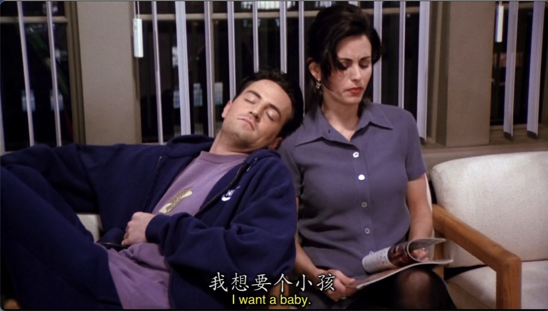
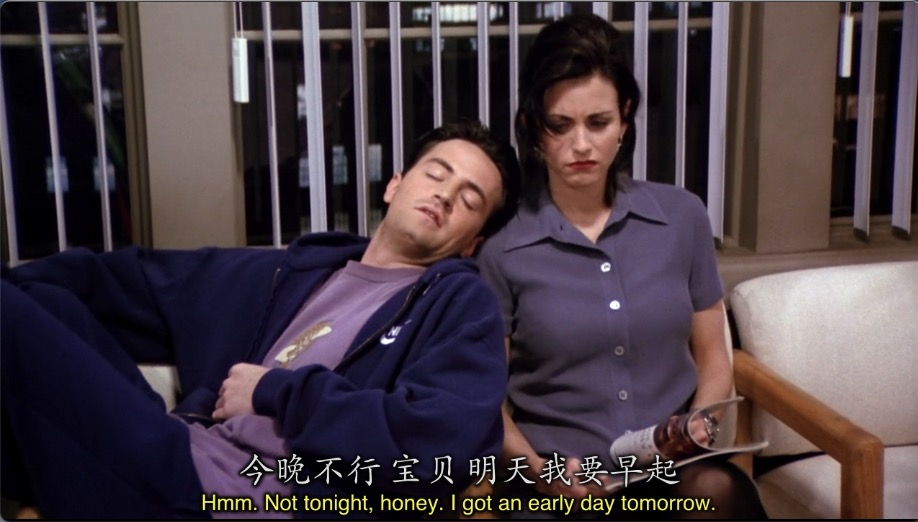


还有Monica看见别人刚出生的双胞胎特别羡慕Chandler还安慰她

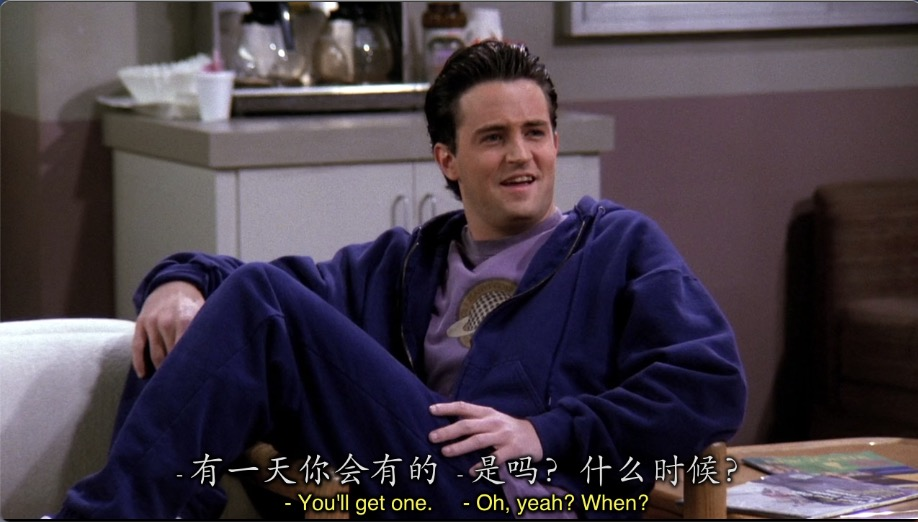
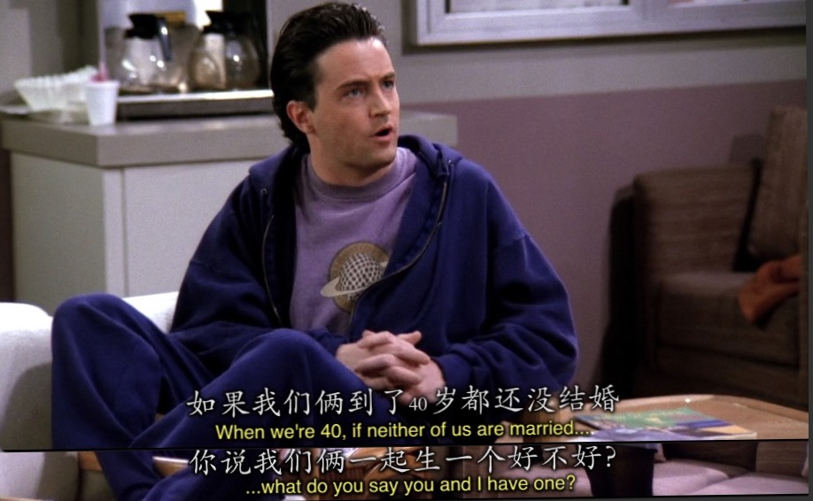

但没想到。。。。


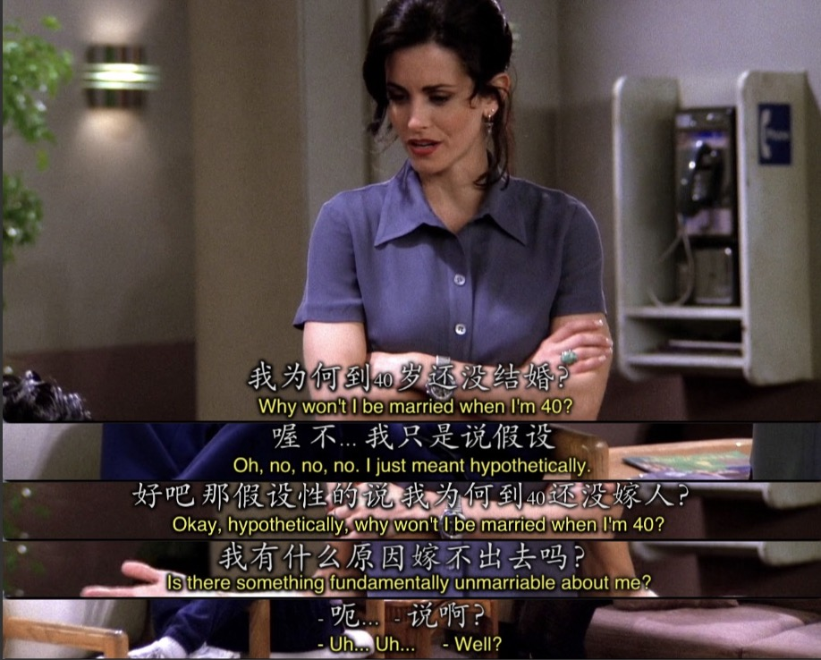


还有

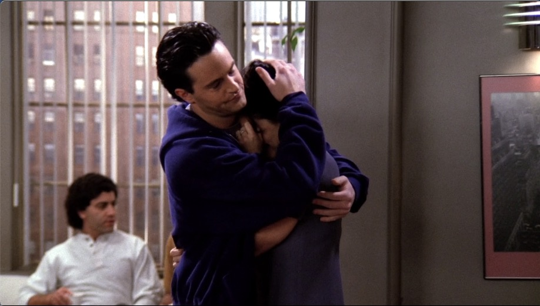

---

```
Joey: So eh, what's the deal with the father guy?

      I mean if someone was having my baby somewhere, I'd wanna know about it.
```

- `What's the deal with...`我见到好几次了，都是想询问`怎么回事`的。
  
---

第一季这个小细节不知道有没有发现。

Joey的经纪人Estell在这一集还饰演过医院的产护。

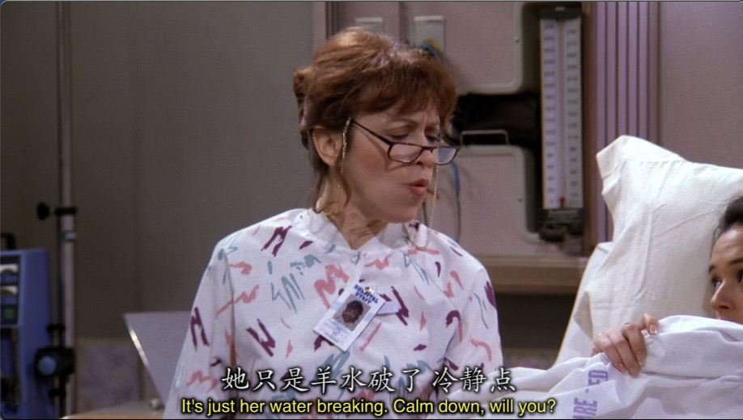

---

就这么在医院的两条线都在为生孩子努力着，Joey陪着这个陌生人女子，而Ross这边则为了和Susan抢风头被Carol赶出病房。

然后Phoebe路过想要劝他俩但是下意识把门关住了而且门打不开了。

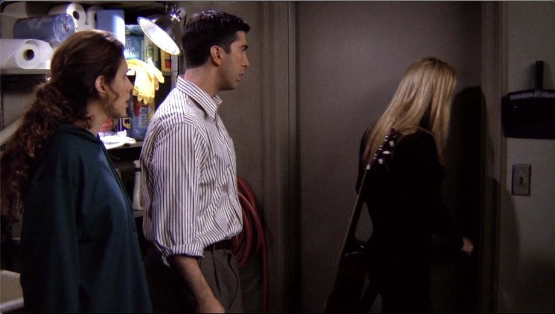

```
Phoebe: My god you guys, I don't believe you!

        There are children coming into this world in this very building.

        And your negtive fighting noises are not the first thing they should be hearing.
```

- `I don't believe you!`在这里结合语境感觉有了一层新的含义，虽然都是`我不相信你们`的意思，但这里有一种`我真不敢相信你们， 你们竟然...`的感觉。
- `In this very building`可以注意到这里多了一个`very`。一般very是做副词修饰形容词来加强形容词的程度表`非常...`，但这里very直接出现在一个名词前面是`表强调的`。比如这里的`In this very building`就有一种`right here right now`的感觉，强调`就在这里！`
- `they should be hearing.`最后一句话出现了一个这样的句子，下意识说这句话一般都是`they should hear.`但这里用了一个`shoub be doing`的形式。两者有什么区别呢？
  - `should do`更多的是想表达一种`事情还没有发生，你只是想到了，把它添加在你的todo list上`。
  - `should be doing`则**偏重你做某件事情已经有段时间了，这不是一件全新的事情，但在不久的将来又要做(发生)**。
  - 那么这里说新出生的baby不应该第一个听到的声音是争吵。baby显然没有做过啊？其实这里的hear是相对于全人类刚出生的时候来类比的，Phoebe的意思就是`你们出生的时候听到的第一种声音不是争吵，那你们想让孩子听到的第一声是争吵吗？`

---

Joey这个背影都这么暖

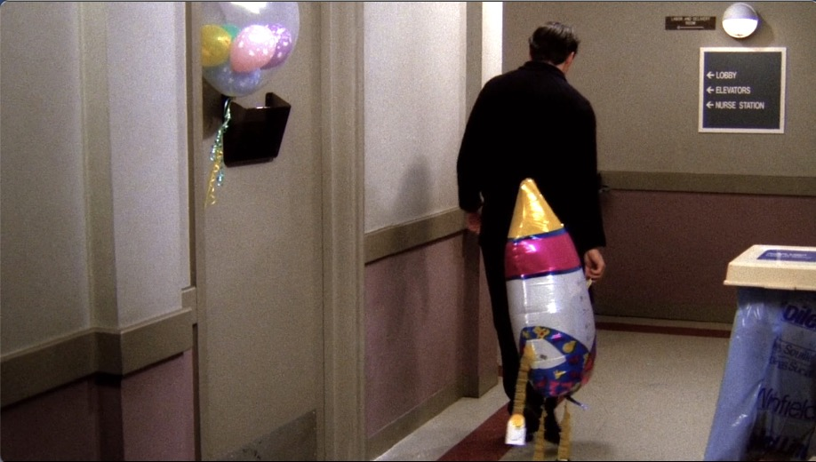

---

Ross和Susan因为被困在这里开始大吵

Phoebe真的是在每次别人争吵的时候都能说出让大家冷静的话

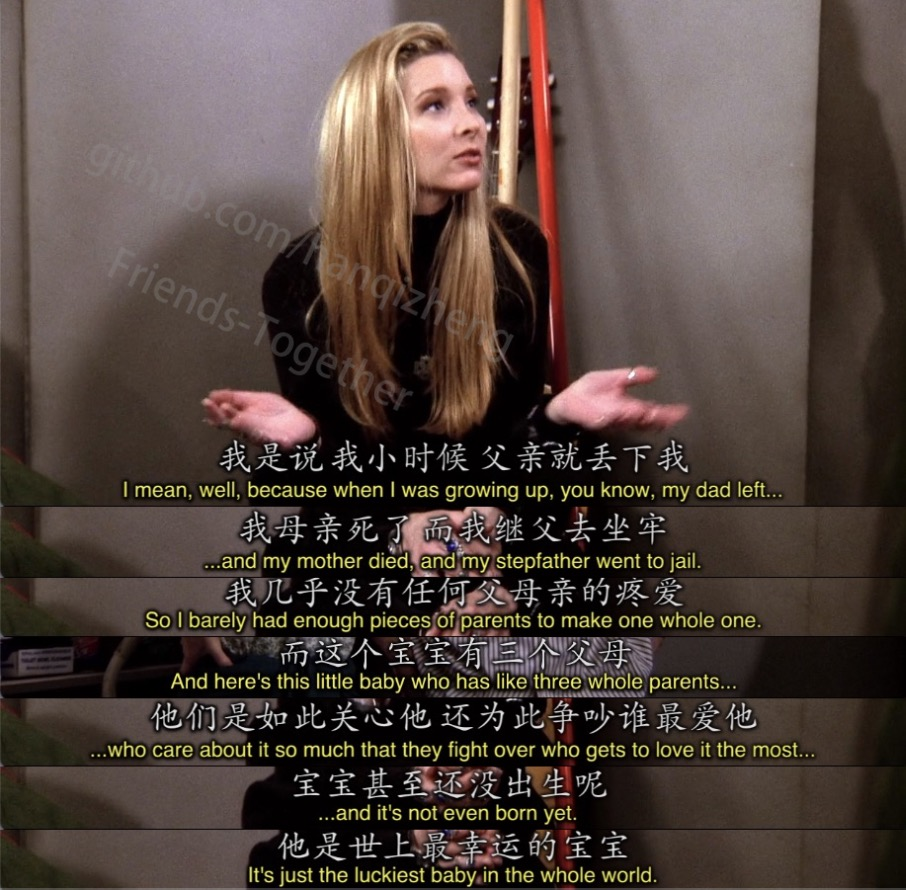

---

这就是Ross第一个孩子Ben名字的由来。是一个很有意义，很有爱的名字

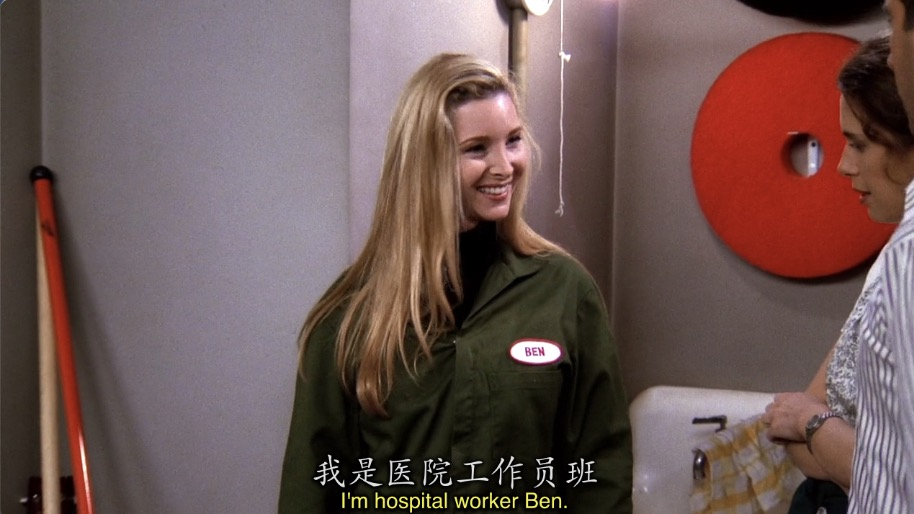

---

你醒啦2.0(1.0在Episode 8)

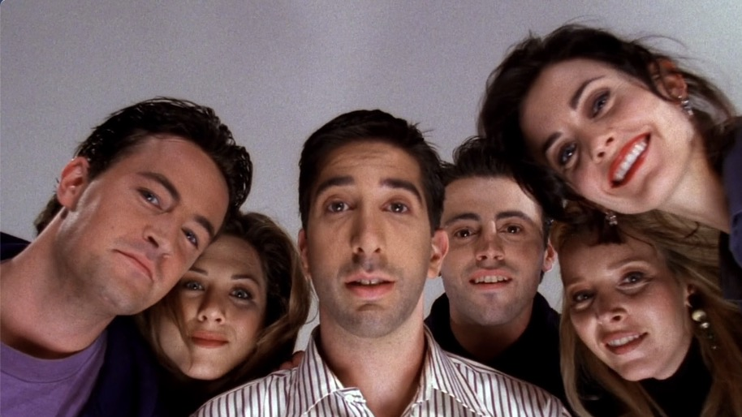

---


## Vocabulary

- mucus **n.** 粘液
- arrange **vt.** 整理，布置，安排
- cab **n.** 出租车
- addition **n.** 加法
- additional **adj.** 额外的
- uterus **n.** 子宫
- resent **vt.** 对...感到憎恨
- parachude **n.** 跳伞，降落伞
- cramp **n.** 痉挛
- ironic **adj.** 讽刺的，令人啼笑皆非的
- vent **n.** 出口，通风口，火山口
