# Season1 Episode 24 - The One Where Rachel Finds Out

> 因涉及版权且视频文件过于庞大，不方便上传，希望在阅读笔记之前，自己要有《老友记》的资源
>
> **先将这一集看一遍**，然后再开始根据个人的学习习惯阅读~~

## Key word: Rachel & Ross


## 概要

- Rachel终于知道了Ross喜欢他
- Joey参加NYU的某个research，会发生什么有趣的事呢？


看过美剧的小伙伴应该都知道，

**收视率不错的美剧会续订下去一直拍很多季**。

所以被续订的美剧一般在每一季的结尾都会留下一个非常重磅的情节，但是不会完全演完，只演到一半一般是，

这样就会让观众意犹未尽开始期待下一季。


所以`老友记`作为当时爆火的美剧肯定是被续订很多季的，作为第一季的最后一集，肯定也会来点**猛料**。

标题是`Rachel Finds Out`，也就是说Rachel真的意识到自己也喜欢Ross了。

那么Rachel 和 Ross的关系会何去何从呢？ 继续往下看吧～

## 正文

---

这一集一上来就给出Rachel靠在Ross肩膀上看Ben的照片，而Ross则有点被Rachel迷的不知道自己是谁了

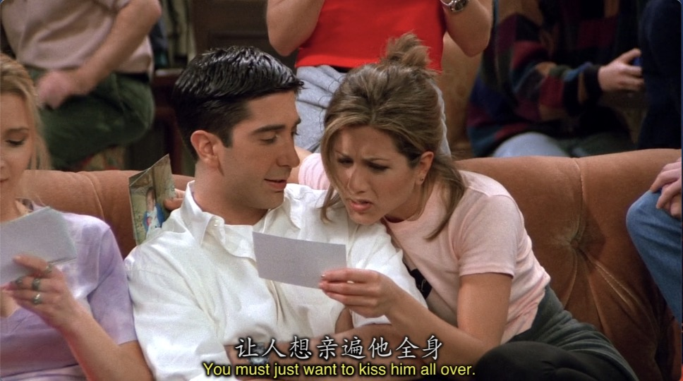

---

```
Joey: Hey Chan, can you help me out here? I promise I'll pay you back.

Chandler: Oh yeah right, including the waffles last week you now owe me 17 jillion dollars.
```

- `help me out here`在这里的意思是`帮我付一下钱`。但我感觉这句话不光光能代表付钱的意思，因该是想对`泛指帮我逃出现在的困境`。
- `pay sb back`意为`还某人的钱`当然真的也有这种表达`return someone's money`
- `jillion`在这里太像`million 、 billion`这些量词了。**`但jillion不是量词`，只是一个`表示数量很多的`泛指的词，没有具体的数量**

---

```
Chandler: Where's the money coming from?

Joey: I'm helping out at the NYU medical school with some uh... research.

Ross: What kind of research?

Joey: Uh...just, you know, science.
```

在国外有很多大学的科研项目需要志愿者参加，

而且因为在国外大学本身是私立的，老师带领的研发团队拿到校方审批的资金之后就能独立研究。

需要志愿者参加的项目也都是会给钱的，而且给的不少。

大家一听Joey有点吞吞吐吐都更好奇了。

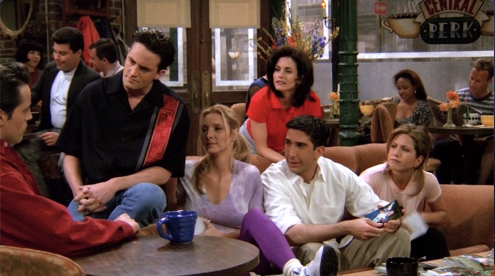


```
Joey: It's a fertility research.

Monica: Oh Joey. Please tell me you're only donating your time!

Joey: Come on you guys, It's not that big deal!

      I mean I just go down there every other day and make my contribution to the project.

      Hey! At the end of two weeks, I get $700.

Phoebe: Wow, you're gonna be making money hand over fist.
```

- 众人一听是一个跟`fertility: 生育`相关的研究，都秒懂Joey参加的是什么research了。(不要告诉我你不懂)
- `hand over fist`
  - `fist`是`拳头`的意思
  - 而`hand over fist`最初是形容`船🚢靠岸船员把船上的绳子丢到岸上，岸上的人抓住绳子开始拉的情景`。当拉绳子的时候，手就像一个拳头一样
  - 但是`hand over fist`在现在多数是用来表示`快速，迅速`,而这种快速一般都是用来表示`挣钱，赔钱`之类的活动
  - 所以这么解释Phoebe的话可谓一语双机。第一个是代表Joey做这次research时的动作(当然Joey握住的不是绳子),第二就是说Joey来钱快。

---

```
Monica: Well, What does she think of your little sience project?
```

- `think of sth.`在这里表达的意思是`对...有意见`

---

Ross因为博物馆的事要去China了(众所周知Ross在博物馆上班，你们不会忘了吧)

```
Ross: Hey, I have to go to China.

Joey: The country?

Ross: No, this big pile of dishes in my mom's breakfront.
```

- 这里Joey的回答是因为`China`这个词是有两个意思的(我知道你们知道), 都是名词
  - 瓷器，陶瓷
  - 中国

---

Joey因为参加研究项目在两个礼拜内不能和在私底下有单独的性生活。

Joey在上面是这么表达这句话的`I'm not allowed conduct any personal experiments.`

但是Joey新谈的女友不知情，所以觉得`tonight is the night.`

Monica就想给Joey支招(Monica真的很在乎其他几个人，每次都能理性的给出意见)。Monica是这么说的

```
Monica: So, uh, have you ever thought about been there for her?

Joey: What do you mean???
```

我承认，我前几次看根本没有看懂这里，只是这次看得仔细，观众的笑声引起了我的注意

仔细品了一下才懂，秒懂的同学好好反思一下

- `have you ever...`典型的现在完成时的`问句形式`
- `been there`其实就是在指`having sex with her`
- `for her`就很值得揣摩了，我们知道`for`能表示`为了`的意思
- 所以连起来就是，嗯。

但Monica毕竟不能直说，这种说法Joey一辆懵逼😂

---

Rachel在拆自己生日礼物的时候

Chandler送的是那种类似大富翁的拼图，Joey送了一本儿童读物

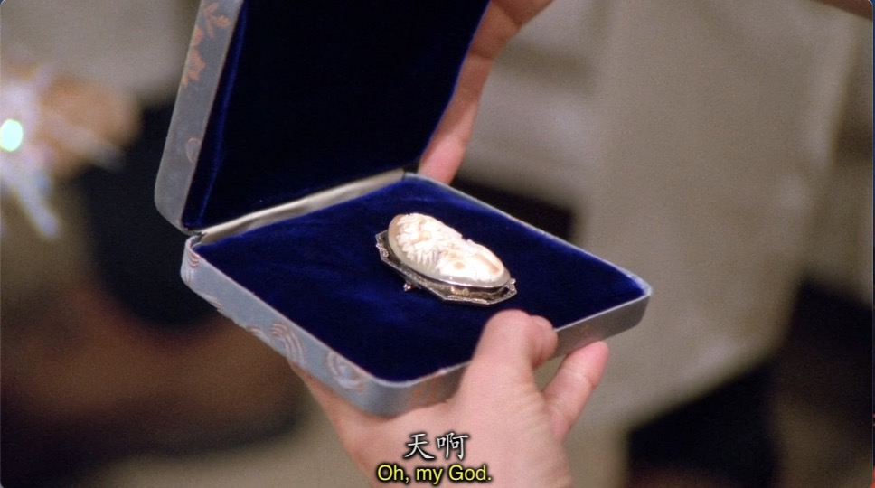

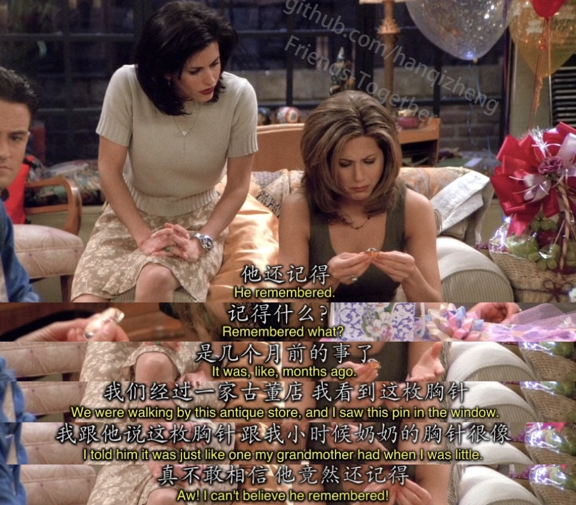

从我个人的角度理解，Ross是真的喜欢Rachel，不管是之前Rachel靠在他肩上他就神魂颠倒的

还是现在能记得Rachel几个月前说过的话喜欢的东西

---

```
Monica: I can't believe he did this!

Chandler: Come on, Ross? Remeber when he fell in love with Carol

          and bought her that ridiculous expensive crystal duck?
```

Chandler不小心说漏了嘴，终于让Ross对Rachel的感觉浮出了水面。

---

```
Rachel: OMG, this is unbelievable!

Phoebe: Yeah, it's really huge!

Chandler: No it's not! It's small. It's tiny. It's petite. It's wee.
```

- 跟着Chandler的狡辩来学几个`小`, small和tiny就不说了
  - petite **adj.** 娇小的
  - wee **adj.** 很小的 ｜ **vi.** 尿尿
 
---

到这里其实我才意识到，Ross喜欢Rachel这件事只有Chandler和Joey知道，其他人根本不知道

Rachel听了之后决定追到机场去和Ross见一面，即使她不知道去了之后说些什么。

注意Phoebe这个手势！看看是什么！！

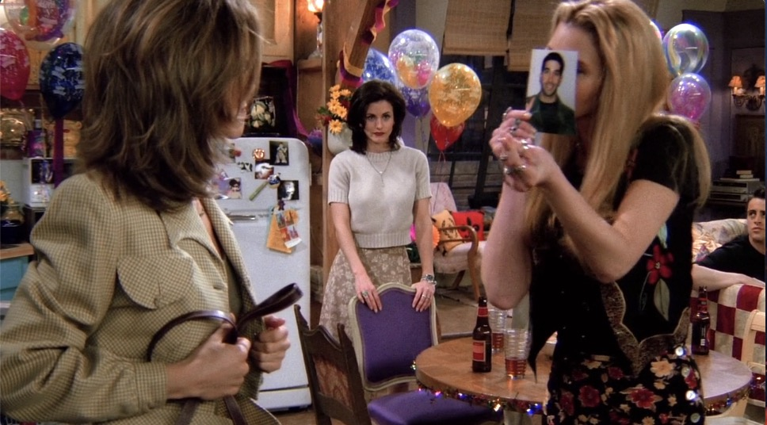

看不清楚给你们换个角度！！

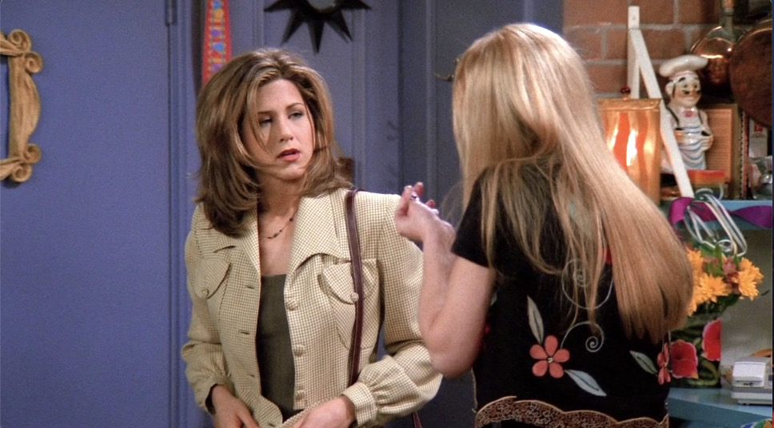


没错就是`比心`的手势！！这里是1995年，Phoebe就做了这个手势！

---

好的，Rachel和Ross这段各种错过，各种分分合合的恋情从这里就开始了

第一段错过

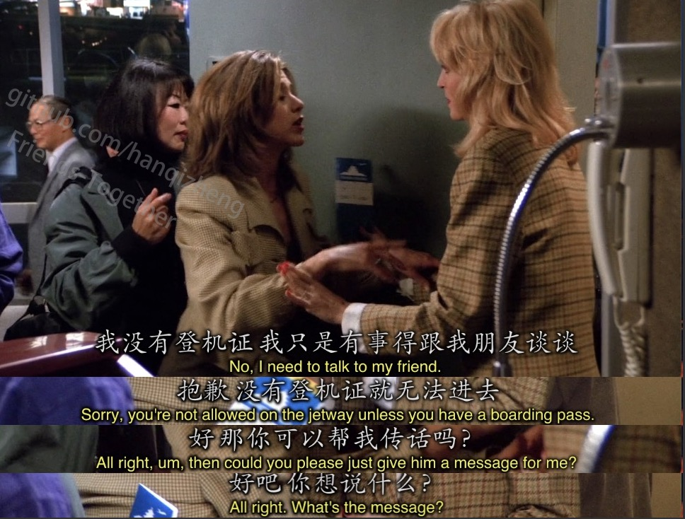


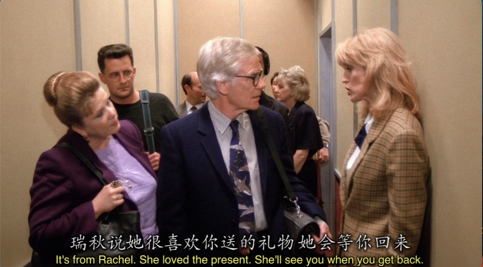


就这样， Ross去了中国，而Rachel的话也没传达到

---

```
Melanie: Oh Joey, Joey Joey, I think I blacked out there for a minute.
```

- 在[Episode 7](../Season1/Episode7.md)中我们学到了`black out`意为`停电`
- 但是其实`black out`还有一个比较生僻一点的意思`昏倒， 昏厥`

根据Melanie的反应我们可以得知，Joey真的`be there for her`了。

---

本来还在犹豫不决的Rachel，在和别人的约会上却不停的想到Ross，

这段和Ross的对手戏是Rachel内心的想法

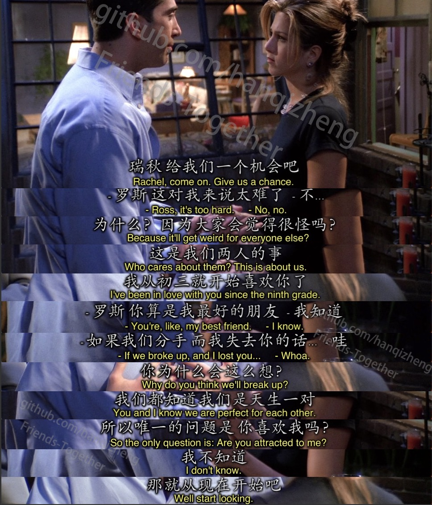

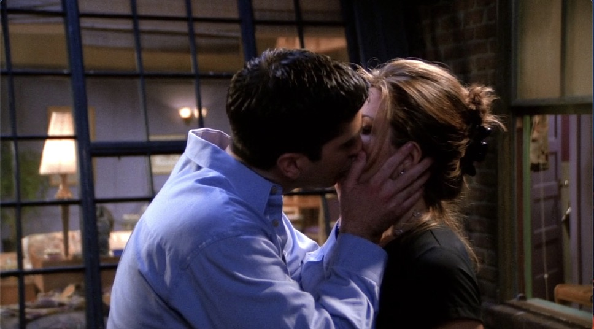

而最后Ross和Rachel的这一吻(醒醒别看呆了，这只是假想的)，让Rachel彻底明白她也喜欢Ross

只是她俩是非常好的朋友，她害怕如果有一天分手了他们就会失去彼此。

真曲折啊，到现在，两个人还没有走在一起。

---

Rachel打断了正在进行的约会去机场接从中国回来的Ross

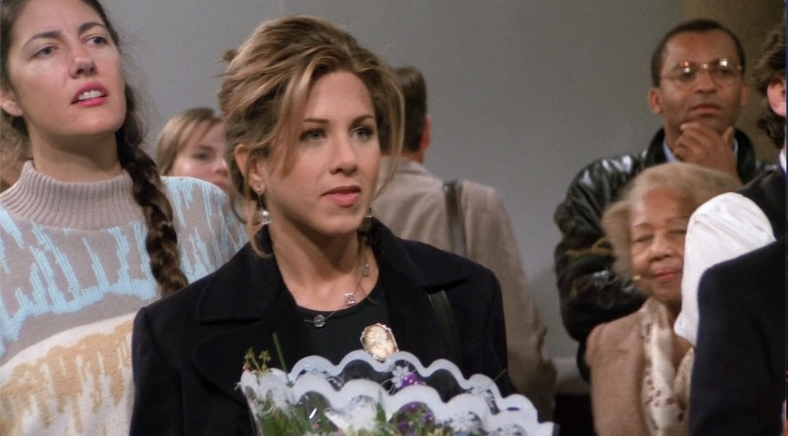

可是等待她的却是

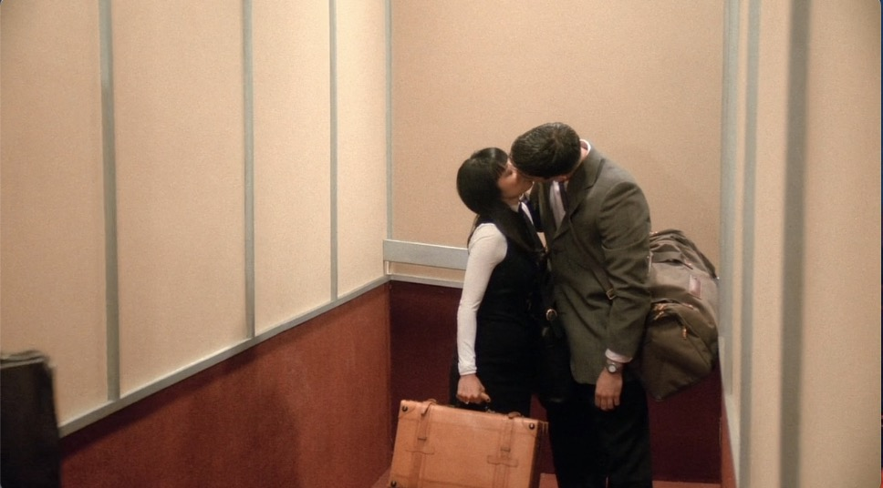

---

果然啊，在一季的最后一刻，还是给我们留下了足够的悬念

Rachel在机场看到Ross和他的新女友会怎么做呢？会跟Ross说明自己的心意吗？

那么Rosshe和Rachel最后会走在一起吗？？

欲知后事如何，请听下回分解。


## Vocabulary

- nod **n.** 点头，同意，对...的认可 ｜ **vt. & vi.** 点头
- fertility **n.** 生育能力的，生育，繁殖力， 肥沃
- conduct **n.** 行为，处理，实施 | **vt.** 为...做向导， 处理，安排
- itinerary **n.** 旅行日程
- petite **adj.** 娇小的
- wee **adj.** 很小的 ｜ **vi.** 尿尿
- mute **adj.** 沉默的，缄默的，哑的，无声的


## 小插曲

如果一直关注这个仓库的你(醒醒，没人看)一定能发现24集的第一季我用了一年零一个月

当然期间经历了毕业、找工作、工作等

但其实有段时间一度的不想写下去了，觉得写这个东西没有用，也没人看，写的内容也总觉得干涩没营养

但是老友记是我的`人生圣经`

也许你会说把一个情景喜剧当成自己的人生圣经有点ridiculous

其实这里面含有太多太多值得我去学习，去思考，去向往，去努力的地方

**这也是为什么我坚持写下来的原因，我想把我对老友记的理解分享给大家，也许英语学习也就看一乐呵，但是能从中对自己今后的生活有那么一丁丁点的启发或推动，那么就没有白写。**

当然在接下来的生活里我还会经历种种无法预测的事情，不想坚持下去的想法也绝对会再出现

在这里希望自己还能继续去完善，坚持下去。

我们第二季结尾见吧～
