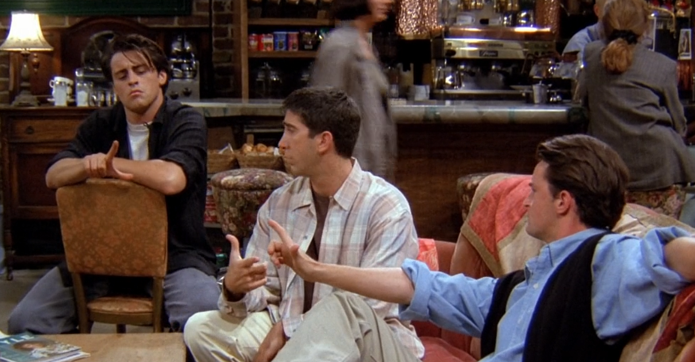
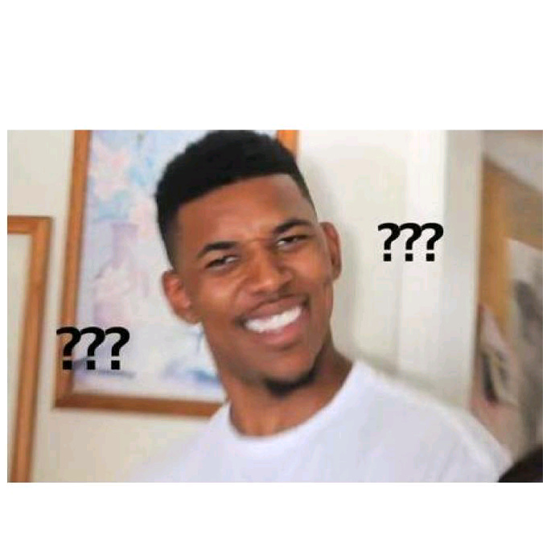

# Season1 Episode3 - The One with the Thumb

> 因涉及版权且视频文件过于庞大，不方便上传，希望在阅读笔记之前，自己要有《老友记》的资源
> 
> **先将这一集看一遍**，然后根据个人的学习习惯再开始学习~~

#### [干货传送门](#id)

**本集关键词：mean**

## 正文

Alright, 今天第三集的开场段子又是一节`小葵花恋爱课堂`。

```
Ross: Oh, How did it go?

Phoebe: Um, Not so good, he walked me to the subway and said "we should do this again."

Guys: "Oh, no~"

Rachel: What?! He said,"We should do it again." That's good right?
```
Phoebe走进咖啡店Ross问他`今天那件事咋样啊？`

- `How did it go?`直译`它咋走的？`，就是它（指你想要问的事情）何去何从了？走到哪一步了？进展的如何？

---
  
Phoebe的话让Rachel一脸懵逼，明明说`We should do it again. 我们应该再来一次约会。`，但是Phoebe却说事情进展的不好。然后接下来说的每一句都要记在小葵花课堂笔记本上！

```
Monica: Eh, no! Loosely translated "We should do it again",
        means:"You'll never see me naked."

Rachel: Since when?

Joey: Since always! It's like dating language, you know,
      like "It's not you" means "It is you."

Chandler: Oh! "You are such a nice guy" means "I'm gonna dating leather-wearing alcoholics
          so complaining about them to you."

Phoebe: Oh! you know, "I think we should see other people"
        means "haha, I already am!"
```
大家纷纷罗列出了一些恋爱的`潜台词`，其实还有很多，但是骚年，醒醒，你来这里的目的不是学习黑话的，是学习英语的。

- `loosely translate`表示`大概翻译一下`，`loose`是`adj.`意为`松的，宽的，模糊的`也有`v.`意为`释放，不受约束的表达`的意思。而`loosely`作为一个副词修饰一个动词可以表示`粗略的做某事`
- `complain to sb about sth`表示`像某人吐槽某事`，这里Chandler这句话的意思是，如果你听到`你是个好人这句话`，就相当于`你是一个愿意听我抱怨跟穿着皮衣的酒鬼约会的那些事的好人，而且你现在在和我约会`。

---

```
Rachel: So, everybody knows this.

Joey: Oh yeah~ Cushions the blow.
```

- `Cushions the blow.`直译是`减轻缓冲`，其实可以理解成`善意的谎话`。

---

```
Chandler: Yeah, it's like when you were a kid, your parents put your
          dog to sleep and they tell you it went off to live on some farm.
```
紧接着这句话证实了`Cushions the blow.`的意思。

- `put your dog to sleep`在这里不是`让狗睡觉`的意思，而是`给狗注射安乐死`。所以我们也学到一个相对委婉表达`死`的句式，但是不确定是否能用到除安乐死以外的场景。

---

镜头给到Chandler帮Joey对台词，但是剧中有用到香烟的道具，这勾起了Chandler的烟瘾。

Chandler的人物设定上有一点就是他有`戒烟，且戒烟成功的经历`。

当然勾起烟瘾是为后面的故事做铺垫。

---

镜头回到Central Park，Monica说了一句话，做了个动作，不知道你是不是秒懂~~


```
Monica: They say it's the same as the distance from
        the tip of a guy's thumb to the tip of his index finger.
```
注意这里还专门说明了`guy's`，而且讨论的话题和`distance`有关，嗯，你一定秒懂了~~~

然后众人开始比划



```
Joey: That's rediculou rediculous！
```
哈哈哈哈哈，Joey这么激动是有原因的，后面的剧集会说到Joey的脚和手都很小，那么这次他这个distance自然有点短了~

- `thumb`,`index finger`,`middle finger`,`ring finger`,`little finger`分别是五根指头对应的英文。而这里专门说到和手指有关的话题是因为这一集叫做`The one with the thumb`。

---

就在大家讨论尺寸的时候，Phoebe气冲冲的走进来

```
Phoebe: @#$18*32... It's my bank!

Monica: What did they do to you?

Phoebe: I'm going through my email and I open up their monthly
        you know, statement! And there are extra $500 in my account.

Chandler: Oh~ Satan's minions at work again.
```
原来是自己账户里不知不觉多出来500美元。

- `go through`在这里翻译为查阅，浏览，其实在前面的笔记中也有提到过`through`这个词，是一个很地道的表达进度的词汇，表示`完成`,还可以很形象的表示某种有过程的动作。
- `Satan`意为`撒旦`，是西方神话里一个很坏的恶魔？？？我不太懂
- `minion`意为`仆从，走狗，宠儿`，但是需要注意的是这个词是`贬义`的，多半是坏人的仆从或者走狗。

---

```
Phoebe: Yeah, Cuz I have to go down there and deal with them.
        It's not mine.
        I didn't earn it, If I kept it would be like stealing.

Rachel: Yeah, but you could spend it, it will be like shopping!
```

Phoebe表示自己不能要这笔钱，因为不是自己的，如果留下感觉就像偷窃。

然后Rachel这个逻辑笑死我，你可以花了他买点东西，那样你感觉就像是在Shopping了~~

---

就在大家都讨论Phoebe这笔钱该怎么办的时候，Monica发现Chandler的行为诡异

```
Phoebe: I couldn't believe you!
        You've been this so good for 3 years!

Chandler: And this is my reward!
```

- `you've = you have`是一个简单的现在完成时，现在完成时表示从过去持续到现在的一个事情，是一个有时间段的，在这里Chandler戒烟已经持续了3年了。可以看到后面紧跟着`for 3 years`。

---

在上一集Monica经历了Paul the wine guy的打击以后，不是很想让朋友们见到自己的男朋友，因为朋友们会和村里人一样围着她男朋友问东问西。

镜头到这里Monica要走，朋友们都问她和Alan的进展，且多会能介绍给他们认识

Monica的回答自然是never

```
Monica: I don't even know how I feel about yet.
        Just give a chance to figure that out.
```

- `figure it out`是一个非常地道的口语表达，表示`想明白，弄个清楚，理解`之类的意思，而且这里有一个连读,可以切回视频感受一下。

--- 

来到Monica工作的地方，在这里我们可以听到一些还算有点黑人味儿的黑人腔。

```
Monica: Why should I let them to meet him?
        I mean, I bring a guy and within 5 minutes they're all over him!

黑妹: Listen, as someone who's seen more than her share of bad beef.
      I'll tell ya, that's not a such terrible thing!
```
就听黑妹说话就能很明显的感觉到和Monica等众人有着完全不一样的语气，音调和节奏，真的很带感。。。

- `tell ya`，就是一个典型的黑人语气，还有很多，如果你经常听rap的话，会很了解这类缩写(没有任何种族歧视)
- `they're all over him!`在这里翻译为`围着他问个不停`。其实看字面意思是`都爬他身上了，其实就是一直追着他的意思`。

---

```
Monica: I just wish that once I bring a guy home they actrally liked.

黑妹: Well, you do realize that the odds of that happening are little slimmer
     if they never get to meet the guys.
```
Monica表示很难受，每次带回去的男朋友他们总是会找到不喜欢的点，她真的希望能找到一个朋友们都喜欢的男朋友。

其实说到这里，可以看到Monica把朋友们的观点看的很重要，把朋友们看的很重要，她也希望朋友们能喜欢自己的男朋友。但其实，boyfriend/girlfriend是找给自己的，不是找给朋友的，只要不是互相有仇，其实没必要太在意别人的观点。

- `odd`表示`古怪的，奇怪的`。
- `slim`意为`细小的，细长的`,表示几率小其实可以不要老是用`small`，这里的`slim`就是一个很地道的表达方式。`little`后面跟比较级表示更少的怎么怎么样。
- `you do realize`这句话看起来有两个动词了，但其实不然，这里的`do`是起强调作用的，这是一个很常用的强调表达方法。

```
// example

I do like you!
```

---

这时后回到Monica的公寓，Chandler还在吸烟！！

Phoebe这时候走进来（这时候的Phoebe真的是青春无敌啊，这时候她的打扮也很好看，到了后面总觉的Phoebe的打扮有点老气）还是很生气的那种，因为。。。。

```
Phoebe: "Dear Miss.Buffay: 
              Thank you for calling attention to our error.
              We have credited your account $500.
              We're so soory for this inconvenience
              And hope you'll accept this football phone as our free gift!"
        
        Do you believe this? Now I have $1000 and a football phone!

Rachel: What bank is this??
```
哈哈哈哈哈哈，因为Phoebe指出银行的错误，银行为了表示歉意不仅没有收回那500美元还又送了她500美元和一个football phone。

这时候我的表情就是：


这是什么神仙银行？？？？

---

Monica 在把男朋友Alan带回来之后焦虑的等待着朋友们的意见。

```
Monica: Okay, let's the Alan-bashing begin.
        Who's gonna take the first shot?
```
- `Alan-bashing`可以翻译成`Alan的批评大会`。`bash`意为`猛击，痛击`这类敲打的意思。
- `take the first shot`是一个很地道的表示`谁起个头`。

但出人意料的是大家都特别喜欢Alan，但这个时候Monica心里犯了嘀咕，其实自己和Alan并不是那么来电。

--- 

Phoebe不愿意要这么一大笔横财，所以决定给路边的乞丐，乞丐为了报答她决定请他和一杯赢料。结果，饮料里喝出一根大拇指。。。。。

---

画面给到Chandler在公司偷偷吸烟，这一部分很有意思是采用了默剧的形式，没有台词，只有演员的动作，神态上的变化再配上应景的BGM就会有很棒的效果。其实这种默剧的手法在后续很多情境喜剧中都有用到。

比如武林外传的短过长就是，还有马男Bojack有整整一集是Bojack来到海底参加某个电影展（我记不太清了）。

都是非常有表演性，和可看性的。

---

因为指责Chandler吸烟Chandler表示不公平不服气。

```
Chandler: This is not fair!
          So I have a flaw, big deal?
          Like Joey constant knuckle-cracking isn't annoying?
          And Ross with over-pronouncing every single word?
          Monica with that snort when she laughs. What the hell is that thing?
```
这下子Chandler一下子把对大家的不满都说出来了，气氛突然尴尬。

- `flaw`意为`瑕疵，缺陷`，`flawless`则是`无暇的，完美的`所以又学到一个完美，不要再用`perfect`了。
- 这里提到了Ross每个音都发的很准确这个梗

大家因为这个都吵了起来

---

```
Joey: Does knuckle-craking bother you guys?

Rachel: Well, I could live without it.
```
Joey问这个掰手指影响到大家了吗！？

Rachel这里的回答值得我们学习

- `I could live without it.`直接意思为`没了它我也可以活`。其实就是很委婉的表达了确实影响到了。很地道，很委婉，学到了吗？

---

```
Rachel: The hair comes out and the gloves come off?
```
- 这里是有什么典故吗？表示`有人露出原形了，说了实话了。`当然前面的`hair comes out`可能和Phoebe吃头发有关。

---

再回到主线剧情，Monica想要dump掉Alan，但是顾及到朋友们的感受有点犹豫，但最后还是这么做了，

然后大家纷纷表示不理解，Alan就像洗脑了一样把其他人都迷住了。

而Phoebe因为举报可乐里的大拇指得到了$7000.???????可能好人有好报吧。

<span id="id"></span>
## 干货

**全部干货需要详细阅读全文**
- `mean`这个词在口语中非常的常用，多是`I mean`这样的短句，和`you know`类似，可以作为一个语气助词，没有什么实际的含义，或者表示`我是说， 我的意思是`，这样的含义。
  `mean`还有一个形容词的意思`刻薄的，残忍的`。比如`Why are you so mean?`这样的用法。当然，这么说一般是女生，男生说这句话会显得有点娘。。。

### vocabulary
- lossely **adv.** 松散地， 蓬松地，轻轻地
- minion **n.** (贬义)奴婢，仆从，走狗
- slim **adj.** 细长的，微小的
- bash **vt.** 痛击，猛击，重击
- cushion **n.** 垫子，起保护作用的事物 **vt.** 使免受伤害
- kunckle **n.** 指关节， 膝关节
- gloves **n.** 拳击手套， 棒球手套，手套
