# Season1 Episode4 - The One with George Stephanopoulos

> 因涉及版权且视频文件过于庞大，不方便上传，希望在阅读笔记之前，自己要有《老友记》的资源
> 
> **先将这一集看一遍**，然后根据个人的学习习惯再开始学习~~

关键词`magic beans`

#### [干货传送门](#id)

## 写在前

停更了几天，因为自己突然变丧，再加上论文查重之类的事情。

我在考虑要给内容进行一次改版了，因为这样讲总觉得缺了点什么。但是我还没有想到好的改版方案，如果你与什么意见一定要告诉我。

提issue，提pr都好。

正是桑的时候看到这一集还是挺感触的，有的时候你不得不相信一些冥冥之中。恰恰就是这一集。

## 正文

这集的知识点感觉会少一些，但是这一集传达出一些我觉得蛮鼓舞人的东西。

Alright， let's begin!

---

```
Phoebe: If I were omnipotent for a day, I would want uh... world peace,
   no more hunger, and good things for the rain forest,
   And bigger boobs!!
```

哈哈，典型的Phoebe式回答，总是那么的脱离现实而又略显古怪。。。

最后的这一句bigger boobs也许是Phoebe这么奇怪但是还让大家觉得如此正常的原因吧。（我的意思是她也有常人的一面）

### 虚拟语气

这里要注意这句`If I were...`,这里要带出一个知识点就是`虚拟语气`。记得简直是上学那会的噩梦。。。。
但是其实虚拟语气并没有那么难。先来看看下面这个表格。


但是有的时候你会发现，很多时候的虚拟语气和这个表格`并不一样`，但人家语法什么也都对，意思也完全没有问题。那是怎么回事呢？

先来看看`虚拟语气的定义`：
> 虚拟语气主要用来表示假设，而非客观存在的事实，所陈述的是一个条件，不一定是事实，甚至完全与事实相反。虚拟语气通过谓语动词的特殊形式来表示。英语中的语气分为陈述语气、祈使语气、虚拟语气、疑问语气和感叹语气五类。虚拟语气表示说话者做出的假设而非事实，或难以实现的情况，甚至表达彻底相反的概念。此外如需表达主观愿望或某种强烈的感情时，也可用虚拟语气。

那么这个时候给出一个很经典的台词，那就是佟掌柜的：`额错咧，额真滴错咧，额从一开始就不应该嫁过来，如果额不嫁过来，额滴夫君就不会死，如果额滴夫君不死，额也不会沦落到这么一个伤心滴地方....`

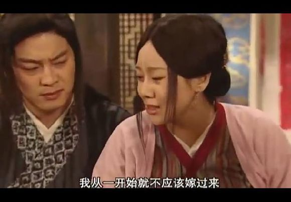

这就是一个典型的中文环境下的虚拟语气。在这里不可能给大家讲完所有的虚拟语气情况，我也都还没有掌握。。。

但是一些简单的虚拟语气大家是可以很容易就判别的，比如`If I were a boy~`这是碧神的经典歌曲，这就是一个很典型的虚拟语气。

大家可以发现一个共同的地方就是，**会有一个词叫做`If`**，这就是很多情况下虚拟语气的一个先行词。

而下面一个共同的地方就是`I 后面跟着的是were, 而不是was`，这也是虚拟语气的另外一个特点。

具体详细的虚拟语气大家可以参考这篇文章，我个人感觉不错。

[虚拟语气到底是什么？](https://www.zhihu.com/question/23983035)

---

```
Chandler: If I were omnipotent for a day, I'd make myself omnipotent forever!

Rachel: See, There's always one guy.
        If I had a wish, I'd wish for three more wishes!
```
- 这里Chandler又来了一句虚拟语气，和上面一样
- Rachel这句虚拟语气是另一种情况就是`had`存在的。具体还是看看那篇文章。我在这里就不做赘述。（主要我也讲不清。。)
- `There's always one...` 可以作为一个很地道的固定句式来使用，表示`总有那么一类...`,很好用。

---
```
Monica: Joey, What would you do if you were omnipotent?
Joey: Probobaly kill myself.
Monica: ?????
```
- Joey这里把`omnipotent`这个词听成了`impotent`
  * `omnipotent`, **adj.** 全能的，权力无限的。
  * `impotent`, **adj.**, 无力的，虚弱的，性无能，阳痿

Joey真的是傻的可爱额。。。。

---

镜头给到Central Park，Monica和Ross看着熟睡的Phoebe表示吃惊，怎么能在公共场合就睡着了？？
```
Monica: She looks so peaceful!
```
在这句话之后Phoebe突然惊醒把Monica下了一大跳，其实这个时候你仔细看Phoebe的表情，`她有点笑场了！！`

---

```
Phoebe: I had no sleep last night. My grandmother has a new boyfriend
        and they're both kind of insecure in bed so...
        And deaf!!
```
惊呆了。。。grandmother还New boyfriend，是麦奶吗？
- `insecure`, **adj.** 不安全的，不稳定的，摇摇晃晃的。这里insecure用来形容他们两位老人家就是说他俩在床上摇呀摇，嗯，画面出来了吧？所以，insecure是一个很传神的词呢。

---

```
Joey: See, I told you. Less than 100 steps from our place to here.
Chandler: You got way too much free time, man!
```
- `you got way too much free time!`很地道的一句表达`你真是太闲了！`。`you got way too much...`，可以很地道的表示`你真是太...`。

---

```
Joey: Come on Ross!
Ross: Alright, maybe it will take my mind off it.
```
- `take my mind off it.`直译就是`把我的想法从那拿走`,是一句很棒的表达`遗忘，忘记的句子。`

---

这时候镜头给到欢呼雀跃的Rachel，也到了这集的主线部分，`Rachel`拿到了自己的第一份工资。
```
First paycheck
```

- paycheck表示`工资支票`。

但是随后拆开信封的Rachel发现。。。

```
Rachel: And it was totally not worth it.
        who's FICA, why he getting all my money?
```
发现自己的工资交了好大一笔税。是真的！！当拿到第一笔工资看到那么多税我感觉我被g**o j*a抢劫了。

- FICA = Federal Insurance Contributions Act 联邦保险捐助条例

---

随后Rachel的老朋友们来这里找他，真的是很鲜明的对比，她的那些朋友都还是靠着父母的资本过着上流社会的生活。

结婚的结婚，怀孕的怀孕，升职的升职。而反观Rachel，正在位自己拿到的第一笔被FICA抢劫完的工资而难受。


朋友们还以为Rachel只是因为逃婚才暂时离开家里，没想到Rachel却在内心悄悄决定要一直留在这里不会回家了。

回到家里的Rachel端起Monica制作的鸡尾酒就喝了起来，可以看到她现在真的很焦虑，很迷惑。

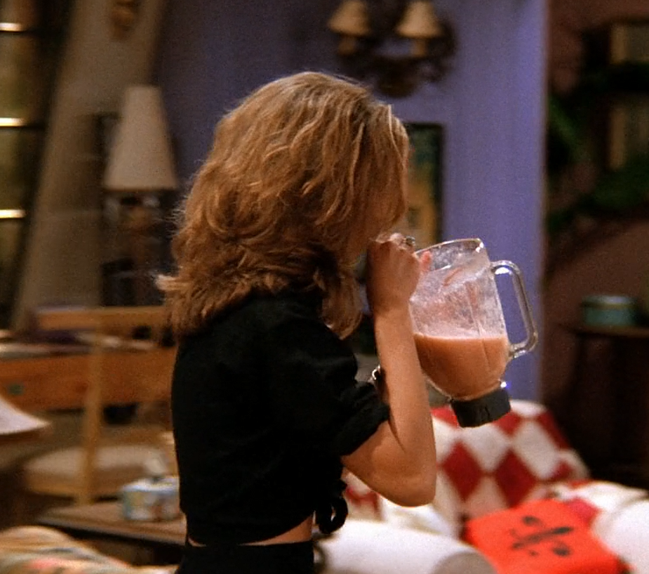

---

信用卡公司这是后打来电话询问Rachel最近过的还好吗？

不是？美国信用卡这么好的吗？还会关爱客户，为什么我的信用卡银行只会给我推销各种保险和理财？？？

Rachel这时候有点爆发了。

```
Rachel: Okay, If you wanna know if I'm ok.
        Well, let's see.
        The FICA guys took all my money. Everyone I know is either getting married
        or getting pregnant or getting promoted and
        I'm getting coffee! And it's not even for me!!
        So if that sounds I'm ok, then you can tell them I'm okay. 
```
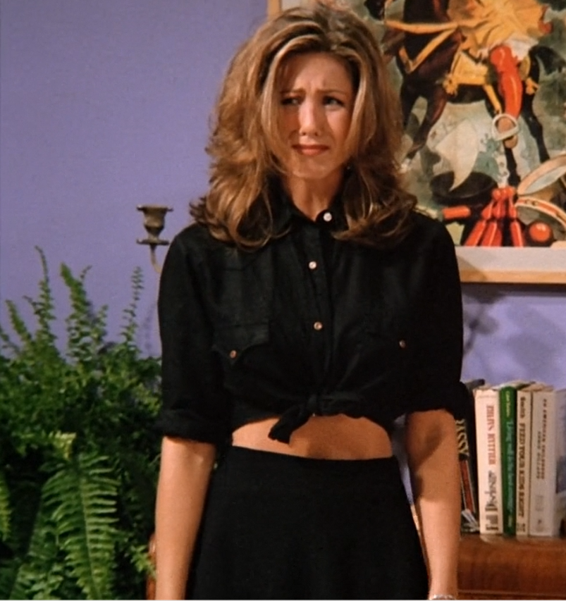

---

```
Monica: You're doing this amazing independent thing!
Rachel: What is so amazing?
        I gave up everything! And for what?
Phoebe: You're just like Jack! Jack and the Beanstalk.
        See, he gave up something, but then he got those magic beans.
Rahel: Okay Pheebs, Jack gave up a cow!
       I gave up a orthodontist.
       I know I don't love him, but it was a plan!!!
       It was clear. And now everything was flupie!
```
这里引出了本集的最关键词`magic beans`。

Rachel说的没错，Jack只是放弃了一头牛，而她放弃了一个`牙医`。我们要知道在美国，是私人医生制度的，就是其实每一家都会有一个专门的医生，你有病就可以去找他，你需要做的是每个月付给他钱，即使你没病。（这段话源于留过学的英语老师，我本人不知现在美国国情是否还是如此）

尤其是牙医，在美国看病时非常昂贵的，看牙医，那是更加贵了，所以一个牙医的收入是非常之高的！！Rachel放弃的可能是一个金龟婿。

而现在的她，根本不知道自己将要何去何从，她亲手撕毁了写好的剧本，而且是很美好的剧情。现在没有剧本了，没有哪个plan了，她根本不知道自己想要什么。自己想要做什么。

```
Rachel: What if we don't get magic beans.
```
Rachel这句话彻底把大家击垮了，因为大家也意识到自己并没有plan，没有计划，然后仨人就这么消沉了。

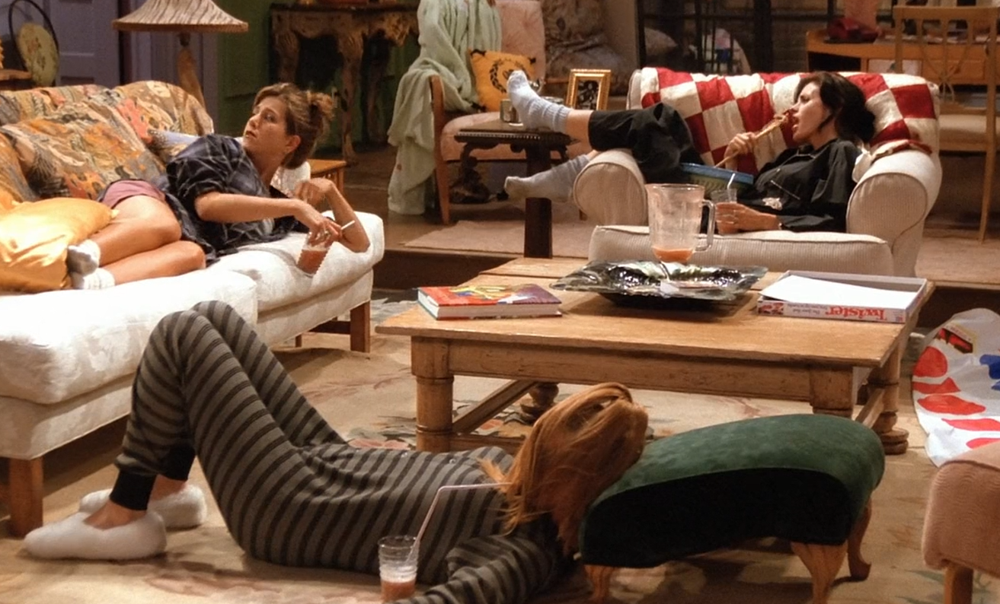

---

到了另一个很精彩的环节，就是女生们评价男生们。这一段真的时有点`预言`的感觉，但是删减掉了。
这里没有多少知识点，所以就直接贴图了。


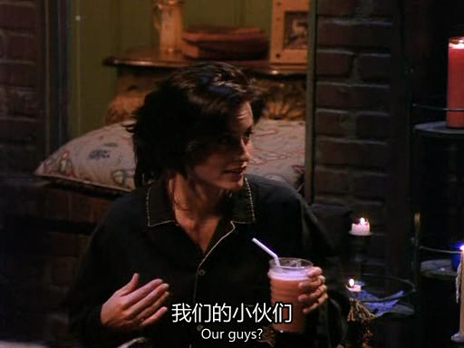

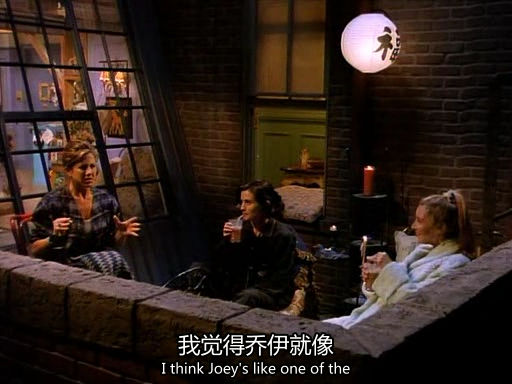
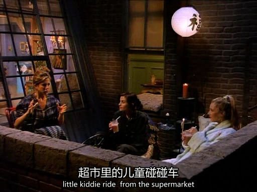
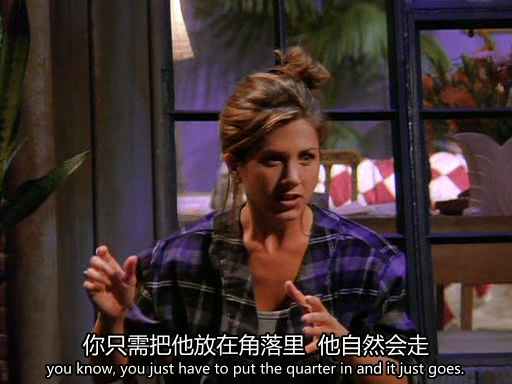
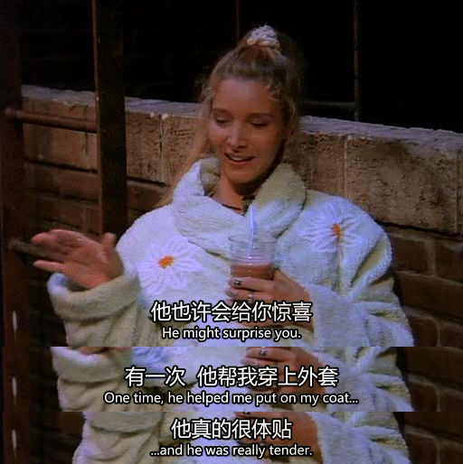

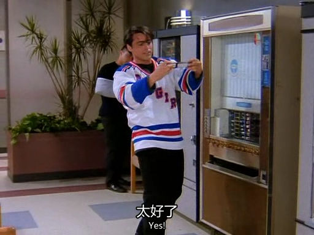
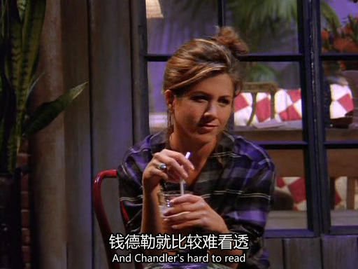


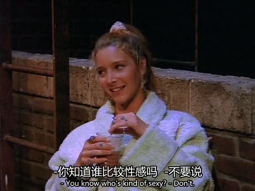
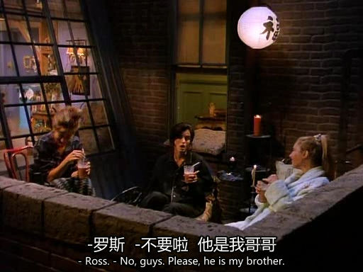
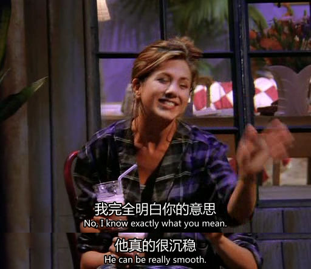


---

镜头切回屋子里，一群人玩的很开心，这时候信用卡银行又打来了电话，问Rachel过得好吗?Rachel看向大家。

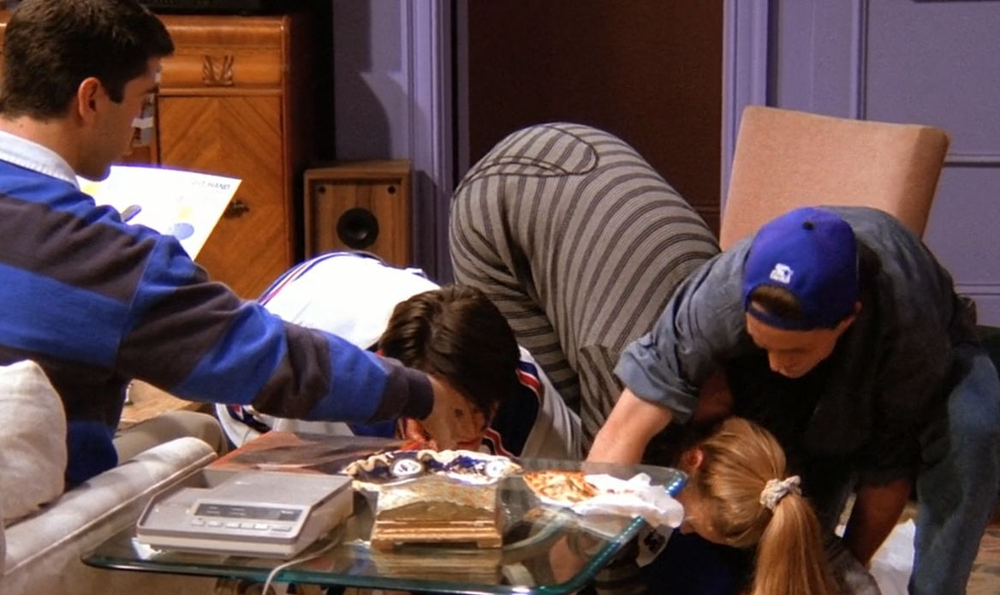

```
Rachel: Thanks, but I'm Okay, really.
        I'v got magic beans.   
```
这句话一出真的有点戳到泪点，不是别的，是羡慕Rachel找到了属于自己的`magic beans`。她舍弃了那么容易又舒适的好生活，得到了这些更加珍贵的朋友们。

---
<span id="id"></span>
## 干货

所以朋友们，我也很希望你们能找到属于自己的`magic beans`。但是别忘了，你要先舍弃掉属于自己的`那头牛`，才能找到。有舍才有得。生活中的我们一定要知道我们想要什么，才能活的明明白白。

有鸡汤就要有毒鸡汤。
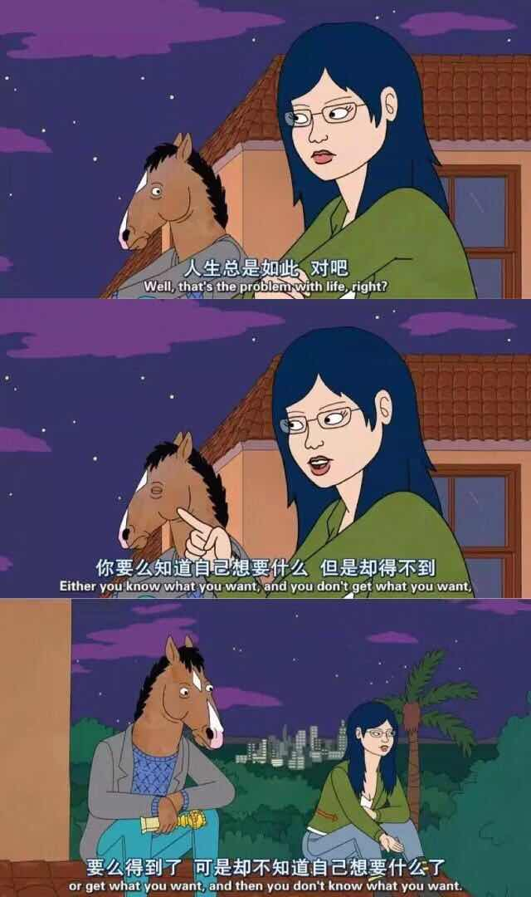

不是为了打自己的脸，是人本来就是复杂的集合体，**我们需要知道我们想要什么。但是这还远远不够**。

## vocabulary
- omnipotent, **adj.** 全能的，权力无限的。
- impotent, **adj.**, 无力的，虚弱的，性无能，阳痿
- apron, **n.** 围裙
- flupie, **adj.** 混乱的，是个俚语
- insecure, **adj.** 不安全的，不稳定的，摇摇晃晃的