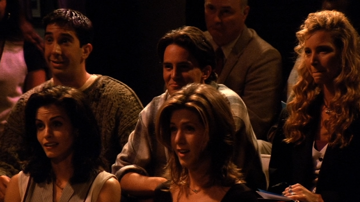
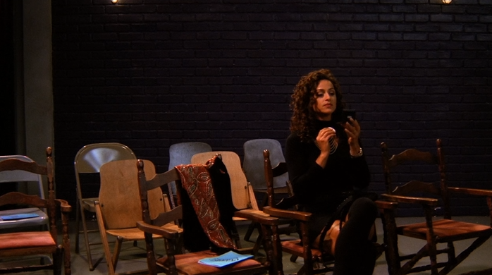
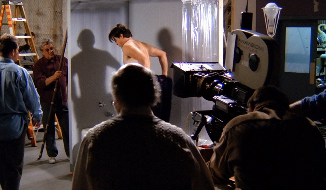

# Season1 Episode6 - The One with the Butt

> 声明：
>       
>      所有内容只用于学习，如有侵权请告知。
>
>      如想转载请标明出处(github.com/hanqizheng)
>      
>      先看一遍原剧集再来阅读效果更佳
> 
>      希望可以Star支持一下😄
>
> 

关键词`relationship`

这一集干货确实不多，就当看个乐子吧

## 正文
```
Rachel: Oh! Look! Look! Look there's Joey's picture!
        Oh god this is so exciting!

Chandler: You can always spot someone who's never seen his plays.
          Notice, no fear, no sense of impending doom.

```

Rachel第一次看Joey的剧，无敌兴奋。激动的给大家指宣传册上Joey的照片。

这时候Chandler的话可以说明他有多了解Joey。 你们通常能`一下子就注意到`谁没有看过Joey的play，你会发现他们根本没有丝毫对即将到来的末日的恐惧感。哈哈哈哈哈哈，可以想象一下Joey的剧是什么样子的。我第一次看这里的时候还以为只是调侃，一会才发现我错了。

- `spot someone/something`意为`一下子注意到某人或某物`，spot这个词有*点*的意思，在众多中聚焦到一点，可以意会为注意到，发现。
- doom这个词其实是带有一定宗教色彩的。主要就是`末日`的意思。如果大家玩过Dota2的话，里面有一个英雄就叫Doom。而他的大招也叫Doom。他在释放大招的时候会说一句`You're doomed.`意为`你完蛋了，你已经是一个死人了`。

---
```
Phoebe: THe exclamation point scares me.
        It's not Freud, it's Freud!

Ross: Shh! The magic is about to happen! 
```
这里一个简单的台词就能看出Phoebe的演技。Freud是一个著名的精神学家，有写过《梦的解析》。所以大家可以看到Joey开场面前有一个沉睡的女子。

- `be about to do`意为`即将...`


---

尬歌尬舞，还带有Joey想模仿的欧洲口音。。。众人当场的表情如图所示



```
Rachel: Oh! I feel violated.

Monica: Did anyody feel like peeling their skin off
        their body to have something else to do?
```
- `peel off`意为`剥下，剥开`
- 
Monica 和 Rachel 心态有点崩了

---
这时候引出本集的一条主线故事就是Chandler和一女子的故事，并且马上引出今天我们要讨论的主题，就是`relationship`。

确实是很漂亮，很有气质的那种。


```
Chandler: Oh! She's amazing!
          She makes the women I dream about look like a short fat bold man.

Monica: Go over to her. She's not with anyone.

Chandler: Oh yeah, right. 
          And what would my openinig line be?
          Excuse me bralblabba~

Rachel: Come on, She's a person. You can do it!

Chandler: Oh please! Could she be more out of my league?
          Ross! Back me up!

Ross: He could never get a woman like that in a million years.
```
Chandler倒是一点都不吝啬赞美之词，这里要注意到这个表达，一个很typical Chandler的表达。`他让我的梦中情人看起来像一个又矮，又胖，又秃的男的。`就是那种幽默中透露着讽刺。。。

众人鼓励其取之。

- `could I be more ...`这个句式是Chandler最最最最口头禅的一句话（这个是被官方吐槽过的），就是在Joey那集和Chandler抢沙发的时候，为了报复Chandler穿上了他所有的衣服，并且说了这句`could I wear any more clothes?`这个句式本身表示`能再更...点嘛？`
    比如你说`Could you be more stupid?`就是调侃对方`你能再傻一点嘛？`
- `out of my league`意为`根本跟我不是一个世界的`。league有联盟，社团的意思。

---

```
Phoebe: But you guys always see these really beautiful woman with really 'nothing' guys.
        You could be one of those guys.
```
Phoebe说话还是那么一阵见血。确实是经常会看到很多漂亮的妹子和很多丑男走在一起，就觉得鲜花插在牛粪上了。（来自单身狗的嫉妒）

而且还顺便把Chandler黑了，哈哈哈哈哈

---
```
Chandler: Oh God! I can't believe I'm even considering this.
          I'm really aware of my tongue.
```
- `consider`意为`考虑，看作，细想`.这里他的意思是`我竟然还敢想这些。`意思是也太癞蛤蟆想吃天鹅肉了。
- `be aware of`意为`意识到，知道。`但这里总不能翻译成我真的非常意识到我的舌头吧。其实就是说，我一定要`注意自己的说辞，注意自己说的话，别乱说。`

---

出人意料的是对方竟然同意和Chandler约会。

这时候镜头转到Central Park，来听听Chandler的约会经历。

得知Aurora不光有hubsban,还boyfriend。众人听了也是惊呆了。

```
Chandler: uh, so what kind of relationship do you imagine us having, 
          if you already have a husband and a boyfriend?

Aurora: I guess mainly sexual?
```

- 没错，我把这句贴出来就是想告诉大家`炮友`的一个清新脱俗的表达方式`mainly sexual`。

---

```
Monica: I'm sorry it did'nt work out.

Chandler: What not work out? I'm seeing her again on Thursday.
          Didn't you listen to the story?

Monica: Didn't you listen to the story?
        How could you get involed with a woman like this?

Chandler: Well, you know I had trouble with it at first too.
          But I get all the good stuff, all the fun, all the talking, all the sex 
          and none of responsibility.
          I mean this is every guy's fantasy!

Phoebe: Oh yeah, that is not true, Ross, is that your fantasy?

Ross: No~ of course not！
      yeah~ it is.
```
听了Aurora又有丈夫又有男朋友，众人安慰Chandler。但是没想到Chandler觉得这样对他来说是百利无一害，这种不用负责任的relationship是所有男人的梦想。

而且得到了Joey的点头和Ross的肯定。

```
Monica: So, you guys don't mind going out with someone else
        who's going out with someone else?

Joey: I couldn't do it.

Monica: Good for you Joey!

Joey: When I'm going out with someone, I need to know
      that I'm going out with more people than she is. 
```
所以Monica把今天的主题引了出来

### **你是否介意和你出去的另一半同时也在和别的人交往。**

其实这一点我的看法是肯定无敌介意啊啊啊，谁喜欢头上顶着青青草原。

但是换个角度想，你和她（他），就只是单纯的炮友，两个人互相不干涉彼此的生活，完全不用谈及责任之类的。听起来，确实很诱人。（我真不敢相信这些话竟然从我嘴里说出来。。。幸亏家里人不知道github）

所以说这个观点，你是怎么看的？

---

另一条故事线是Joey去演一个大演员的`屁股`

没什么知识点可以讲，给大家来张图就ok，演员确实有的时候不好当。



---

```
Aurora: So what do you want?

Chandler: You!

Aurora: You have me.

Chandler: No, not just you, loose the other guys.
          Come on, we're great together, why not?

Aurora: Why can't we just have what we have now?
        I thought that what you want to too.
```

一段对话之后，Chandler也选择了离开。他也认为这样是不对的。

---
再来一段Phoebe暖心的安慰。Joey因为没有演好`屁股`被炒了，很伤心，因为这是第一次他参加这么大的电影。

```
Phoebe: I don't even think you just get one shot.
        I really believe big things gonna happen for you. I do.
        You gotta just keep thinking the day that some kids are gonna run up to their friends
        and say:"I got the part! I got the part! I'm gonna be Joey Tribbiani's ass!"

Joey: You think? That's so nice!
```
注意一个细节就是这里Phoebe说的是things，复数。

## 闲聊

所以归根结底，那种没有任何责任感支撑的，只是建立在两个人欲望上的炮友关系，根本算不上是一段relationship。所以也不要说我们对relationship的态度怎么怎么样。

如果你真的喜欢一个人，你怎么可能舍得把她（他）交给另一个人？所以，一段relationship需要的，不光光是我们彼此的爱，还有无时无刻不想着如何维系这段感情的responsibility。我们要对彼此负责，这才能对得起彼此这段感情。

## Vocabulary
- impending ***adj.*** 迫在眉睫的，即将发生的
- doom ***n.*** 命运，厄运，死亡。主要指不利的，不好的。
- exclamation ***n.*** 惊叹，呼喊，感叹。
- exclamation point ***n.*** 感叹号。
- violate ***vt.*** 违反，侵犯，冒犯
- league ***n.*** 联盟， 社团 ***v.*** 使...结盟
- detergent ***n.*** 洗涤剂，这个词绝对不是我第一次写出来了
- kook ***n.*** <美口>怪人，怪胎，疯子同义还有`geek, nerd`
- obligate ***vt.*** 使...有义务 ***adj.*** 有义务的