# Season1 Episode7 - The One with the Blackout

> 声明：
>       
>      所有内容只用于学习，如有侵权请告知。
>
>      如想转载请标明出处(github.com/hanqizheng)
>      
>      先看一遍原剧集再来阅读效果更佳
> 
>      希望可以Star支持一下😄
>
> 

这一集是很经典的`纽约大停电`。

## 正文

```
Rachel: Everybody, shh! uh, Cenral Park is proud to present the music
        of Phoebe Buffay.

Phoebe: Thanks. Hi, I wanna start with a song that's about
        that moment when you suddenly realize what life is
        really about.
        Okay, here we go.

(Playing guitar and lights off)

Phoebe: Okay, thank you very much.

（At a bank in New York somewhere)

Chandler: What? Oh great, this is just... 
```
这一集是老友记里很经典的一集，纽约大停电，整个纽约都停电了，Chandler被困在了银行，而其他人则是在Monica的家里渡过。这一集主要有两条线，一条就是Chandler在银行与美女路人的邂逅，另一条则是众人在Monica家，Ross想要和Rachel表白。

片头的开始Phoebe刚要表演歌曲则灯突然就黑掉了。让我想起了初中数学老师讲函数讲的那叫个风生水起，抑扬顿挫，然后一抬手，整个班里的灯黑掉了。后得名`巫婆`。

- `be proud to present something`是一个很正式的表达，多用在正式场合向大家介绍什么。意为`很荣幸为大家介绍...`
- Phoebe这句话有点长，我们来分析一下句式，到`song`这里已经是一个完整的句子。`以一首歌开始`。后面的`that is...`是用来修饰这首歌到第是一首什么样的歌的，所以从`that's到about`是一个`定语从句`。但是后面还有，`moment`后面有紧跟了一个`when you...`，这里是一句话来修饰`moment`的。所以有时一句定于从句。`realize`是一个谓语动词，做这个定语从句的谓语，而后面是一个`what`引导的句子，这里就是一个典型的`宾语从句`。

句式复杂不要害怕，分析清楚结构也有助于我们翻译句子。

---

这里也可以看到细节很用心，过场的街景都是停电的样子。


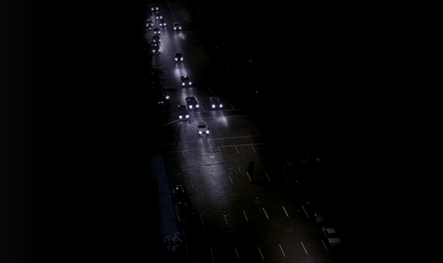

---

```
Rachel: Wow! This is so cool you guys.
        The entire city's blacked out.

Monica: Mom says it's Manhattan, Brooklyn and Queens and doesn't know when it'll be back on.
```
- 这里注意一下停电是怎么表达的。`black out`，黑暗出来了，就是停电了。蛮地道的。
- 还有就是普及一下New York的一些区，就和帝都一样，New York也很大，也有很多区，这里提到的有`Manhattan`,曼哈顿区。曼哈顿是纽约最中心的区域，中央公园，华尔街等都在这里，可以说是美国富人聚集的区域。`Brooklyn`，布鲁克林区，是纽约人口最多的区域。也是华人聚集的地方，但是这里貌似对华人不是很友好。`Queens`，皇后区，是美国为数不多的黑人收入比白人平均收入高的区域。

---

```
Chandler: OMG, it's her.
          It's that Victoria Secret model. Something Goodacre.

Jill: Hi mom, it's Jill.

Chandler: She's right, it's Jill, Jill Goodacre.
          OMG, I'm trapped in a ATM vestibule with Jill Goodacre!
          Is it a vestibule? Maybe it's an atrium?
          Oh yeah, that's the part to foucs on, you idoit.
```

镜头给到银行的Chandler，独自和美女被困在一起，内心戏拉满了。大家可以注意一下Chandler的站位，其实也很能说明这个角色的特点，他内心还是很自卑的。和上一集与Aurora初次见面想搭讪却还没去就已经把自己否定了的时候是一样的。


- 这里要说一个常识，就是`Vectoria Secret`是一个国际上无敌出名的`女士内衣品牌`。因为设计上很时尚，很花哨，已经可以外穿（但其实一般不外穿，我就随便说说）的那种好看。最关键的是他每年都会举办`Vectoria Secret Show`，也就是大家熟知的`维密秀`。
  全世界最顶尖的模特都会经过选拔然后来参加这次T台show。其实在模特界如果你能走一次维密show，就已经说明是一个很国际化且成功的模特了。而且维密每年会邀请很大牌的明星在走秀时助阵。
  最最最最关键的，这个牌子的内衣，是真的贵。

---

```
Jill: I'm fine, I'm stuck at the bank in an ATM vestibule.

Chandler: Jill says vestibule. I'm going with vestibule.

Jill: I'm fine~ No I'm not alone. I don't know, some guy?

Chandler: Oh! Some guy, I'm the some guy.
          Hey Jill I saw you with some guy last night.
          Yes, he was some~ guy~
```
这一段Chandler的内心戏更足了，Jill说这里是vetibule, 他就认为这里是vestibule。Jill就说了一下他是some guy，他就高兴的开始`钱氏尬舞`了。

可以看Jill说他是some guy的时候，Chandler笑的有点可爱。

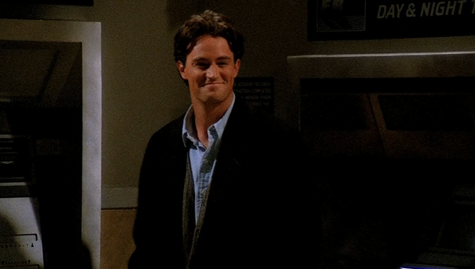

- `I'm going with....`这里不是说Chandler要去哪里，而是意为`赞同，我也支持`的意思。

---

Chandler和Joey的eeeee对话也是笑死。

---

镜头回到Monica这边，大家在玩真心话大冒险

```
Monica: Okay, okay, I'll go.
        um.. senior year of collage, on a pool table.

Ross: That's my sisiter.

Joey: Okay, Okay. My weirdest place would have to be
      the women's room on the second floor of th New York city public Library.

Monica: OMG, what were you doing in a library?

Ross: Phebs what about you?

Phoebe: Oh, um, Milwaukee.

Rachel: Uh Ross?

Ross: Disneyland, 1989. "It's small world after all."
      The ride broken down, so Carol and I went behind of those mechanical Dutch children.
      Then they fixed the ride and we were asked never to return to the magic kindom.

Phoebe: Alright, the weirdest place would have to be 
        the foot of the bed.
```
看到这段话，大家应该能猜出，他们在讨论做在最奇怪的地方做过某种事情吧。也不得不说美帝还是开放啊。

---

故事来到了本集的第二个故事线，Rachel and Ross。

```
Rachel: I've just never had a relationship with that kind of passion.
        Barry wouldn't kiss me on a miniature -golf course.
Ross: You didn't marry him because...

Rachel: Do you think there are people that go through life never having that kind of (passion)?

Ross: Probably.

Rachel: Really?

Ross: But ,you know, I'll tell you something. Passion is way overrated. Eventrually  it kind of burns out.
      
      Hopefully what you're left with is trust and security.
      
      You know for all those people who miss out on that passion thing there's other good stuff.
      
      But I don't think this gonna happen to you. I see a big passion in your future.

Rachel: Ross, you're so great.
```
这段话我们其实可以好好的品一品，语法基本都很简单，但是其含义值得我们每一个人记在小葵花恋爱课堂笔记本上。

Rachel和Barry最后不欢而散，不是一天两天造成的。是生活中点点滴滴积累起来。我们记得Rachel在第一集里看着电视剧里的片段哭着说`That's the diffence.`她不爱Barry，所以才会逃婚。而这里Rachel说到Barry连在迷你高尔夫球场都不愿意亲Rachel一下。可以见得其实Barry也不喜欢Rachel（这个在第二集里Barry也有说`I'm not happy when I with you(Rachel).`）

Rachel对自己未来的感情生活充满了疑惑，觉得有可能一辈子都不会有这种在游乐园make love的passion了。

而Ross安慰道Passion终将会褪去，而留下的才是值得珍惜的。所以有的人一辈子没有Passion也算是一种幸运。但是Ross明显看得出来Rachel很想要那种passion，因为Rachel说的是`never had a relationship with that kind of passion`。所以Ross最后才安慰Rachel说你将来一定会体会到那种Passion的。

---
Joey在旁边作为旁观者都看在眼里。

```
Joey: It's never gonna happen.

Ross: What?

Joey: You and Rachel. Because you waited too long to make your move
      and now you're in 'Friend Zone'.

      Ross, I'm telling you, she has no idea what you're thinking.
      If you don't ask her out soon, you'll end up stuck in that Zone forever.
```

Joey说的是太对了！！！！！我举双手双脚赞成。别问我为什么。

喜欢一个人就跟他/她说吧，没什么不好意思，没什么害怕的。跟对方表明心意是对 对方的尊重也是对你自己的尊重。一直玩暧昧却不敢出手真的很怂。最后错过了还要难受后悔当时为什么不把握。

跟对方成为朋友，真的是把双刃剑，而且是弊大于利的。至少在我这里是。有的时候你俩都成哥们了，就算在一起，也会觉得怪怪的。

Friend Zone真实存在。

而且看看Rachel这记摸头杀，明显是对Ross一点感觉都没有。


---

所以Ross鼓足勇气准备和Rachel表白。The food, The candle, The moonlight


但是一个不速之客的出现彻底打破了这么浪漫的气氛，瞬间爆笑。

Ross的表白之路，也真是坎坷。

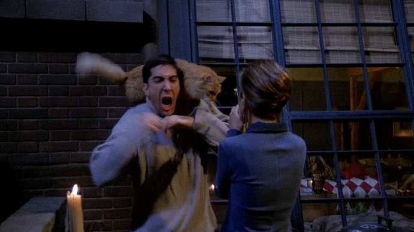

---

给这个不速之客找主人的时候，Mr.Hackle登场了。也是后面某集要说的一个人。

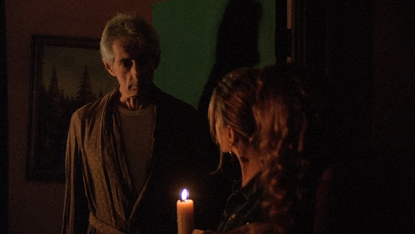

---

下面回到Chandler这边看一组图开心一下。


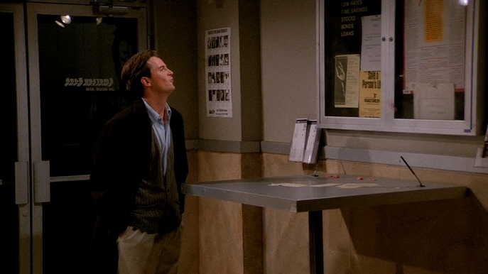
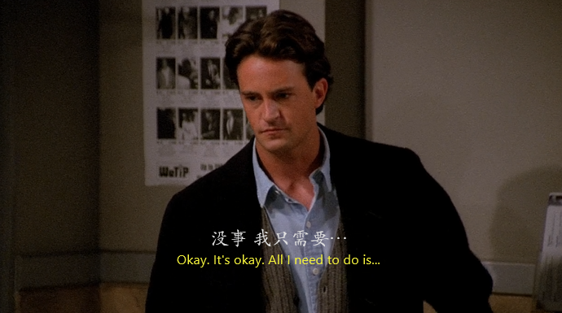
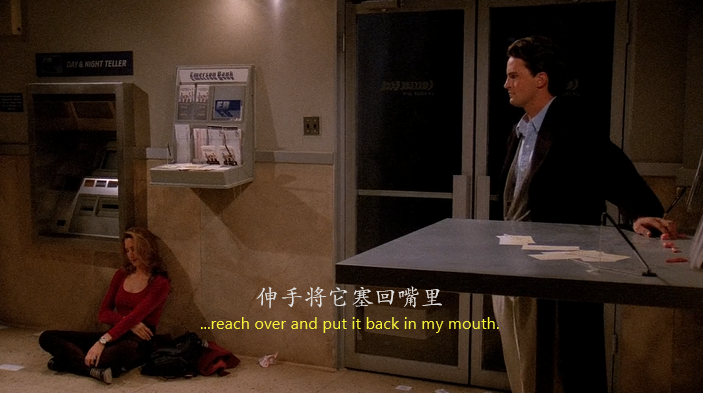
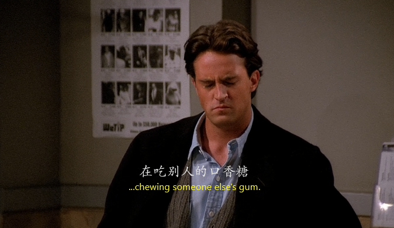
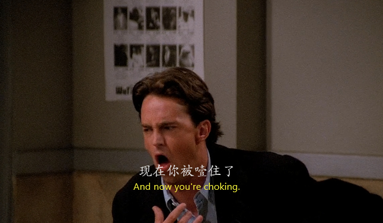
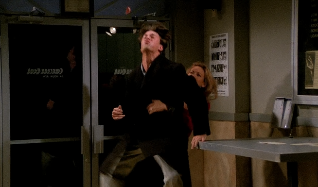

---
画面回到Monica这边。Ross表白失败，还看到了这一幕，哎。

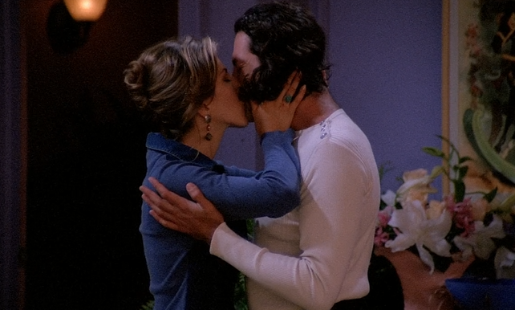


## Vocabulary

- vestibule ***n.*** 门厅，前厅
- atrium ***n.*** 心房，中庭，天井
- loathe ***vt.*** 憎恨，厌恶