# Season1 Episode8 - The One Where Nana Dies Twice

> 声明：
>       
>      所有内容只用于学习，如有侵权请告知。
>
>      如想转载请标明出处(github.com/hanqizheng)
>      
>      先看一遍原剧集再来阅读效果更佳
> 
>      希望可以Star支持一下😄
>
> 


这一集总有那么点冥冥中自有定数的感觉，主线围绕Monica和Chandler两个人展开，分别通过两件事情把两个人各自的特点和遭遇展示给了观众。要知道这才是第一季的第8集，人物塑造还在继续。

本集故事分为两条线：
- Chandler的`Quality~`
- Monica的Nana过世了

## 正文

```
Shelly: Hey gorgeous! How's it going?

Chandler: Dehydrated Japanese noodles under the fluoresent litghts. 
          Dose it get better than this?
```
开场来到Chandler的公司，应该是午餐时间，而Chandler一个人坐在公司的茶水间吃泡面。

这里刚开场，就有几个非常值得强调的地方！

- `Hey gorgeous!`这是Shelly和Chandler打招呼的第一句话，其实就是`帅哥！`的意思。咱们在日常生活中打交道其实也经常用到这种方式，算是一个技巧。毕竟直接称呼对方的名字显得生硬不少，所以来一句`老哥，帅哥，美女，仙女`，比如我在天津还会听到很多次的`姐姐~`。都是一种缓冲。

  而这里的`gorgeous`这个词更是要大说特说！`gorgeous`意为`华丽的，美丽的`。不光可以形容一件事物非常的美好，**还可以形容人长得好看。**

  所以，想夸赞别人就不要老用`beautiful、handsome`了。这里还要再给大家科普几个夸人好看的词：

  - `attractive`，吸引人的，迷人的
  - `cute`,可爱的。这个`cute`也是非常常用的一个表达，和`gorgeous`同理，夸人好看！

- `How's it going？`,这个是口语中非常常用的表达，意为`最近咋样啊？`但不用翻译的那么刻板，其实就是打个招呼，就是个`哈喽`的作用。

  所以不要再用`How are you? I'm fine thank you.`了真的很尬。

- `Does it better than this?`很Chandler的自嘲式口吻，表达了`还有比这个更好的吗？`

---

```
Shelly: Question: You're not dating, are you? Because I met somebody who would be perfect for you!

Chandler: You see perfect would be a problem.
          Had you said co-denpendent or self-destructive?

Shelly: Do you wanna date on Saturday night?

Chandler: Yes, please.

Shellu: Ok, He is cute. He is funny. He's...

Chandler: He is a he?

Shelly: Well yeah! Oh god! I just... I... You're nice...
        Oh god! Good Shelly, Okay, I'm gonna go flush myself down the toilet now!
        Okay Bye bye!
```

这句`Had you said co-denpendent or self-destructive?`完美的体现了Chandler的一种生活态度或者是人生哲学，Pefect对他来说反而是一种不好的东西，尤其是在他拥有了Janice，Aurora那样的女友之后，他更是以一种消极的态度去面对relationship。

- 这里要说说`词缀`这个概念了，可以看到这里的`co- & self-`两种词的`前缀`，`co-`表示`合作关系，伙伴`这类意思，比如`co-founder`合作建立者。`self-`表示`自己怎么怎么样`
  还有很多这样的前缀，比如`anti-`表示`反对...`

然后，就到来了本集第一条主线，Shelly意为Chandler是Gay~


---

```
Chandler: Can you believe she actually thought that?

Rachel: Emmm.. Yeah~
        Well, I mean when I first met you, 
        you know I thought maybe, possibly you might be~

Chandler: You did?

Rachel: Then you spent Pheobe entire birthday party talking to 
        my breasts, So then I figured maybe not.

Chandler: Huh~ Did any of the rest of you guys think that
          when you first met me?

Monica: I did~ 

Pheobe: Yeah ,I think so~

Joey: Not me!

Ross: No no no, me neither!
      Although back in collage Susan did.
```
Chandler把自己在公司的遭遇和朋友们一说，用的是`radiculous`来形容，但是，没想到朋友们的反应确是。。。。也有过这种想法。

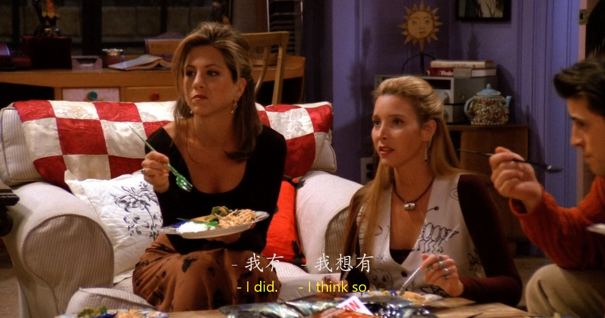


而且大家有没有发现一点，是所有的女生有过这种想法，而男生则完全没有过。这也是女生的直觉吗？？？？？？

---


这显然让Chandler有点不爽，凭啥啊，凭啥就觉得我是gay啊！

```
Chandler: So, what is it about me?
```
- `What is it about me?`什么是关于我的？关于我的是什么？这样的直译显然不对，所以，这句话其实就是说`那我错在哪了？我的错在哪？`这个意思。


众人说你比较幽默，聪明。Chandler说那Ross也幽默聪明！你们有觉得他是gay吗？

结果大家都狂笑。

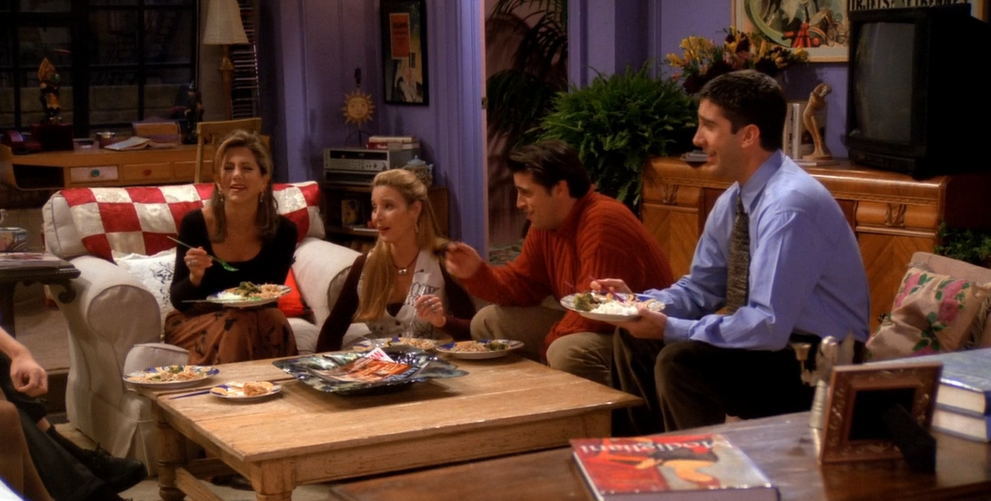


---

```
Monica: Ok, I don't know, You just have a quality.
```

Monica给出了答案，表示Chandler就是有某种特质，但说不上来是啥，就是会让人觉得你是Gay。


---


```
Chandler: Yeah good.
          A QUALITY, I was worried about you were gonna be vague about this.
```
显然这不是个满意的答案，钱氏讽刺警告。

- `vague`意为`模糊，弥漫，渺茫`

--- 

这时候一通电话带来了本集的第二条主线，Monica和Ross的奶奶过世了。


其实这里有个细节不知道大家在看的时候有没有注意到，就是Monica一家在医院碰面后Ross和Monica要分别拥抱亲吻在场的家人。

这个镜头给全了这个过程，让这个过程看起来会加漫长。我个人感觉是对这种比较繁琐的礼仪的一种调侃，当然，毕竟是情景喜剧，不要过分解读。

---

其实这条线是再一次将Monica和自己老妈的关系搬了出来。

前面我们也说过Monica和自己老妈的关系很不好，但是不好到什么程度可能还没有一个具体的定论，这一次Nana过世，完美的诠释了她俩的关系有多不好。

上来就火药味儿十足了。


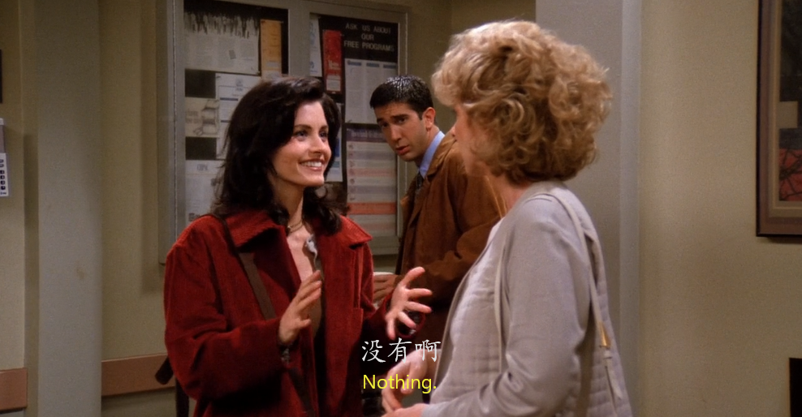


Monica很贴心的问了老妈现在还好吗，毕竟是妈妈的妈妈过世了（滑稽，自己倒清楚关系）

但实在是跟不上老妈的节奏，这个时候还要挑刺Monica的发型。Monica真的心里mmp。

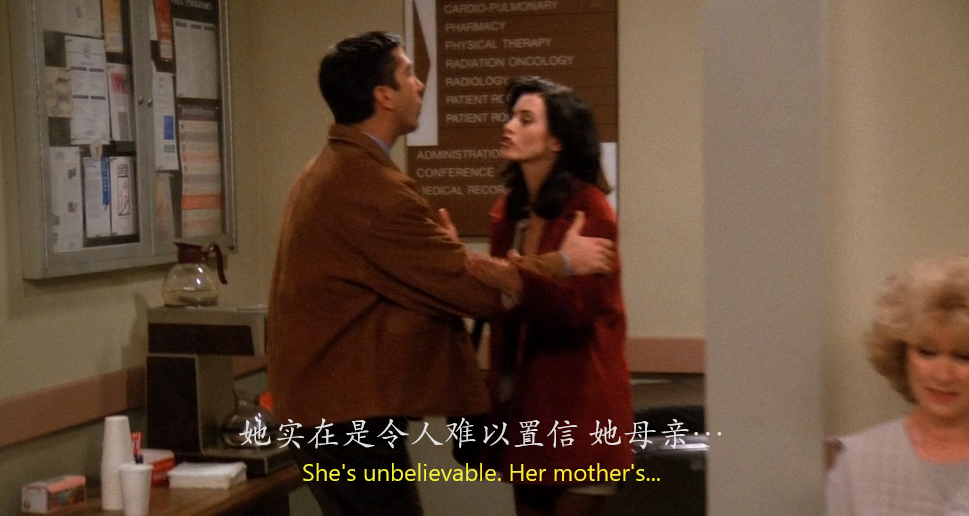

---


```
Ross: We are gonna be here for a while, it look like.
      We still have your boyfriends and your career to cover.

Monica: Oh god!
```

Ross安慰的方式很特别，提醒Monica后面还有很多呢，你现在就生气还太早啦。

- `We still have your boyfriends and your career to cover.`这里注意到一个词`cover`。原译为`遮盖`，但在这里表示`面对，处理。`也是一个地道的表达。`cover the problem`

---

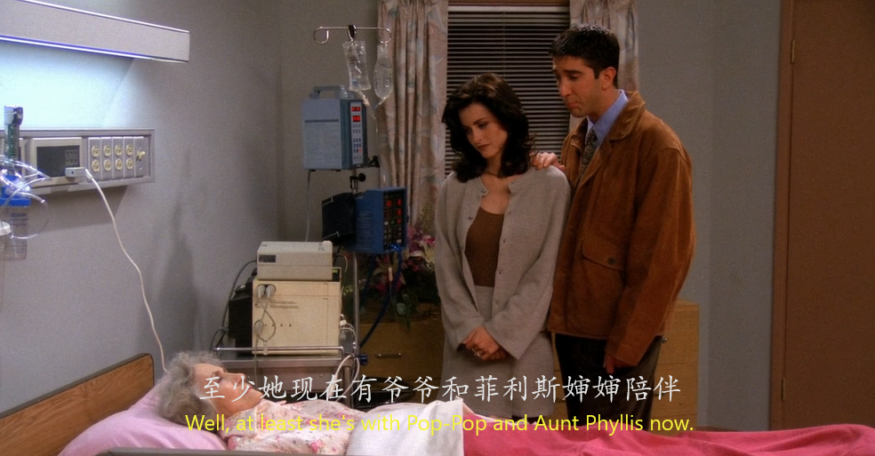

这里有个细节，这里的`Ant Phyllis`也会在后面的某集中提到~

---

然后，在和nana告别时，nana貌似回光返照了一下，把Ross和Monica吓死了。

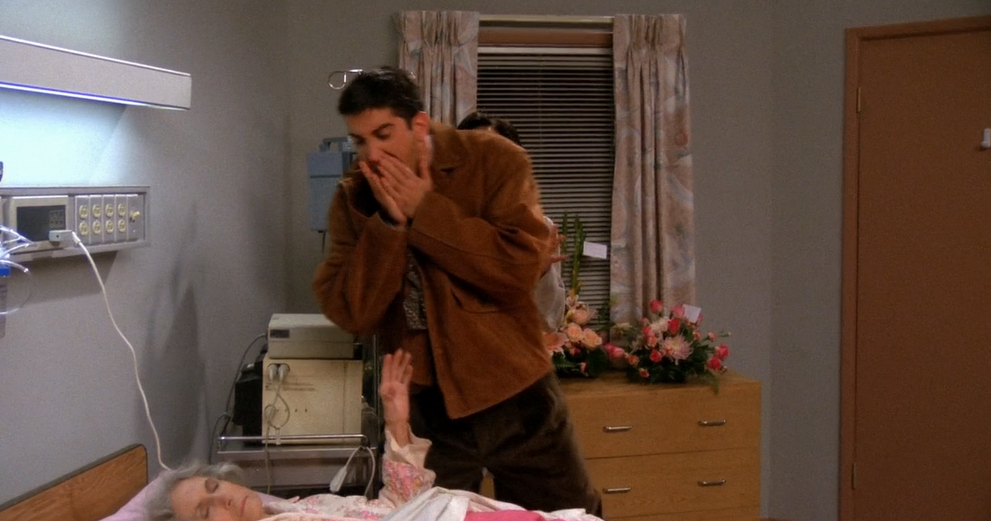

```
Ross: You know how the nurse said the nana had passed?
```

- 这里Ross在表达`死`的意思时，并没有用大家所熟知的`die`。因为`die`这个词程度太重了，其实我们中国也有这样的忌讳，就是在参加丧礼时不要说死这个字，是对死者和死者的家人一种不尊重的行为。

  而这里很委婉的表达方式就是用`pass`这个词。我们中文也有，`过世，过去了`。

---

镜头回到Central Park，Chandler还在不懈努力的追求这为什么大家会觉得自己是Gay的真正原因。

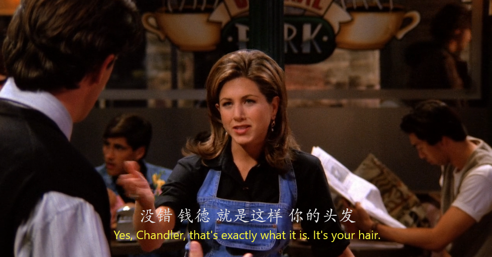
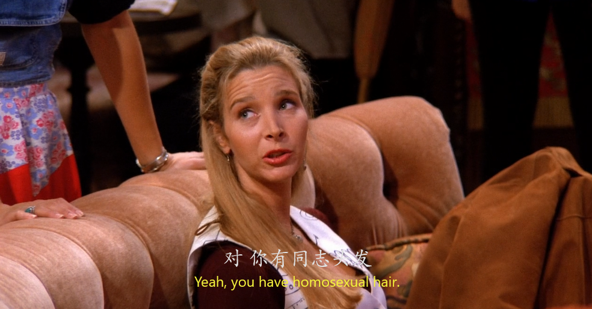

---


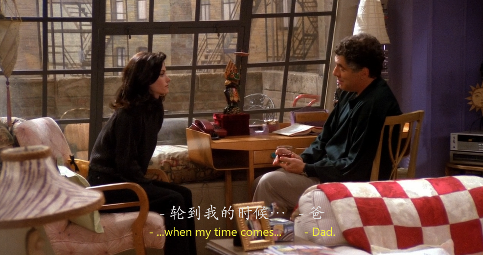


---

还有一个很经典的画面，可以制作成表情包

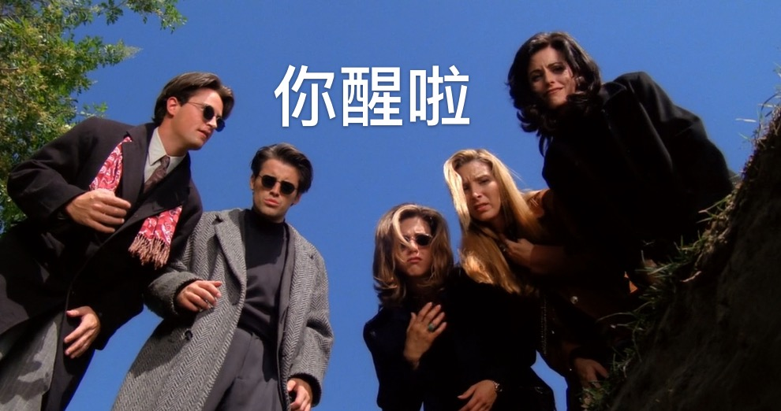

---


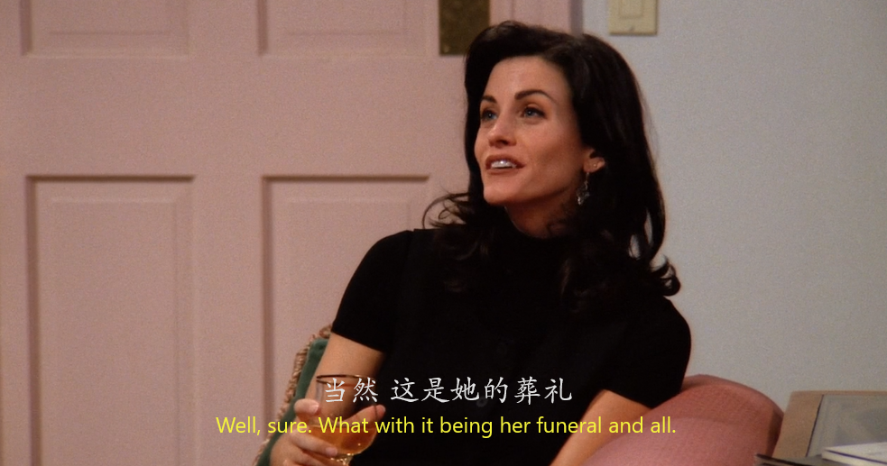
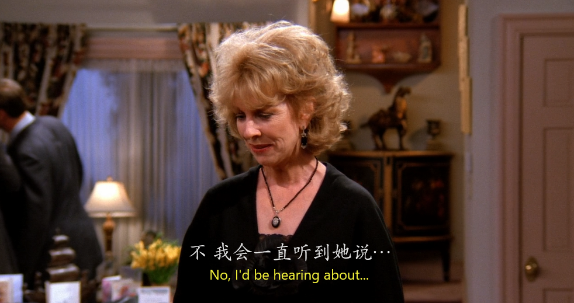


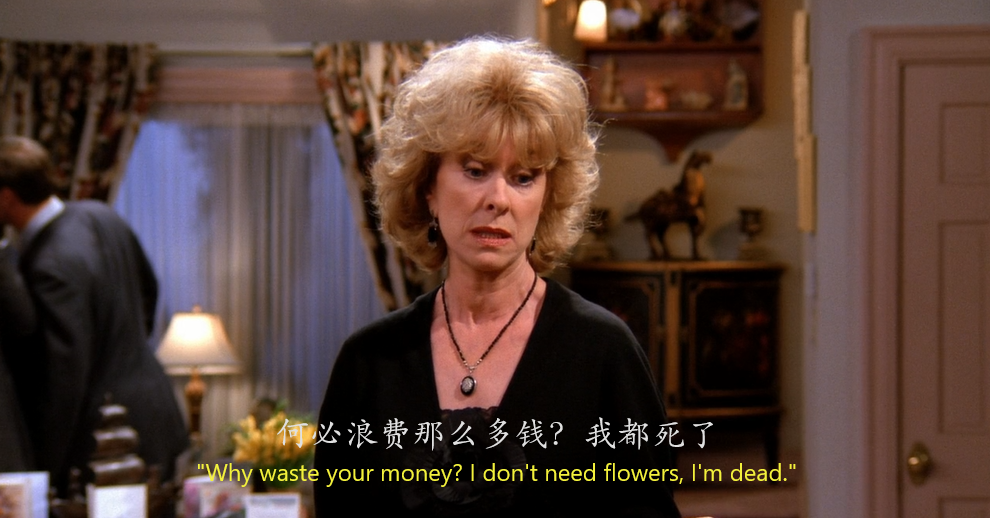

看到这段对话其实Monica和妈妈关系不好是有原因的，她的妈妈和奶奶关系就不好，和她俩如出一辙。其实，最终我们都能看出来，她的妈妈像她奶奶，她像她妈妈。

## Vocabulary
- predict ***v.*** 预测
- vague **n. & adj.** 弥漫，模糊，弥漫的，模糊的
- gorgeous ***adj.*** 华丽的，美丽的。
