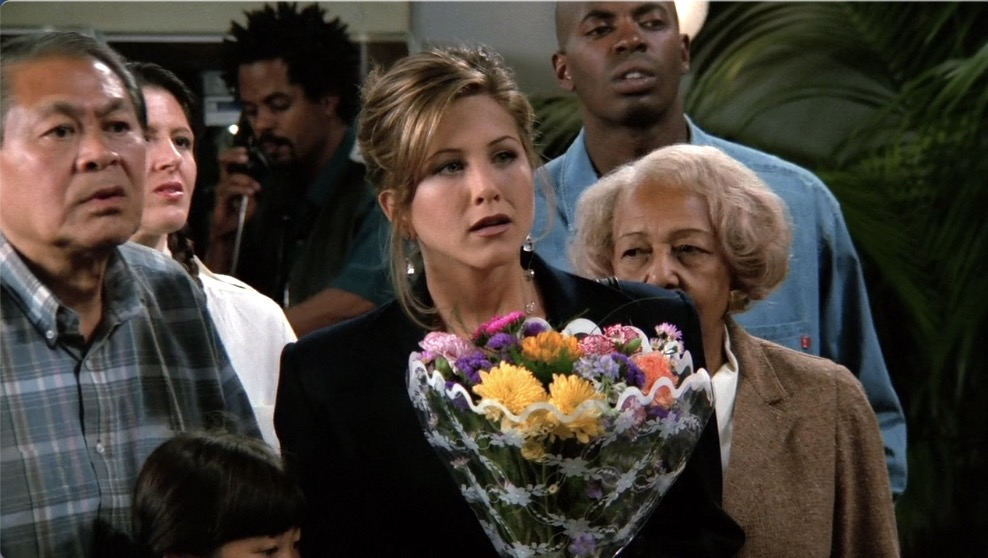
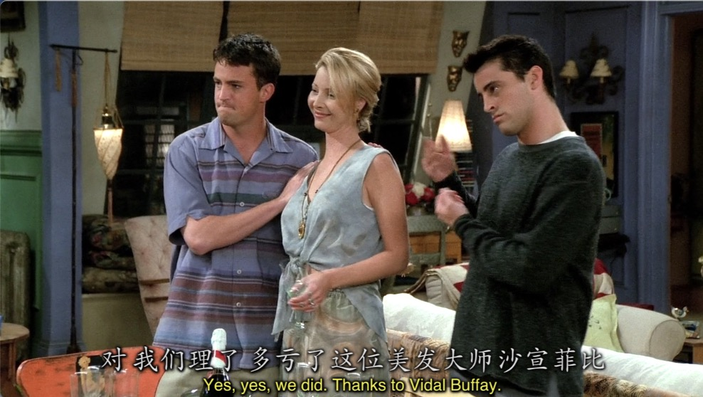
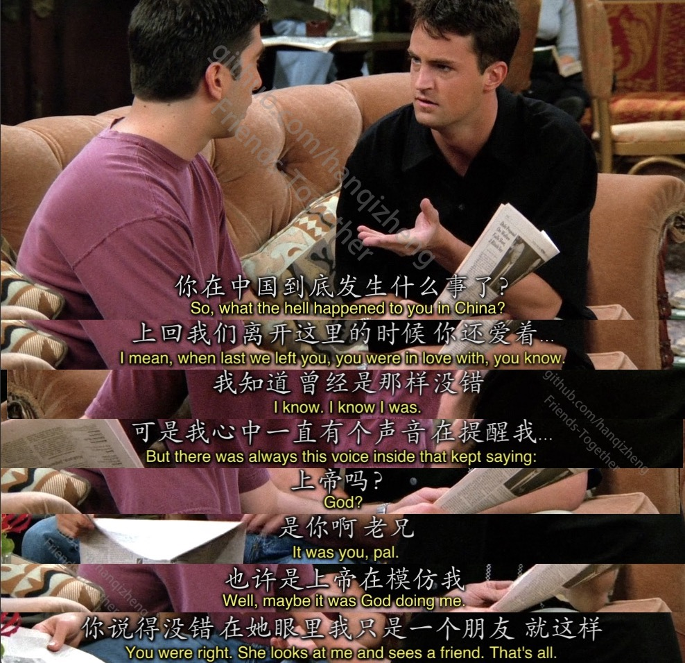

# Season2 Episode 1 - The One with Ross's New Girlfriend

> 声明：
>       
>      所有内容只用于学习，如有侵权请告知。
>
>      如想转载请标明出处(github.com/hanqizheng)
>      
>      先看一遍原剧集再来阅读效果更佳
> 
>      希望可以Star支持一下😄
>
> 


## 概要

Hi everyone, 看到这里我们已经成功渡劫，功力也达到了小菜鸟阶段。

上一季的结尾Rachel在最后得知Ross暗恋她已久，而经过一番思想斗争的她也决定面对Ross。

冲到机场接机的她却不知道接下来要看到Ross已经带着神秘女友回到了美国，这一集就从这里开始。



## 正文

```
Rachel: Enough about me! Mr.Back from The Orient.
```

- 当然说到我们中国，老美的第一印象就是`东方国度`。而这个`东方`我们一般是`不太会用East`的，想对地道，经典的就是`orient`这个词了。
- 这里需要注意`Orient`是大写的。意为`东方国度`。当`orient`小写的时候，就是一个动词代表`使朝向东`。

---

```
Joey: No way!

Monica: I'm telling you! She went to the airpot and she gonna go for it with Ross!!
```

- `没门`用英语说肯定 **不是**`no door`。这个大家都知道是`No way.`但在这里肯定不是没门的意思。
- 其实`No way`在口语中有的时候表的的是一个`语气`,大概可以粗糙的翻译成`卧槽，不是吧！`

---

给一张Chandler和Joey在第二季的颜值巅峰




---

- 这里的`Gusse who is in charge of the dig?`原本看这句话我以为是`猜猜谁是总负责人？谁是管事的？`之类的比较地道的说法，但是我错了。我才意识到`Ross过去就是跟考古有关的，所以dig就是dig的本意，挖掘。`
- `in charge of the...`意为`主管...， 负责...`

---

```
Rachel: Isn't that kick-you-in-the-crotch and spit-on-your-neck fantastic? 
```

Rachel已经在强颜欢笑了

- 这里这种`kick-you-in-the-crotch`之类的是`形容词性的自建词`。可以自己在口语中自己构建。

---



- `Well, maybe it was god doing me!`这里的`do`翻译为`模仿`
- `She looks at me and sees a friend.`这句话被拿出来是因为太典型的英语思维的句子。`她把我看作朋友。`这么表达，我们直接翻译就是`她看向我，看到的是一个朋友。`就这么巧妙的表达了这句话的意思。

---

```
Ross: And I have to say I would have gone for it with her if it hadn't been for you.
```

- 这就是典型的`虚拟语气`

---

```
Chandler: He said they're having a great time. I'm sorry.

Rachel: What?

Chandler: But! The silver lining if you wanna see it is that he made this decision all by himself.

          Without any outside help whatsoever.
```

- `silver lining`是一个谚语`Every cloud has a silver lining.`意为`日子虽然过的不顺，但终有一线希望。`所以`silver lining`就是`一线希望`的意思。
- `whatsoever`是一个名词`诸如此类食物`


---

```
Phoebe: I'm incredibly anal and an unbelievable control freak.

Monica: No you're not.

Phoebe: I know I'm not but you're. I was trying to spare your feelings.
```

- `I was trying to spare your feelings.`翻译为`我是不想上你的感情。`挺地道的表达，学一下。

---

```
Chandler: Okay, you have to stop the Q-tip when there's resistance.
```

- 这句话大概的意思就是`当你用棉棒掏耳朵的时候，棉棒再也深入不进去就该停下来了。`Chandler是在调侃Joey想不通的问题就不要一直在想了。

---

Monica看到Phoebe给Chandler和Joey剪的发型很好也想让Phoebe剪一个，但是她俩想的完全是两个人，Monica头发也遭殃了


Monica想要Demi Moore(左),而Phoebe认为是Dudley Moore(右)


---

```
Tailor: How long do you want the cuffs?

Chandler: At least as long as I have the pants.
```

- 这里的梗是裁缝问他裤子褶想要多长(长度单位)，但Chandler开玩笑的说我想让裤子褶活得跟裤子一样长(时间单位)

---


## Vocabulary

- baggage **n.** 行李
- claim **n.** 要求...的所有权, 认领，声称
- baggage claim 认领行李
- crotch **n.** 胯部， 裤裆
- anal **adj.** 肛门的，极度刻板的
- spare **adj.** 闲置的，不用的，备用的，空闲的 ｜ **n.** 备用品 ｜ **vt.** 拿得出，花得起
- resistance **n.** 阻碍， 抵抗，电阻。
- palpable **adj.** 可触摸到的，明显的，显而易见的，可察觉的。
- tension **n.** 紧张关系，紧张，张力 ｜ **vt.** 绷紧
- despite **prep.** 尽管
- crack **n.** 裂缝， 漏洞， 噼啪声 ｜ **vt.** 使...裂开，砸开。