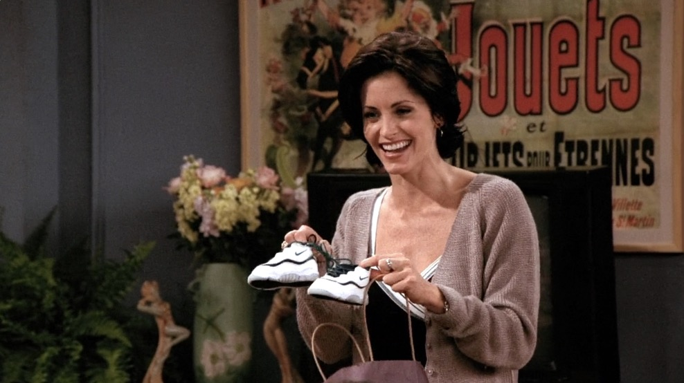
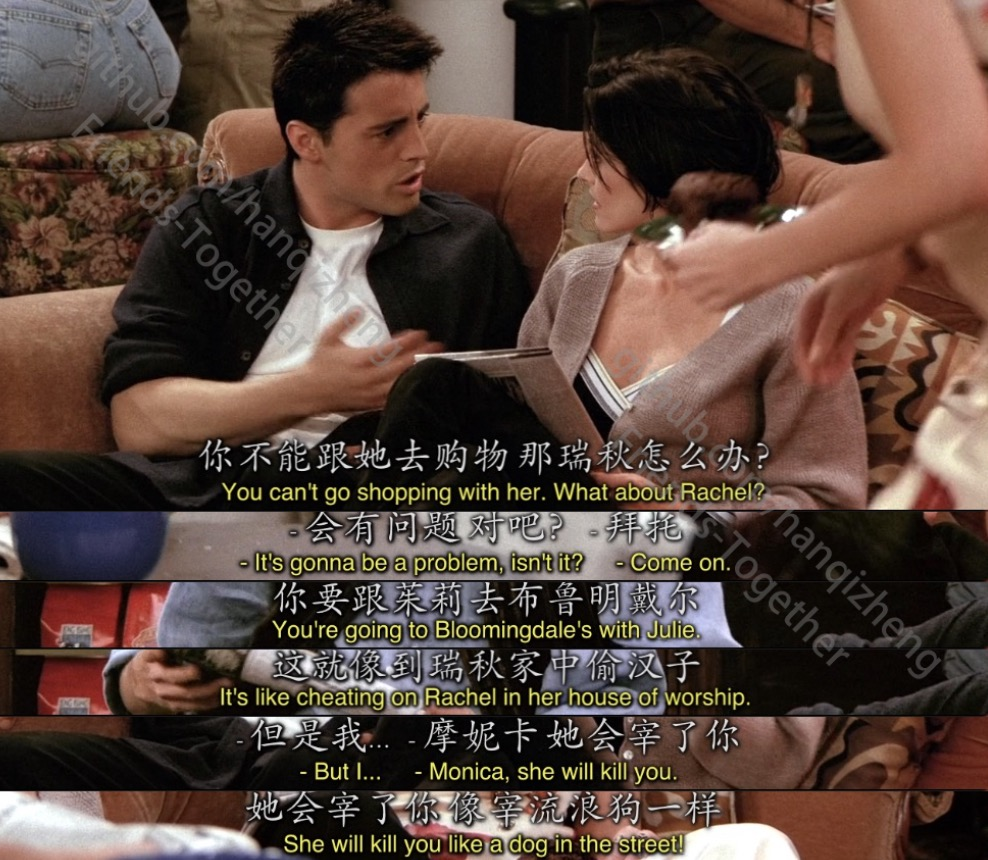
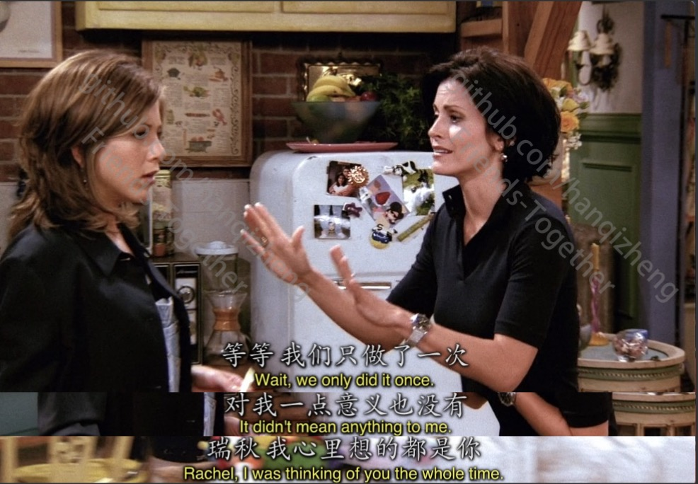

# Season2 Episode 2 - The One With the Breast Milk

> 声明：
>       
>      所有内容只用于学习，如有侵权请告知。
>
>      如想转载请标明出处(github.com/hanqizheng)
>      
>      先看一遍原剧集再来阅读效果更佳
> 
>      希望可以Star支持一下😄
>
> 


## 概要

- Ross看到Phoebe尝母乳无法理解，但得知Susan也喝过就很吃醋很气。
- Julie为了向大家示好邀请一同去狂街，Monica答应了，Rachel知道后很生气。
- Joey兼职的香水推销员遇到了对手，无奈之下决定跟他正面对决，结果竟然...

## 正文

开场Carol和Susan带着Ben来Monica的公寓玩

Monica送了Ben一双Nike，这双Nike说实话挺好看，而且那条黑线和现在Nike的鞋还挺像的，这时候是1995年，时尚果然是轮回。




---

```
Julie: Rachel, do you have maffins left?

Rachel: Yeah but I forgot which ones.

Julie: Okay you're busy. I'll get it. Anyone else want one?

       Oh you're losing your apron. I'll get it.

Rachel: Thank you~ What a bitch.
```

可以看到Julie人真的挺不错的，不管是看到Rachel在忙自己去拿maffin，而且去拿的时候还不忘问问大家要不要。看到Rachel围裙快开了还帮她系紧。

当然，也有可能是Julie为了融入大家努力的在示好。

而Rachel来了一句`What a bitch.`也算是今天我们学到的第一句骂人的话了。

- `What a bitch.`就是一句用了强调句式的骂人话，其实只不过是强调了`bitch`这个骂人的词罢了。
- `I'll get it.`这句子在这段对话中出现了两次，但是代表的东西却不一样。第一次表示`我去拿。`第二次表示`我来帮你系好。`其实`I'll get it.`这句话很灵活的，它大概的意思就是`我自己来解决。`
- `left`是`leave`的过去式。

---

```
Julie: Listen you guys, I have a friend at Bloomingdale who is quitting tomorrow 
        
       and he wants to abuse his discount.

       So anyone want to take advantage of it?
```

- `abuse`有`滥用`的意思，在这里其实也不算滥用，就是想表达`花光，使用完`的意思。
- `discount`就是`优惠券`
- `take advantage of...`这个就是`占便宜的意思`，可以代表`金钱上的占便宜`也能代表`猥亵这一类的意思`。

看到这给我更多的感觉是Julie示好的感觉更多些，所以Rachel才会来句`What a bitch.`当然Rachel有很大一部分原因是因为她和Ross在一起了😂

---

Monica就是这种老好人的性格，也不好意思拒绝别人，记得后面有一集Monica得罪了Rachel的老妈各种道歉各种讨好。

但是貌似女生们很看重一起购物这件事啊。




---

Phoebe热好的牛奶放在胳膊上试温度然后自己舔了一下，众人都惊呆了。(为什么我觉得这很正常啊，我记得看小朋友的大人都是这么试温度的)

---

Rachel发现Monica和Julie一起去吃饭去逛街后Monica的解释看起来就像她出轨Rachel了。看起来女生却是很看重这个啊。



---

```
Rachel: I'm sorry, did my back hurt your knife?
```

- Rachel这句话其实是一句很常用的阴阳怪气的话。`did my back hurt your knife?`直译过来是`我的背伤着你的刀了吗？`言外之意就是`你他妈背后捅我刀子现在还在这跟我bb？`
- `get back at sb.`这个我总是把它理解成`背后插某人刀子。`但其实这个短语意为`报复某人`,有可能是背后报复，有可能是正面报复。

---

```
Julie: I probobly shouldn't even tell you this, but emm, 

       I'm pretty much totally intimidated by you.

Rachel: Really? Me?

Julie: OMG, Are you kidding?

       Ross is so crazy about you, and I really wanted you to like me.

       And It's probably me just being totally paranoid,

       but I kind of got the feeling that maybe you don't.
```

我们来品一下Julie说的这几句话，来学一下`委婉的表的技术`。顺便来分析一下Julie。

- `I'm pretty much totally intimidated by you.`可以看到这里用了一个`pretty much`但紧接着又来了一个`totally`。就是在用这种程度副词来给出一种`我说这个话很犹豫不好意思说出来的感觉`。
- `be intimidated by...`Julie这里用的是一个`被动语气`，表达出来的意思就是`被你Rachel吓到了，我挺害怕你的。`侧面表达出咱俩关系不好是因为我`被`你吓到了。
- `It's probably me just being totally paranoid.`这句是说在`我觉得你不喜欢我`那句之前的，先直接说你不喜欢我太突兀了，Julie加了一句`当然可能是我自己想太多...`语气一下子就委婉了不少。
- 最后这句没有说完的`maybe you don't.`更是会给人一种`我太难了，我不好意思说出口`的感觉，因为`that maybe you don't like me.`是完整的一句修饰前面的feeling。

---

```
Rachel: When you first started going out with Ross, it was really hard for me.

        for many reasons of which I'm gonna bore you with now.
```

Rachel的回答也是很巧妙的避开了Julie想要得到的答案，但是也传递出了她喜欢Ross的信号。

- `of which`在这里也是引导一个`定语从句`修饰前面的`reason`。

---

```
Julie: Hey listen, Would you like to go to a movie sometime or something?

Rachel: Yeah, that'd be great. I love it.

Julie: I love it too.

       Oh, shoot, I got to go. So I'll talk you later.

Rachel: Alright.
```

这段话就很值得揣摩一下，Rachel在表达了自己的想法之后Julie来了句`改天一起去看个电影？`

Rachel回答了一局`I love it.`

但是这时候Julie回了句`我也想，淦，我该走了，改天再聊吧。`

这...应该很明显了，Julie就根本不想继续谈话，更不想一起去看电影。

```
Rachel: What a manipulatve bitch.
```

- manipulate **vt.** 操作，操纵，控制

---

看到最后我才意识到，我不会觉得别人试母乳温度顺便尝一尝有什么奇怪，但是如果要我喝我却喝不下去。我现在有点懂他们的感受了。


## Vocabulary

- resist **vt.** 拒绝，抵抗，阻止 ｜ **vi.** 反抗
- sneaker **n.** 运动鞋
- sneak **vi.** 溜， 溜走 ｜ **vt.** 偷偷拿 ｜ **n.** 打小报告的人
- abuse **vt.** 虐待，滥用，辱骂
- one thing led to another... 一件接一件的事
- intimidate **vt.** 恐吓，威胁
- paranoid **adj.** 患妄想症的，多疑的，胡思乱想的
- manipulate **vt.** 操作，操纵，控制