# Season2 Episode 3 - The One Where Heckles Dies

> 声明：
>       
>      所有内容只用于学习，如有侵权请告知。
>
>      如想转载请标明出处(github.com/hanqizheng)
>      
>      先看一遍原剧集再来阅读效果更佳
> 
>      希望可以Star支持一下😄
>
> 


## 概要

这一集也算是对我影响比较大的一集了，因为这一集我对Chandler这个角色有了更立体的认识。

甚至觉得跟他有很多相似的地方。

- Mr.Heckles突然逝世让众人对他更加了解，Chandler发现自己和Heckles太像了担心自己也孤独终老。
- Rachel在收拾Mr.Heckles公寓时发现了一个台灯想摆在家里。
- Phoebe不相信进化论让Ross抓狂


## 正文

```
Monica: So how was Joan?

Chandler: Broke up with her.

People: Oh why?

Ross: Don't tell me because of the big nostril thing?

Chandler: They were huge. When she sneezed, bats flew out of them.

Rachel: Come on they were not that huge.

Chandler: I'm telling you, she leaned back i could see her brain.
```

- `don't tell me...`我把这个专门拿出来是因为这是一句和咱们说话习惯非常类似的口语表达，`别跟我说是(因为)...`如果要加因为后面跟because即可
- `I'm telling you.`可以大概翻译成`真的，真的是这样，相信我`之类的。语气是相对比较严肃的。
- `lean back`意为`向后仰`。

---

```
Monica: How many perfectly fine women are you gonna reject over the most superficial insignificant things？

翻译：你还要因为这些无足轻重的小事拒绝多少个其实挺不错的女孩子？
```

这句话的句式很有意思，来分析一下。
- 这句话可以简化成`你还要拒绝多少女孩子？`换成英文就是`How many wamen are you gonna reject?`
- 然后reject加一个`over`形成短语`reject over`同样意为`拒绝`。但是后面可以跟一个宾语`the most superficial insignificant things`
- 然后添加`fine`修饰`women`
- 最后添加`perfectly`修饰`fine`。
- 句子就变成了上面的原话。

---

```
Joey: Hold on. I gotta side with Chandler on this one.

      When I first moved to the city, I went out couple times with this girl,
      
      really hot, great kisser. But she had the biggest Adam's apple.

Ross: Joey, women don't have Adam's apple.

Joey: Huh, you guys are messing with me right?
```

- 这里学一个词`Adam's apple`。就是我们常说的`喉结`。
- `mess with`意为`逗某人， 骗某人，戏耍某人`。`mess`有名词`脏乱差`的意思但是在这里是一个不及物动词`瞎搞`

那么按照这种说法，Joey竟然是跟...

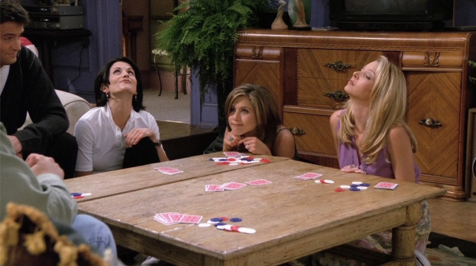

---

Mr.Heckles登场，也是本集的主角吧。

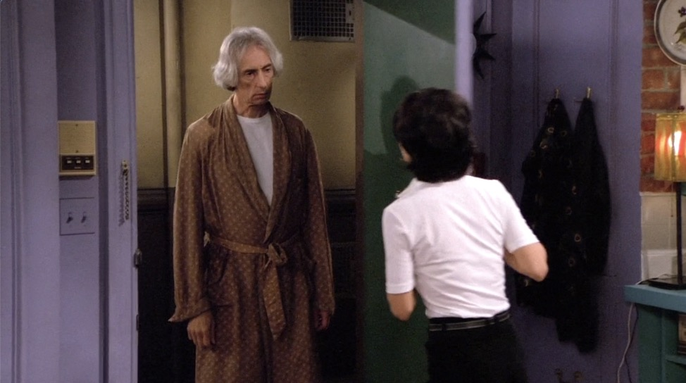

他是住在Monica公寓正对应楼下的一个怪老头，我们在[Season1 Episode19](../Season1/Episode19.md)中有见到过。

Mr.Heckles总是因为一些奇怪的事，比如嫌Monica他们跺脚之类的(但是并没有，应该是楼层隔音不行，后面还有好多情节有用到隔音不行这一点)事找上门，Monica他们都很不喜欢Mr.Heckles.

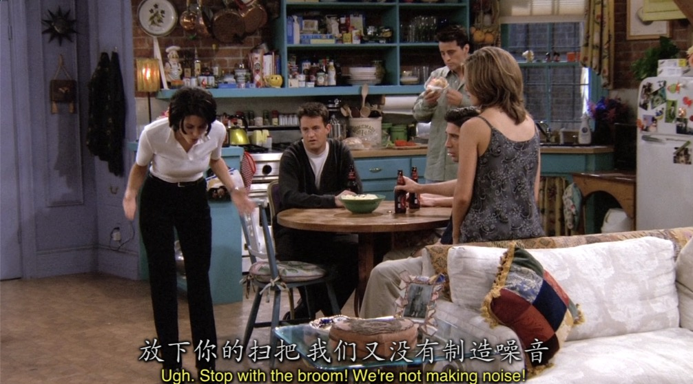

Mr.Heckles 用扫帚桶房顶，Monica众人就跺脚回击，但万万没想到次日...

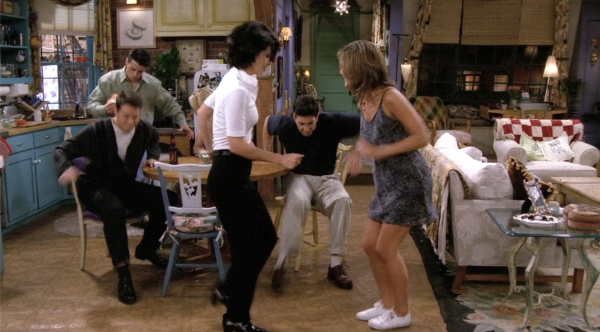

Mr.Heckles死了。

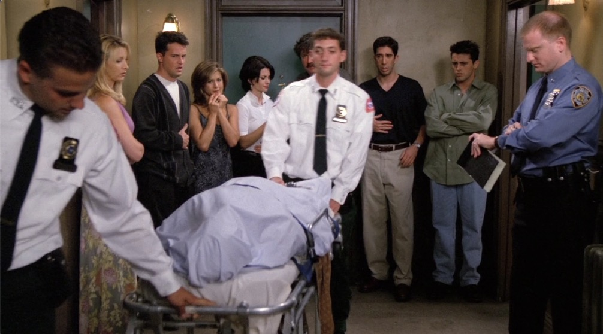

---

难以置信的是Mr.Heckles把自己的公寓的打扫任务给了Monica他们(应该不是把公寓给他们了，因为本集最后他们整理完就再也没有来过了)。

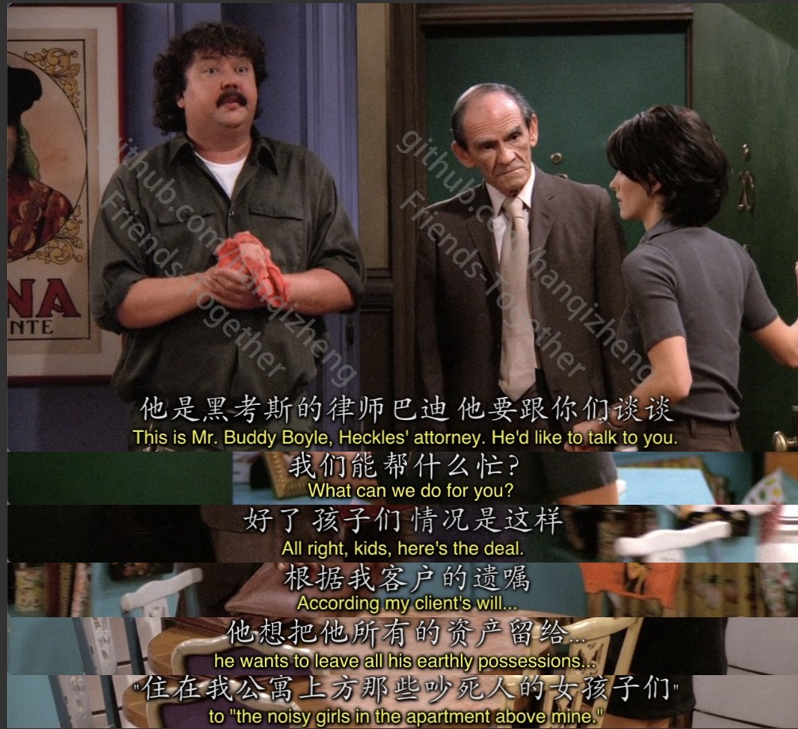

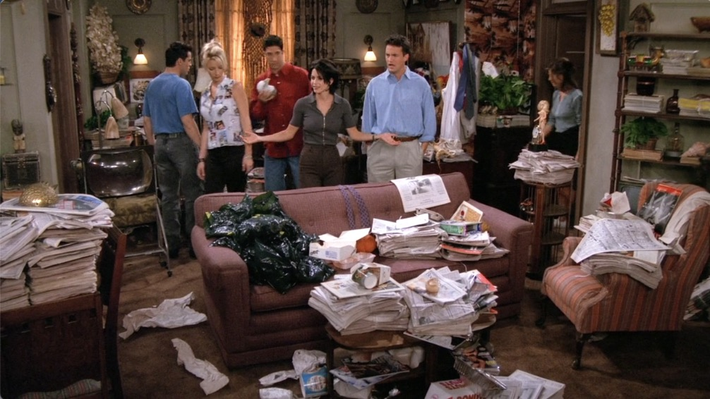

```
Monica: Would you look this dump?

        He hated us. This was his final revenge!

Rachel: Ever seen so much crap!

Chandler: Actually I think this apartment sullies the good name of crap.
```

- `sully`这个词意思为`弄脏，玷污`。
- `good name`翻译成`美名`。也是挺直接的。

---

他们找到了Mr.Heckles的日记和高中毕业册。

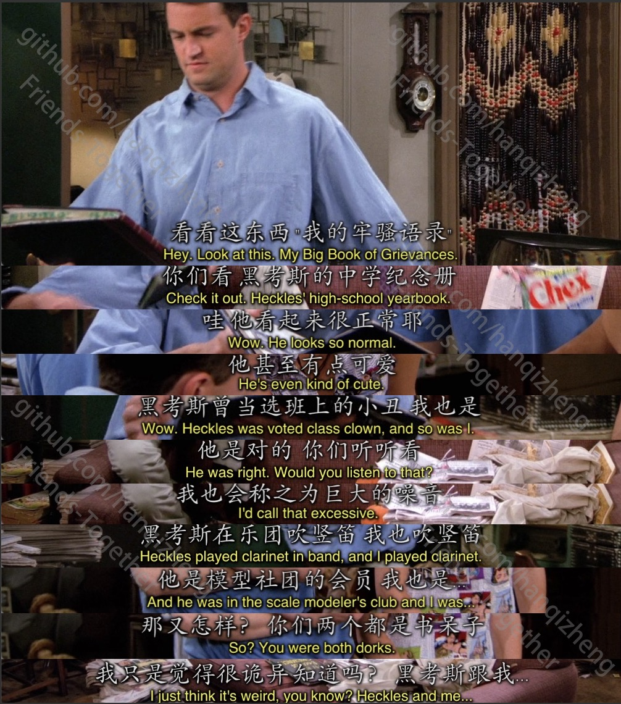

Chanlder看到曾经的Mr.Heckles和自己太像了

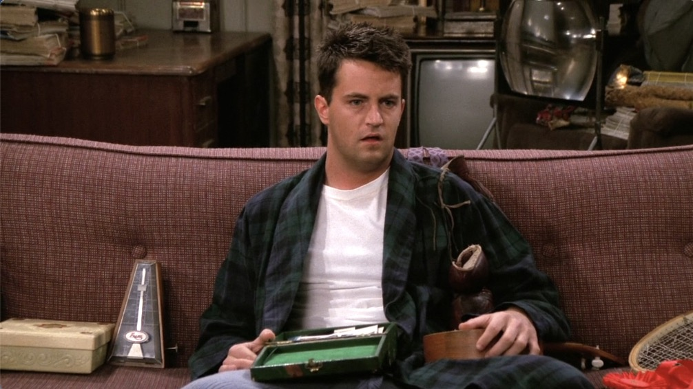

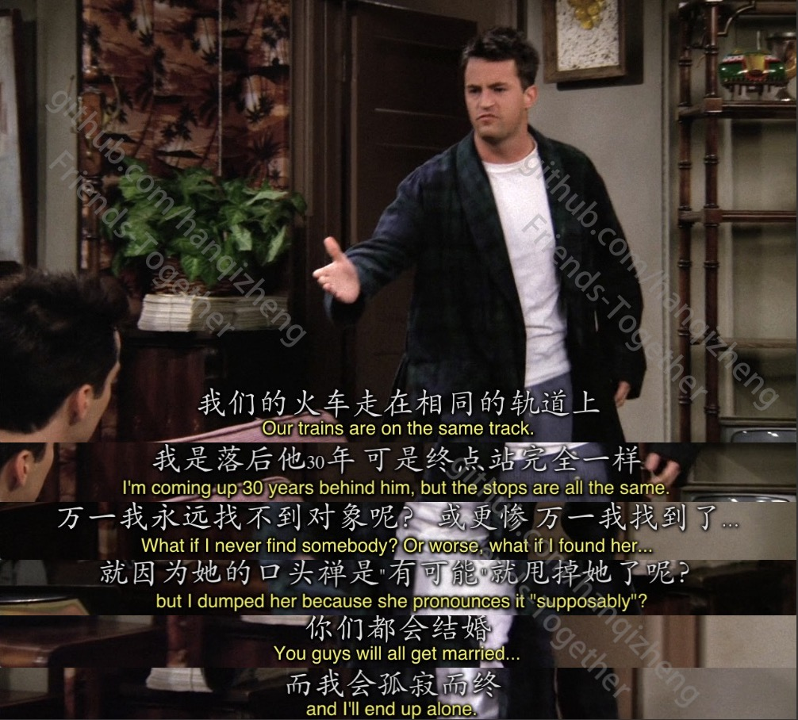


而且有个细节就是Chandler说这些话的时候楼上确实传来了噪声，他不断的被打断最后也生气的拿起扫帚捅屋顶。

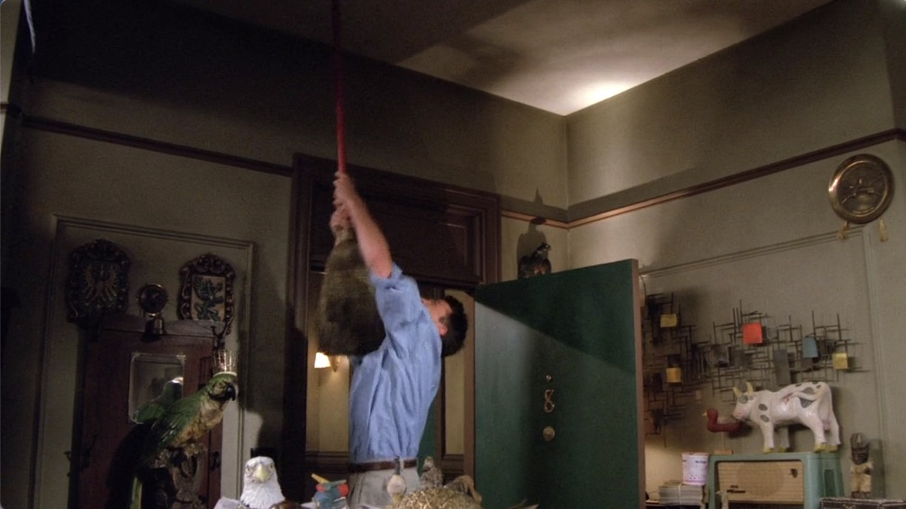

Chandler认为自己也会步入Mr.Heckles的后尘，最后他打给了Janice。

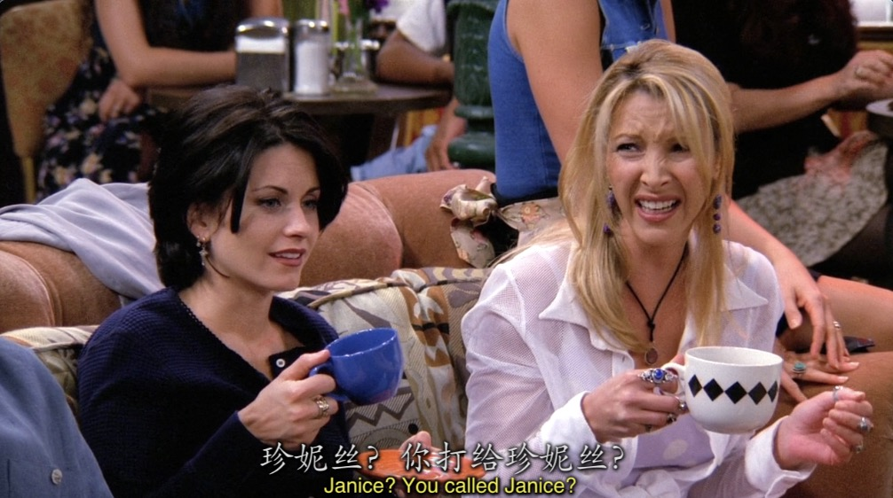

但是万万没想到，Janice结婚了而且还怀了孩子，最后一根稻草也没了。

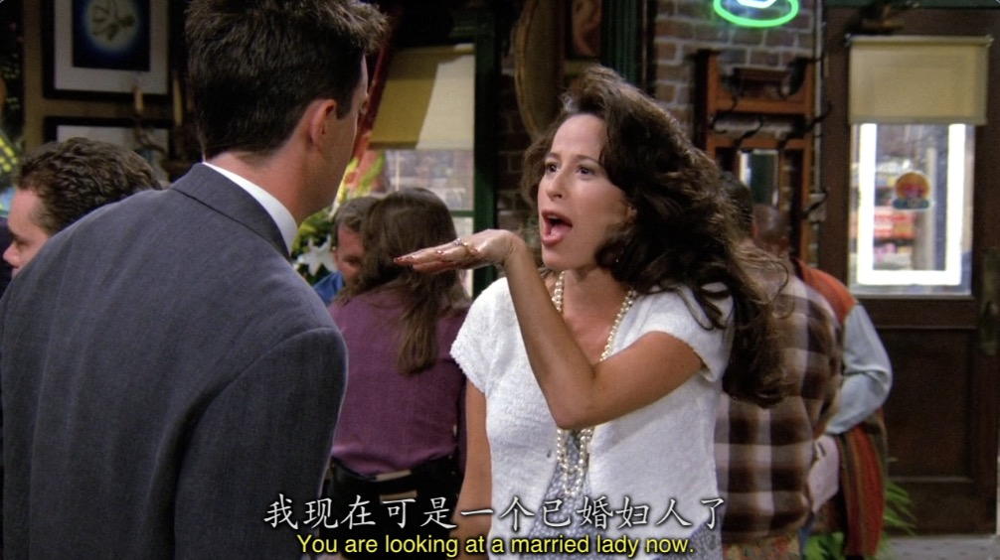

---

```
Monica: You gotta be get over this.

        You're not gonna end up alone.

Chandler: Of course I am. I rejected anyone who is crazy enough to actually go out with me,

          and then I bitch that there are not any women out there.
```

- `bitch`这个词不要光学到它骂人的意思，它还有一个不及物动词的词性，意为`抱怨`

Monica她们说的话也挺有道理的

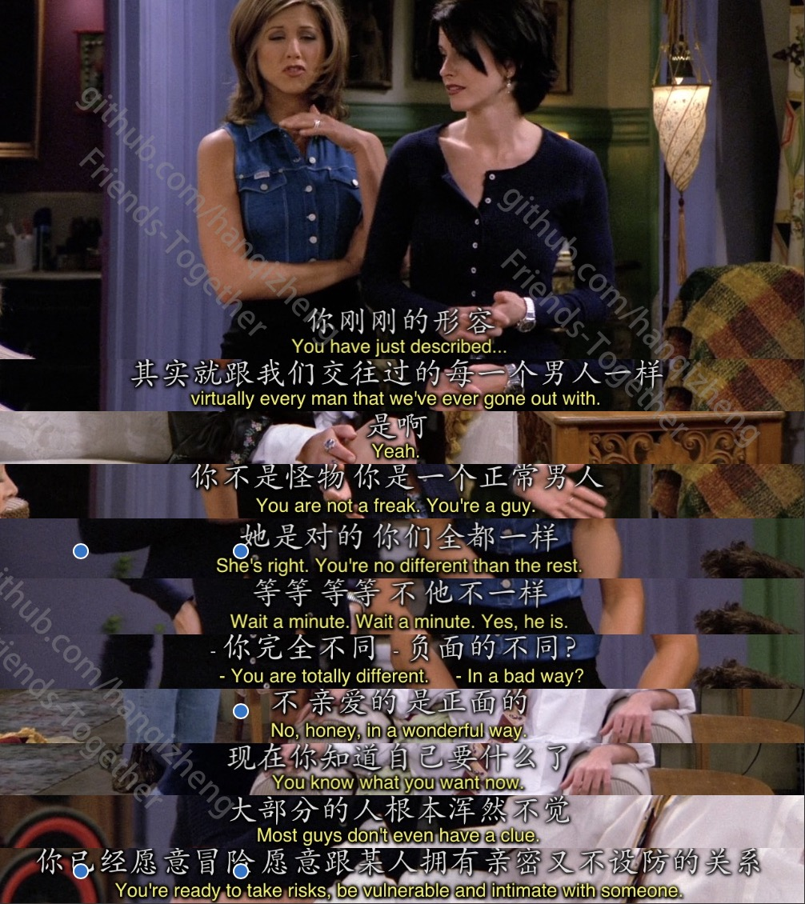


---

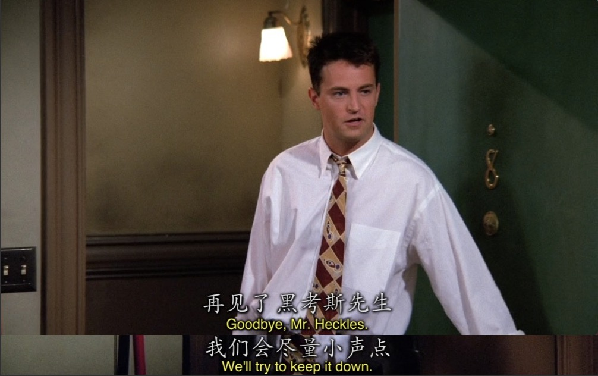

由Chandler最后退场Mr.Heckles的公寓也是侧面的交代了Chandler通过Mr.Heckles这件事也成长了不少。

不管是不是怪人，不管是不是和Mr.Heckles有着一样的过去，但现在的Chandler明白了自己和Mr.Heckles已经不一样了，他知道自己想要什么。就已经比大多数人强了。


## Vocabulary

- nostril **n.** 鼻孔
- sneeze **vi.** 打喷嚏
- lean **adj.** 瘦的， 不景气的， 效率高的 ｜ **vt.** 使...倾斜
- superficial **adj.** 外表的，粗略的
- insignificant **adj.** 不重要的
- stomp **vi.** 跺脚，重踏
- disturb **vt.** 扰乱， 打扰
- broom **n.** 扫帚
- scoff **vi.** 嘲弄，嘲笑
- evolve **vi.** 进化 ｜ **vt.** 使...进化
- comprehend **vt.** 理解，包括
- alergic **adj.** 过敏的
- atom **n.** 原子
- arrogant **adj.** 傲慢的
- cave **n.** 洞穴， 屈服
