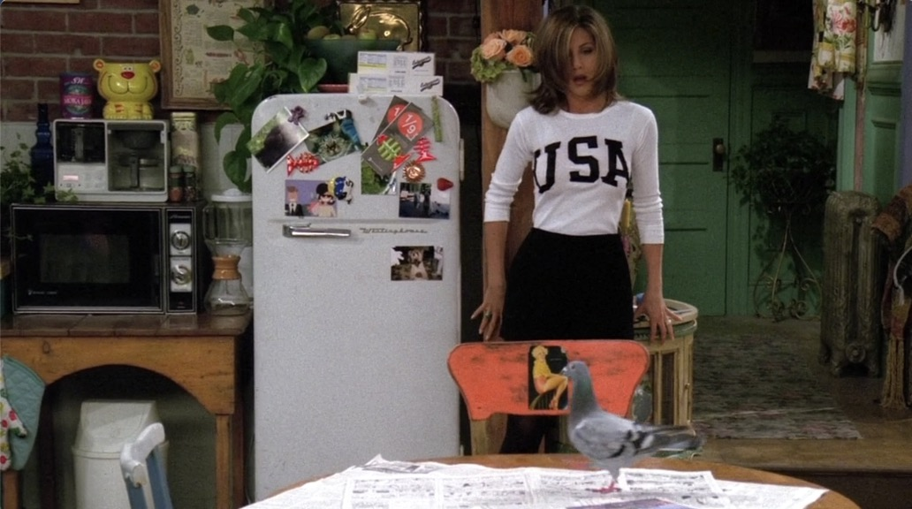
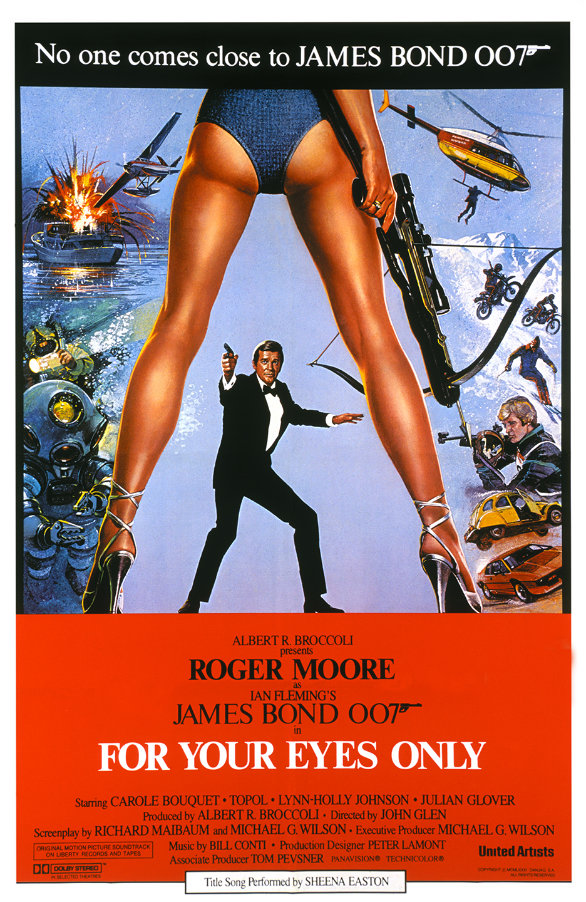

# Season2 Episode 5 - The One With Five Steaks and an Eggplant

> 声明：
>       
>      所有内容只用于学习，如有侵权请告知。
>
>      如想转载请标明出处(github.com/hanqizheng)
>      
>      先看一遍原剧集再来阅读效果更佳
> 
>      希望可以Star支持一下😄
>


<p align="center">

</p>

## 概要

- Chandler接到一个陌生女子的电话，对方是打给前男友的想复合，Chandler就假装成被前男友放鸽子之后碰到的好心路人，发生了一系列事...
- 因为Ross过生日所以众人都要给Ross请客，送礼物。结果引发了一些争执。


## 正文

```
Chandler: So eh, What have you been up to?
```

- 注意一下Chandler这里的`问候语`，我们到现在已经学到很多比较地道的问候语了，不要再用`How are you?`了。而且`How are you?`的答案也不是`I'm fine, thank you.`
  - `How're you doing?`这个是Joey最常说的，也是很普遍的一句，但是`不要用Joey的口气去说😂`。注意是`How are you doing?`只是在口语中`are`的发音真的微乎其微，甚至Joey这种奇怪的慢速语气说出来的直接省略掉`are`了，但是从语法上来说，是有个are的。
  - `How's it going?`是上面那种的另一种形式，也是很常用的问候语。
  - `You okay? / You alright?`这两句在`英国🇬🇧`是一句再正常不过的问候了。**但是在美国🇺🇸**这句话就是一句`很严肃的询问你现在是否遇到麻烦之类的话`。
  - `What's up?`也非常常见。
- 说完问候语我们来说一下`回答`。
  - **不要说`I'm fine thank you.`**!!!!!!不要说不要说，太傻了。
  - 也不要说`Just so so.`不要，不要，不要。
  - `I'm + great / good.`
  - `Not so bad.`
  - `Oh, you know, normal.`
  - 我给出来几种回答，可以看到其实都是形容自己过的怎么样的。根据自己具体的情况选择不同的描述方法。**回答是非常灵活的。**

---


这里提到了一句这个，我就查了下007在95年上映的是`黄金眼`这一部，但是没有搜到相关有腿的poster

倒是搜到一个很经典的`007: FOR YOUR EYES ONLY`这一部的海报是有腿的，可能就是编剧在这里为了突出这个神秘电话女子的身材比较性感用的一个也不能叫梗的东西吧。

附上海报



---

```
Chandler: How about tomorrow afternoon?

          Do you know uh, Central Perk in the village? Say, five-ish?
```

- 注意Chandler这里约时间的表达方法。`数字后面 + ish`表示`大约，大概`的意思。

---

Chandler提出了要给Ross过生日，所以大家没人要掏$62

可以看出Phoebe显然是有点觉得太贵了


然后Joey和Rachel随后也表达了同样的感受


这一集也是让Friends更真实的一集，六个人不可能就像童话一样关系好的不得了，每天开开心心的。

凡事涉及到钱的地方，总是会出现矛盾，他们六个人也一样。

其实看到这集的时候自己挺感慨的。

Joey是一个演员，说白了没有名气的他其实就是间接的相当于无业游民。(ps: 当时扮演Joey的演员Matt在接到Joey这个角色时身上就剩下十几美元了，所以在气质和经历上非常符合Joey)

Rachel是一个咖啡店的服务员，而且有提到她干的不是很好所以老是被扣薪水(第一次发薪水的时候)

Phoebe在这一季不知道是不是一个按摩师，但其实Phoebe也是没有固定工作的。

反观Chandler是一个大公司的职员，还升值做了一个领导(S01E22中Chandler让暂时没有工作的Phoebe去他的公司当他的助理)

Monica就在Rachel他们抱怨完的下一秒走进门告诉大家她升职成了主厨

Ross是一家博物馆里的职工

他们三个是有固定工作且都是收入不错的工作的。


其实看这集自己挺感触了，就说句比较扎心但实在的话`自己努力不为别的至少朋友们出去玩你不会舍不得花钱，不要想吃一顿肯德基却嫌贵舍不得吃。`


---

这一集就把他们之间的这种矛盾突出的很鲜明。

来到饭店的他们看着菜单上的菜都舍不得点

可以看到Rachel点的是佐餐，有点类似于我吃黄焖鸡米饭只点了豆腐皮和金针菇却没点黄焖鸡和米饭。

Joey和Phoebe在点餐的时候也是显得非常的`穷`。这里显然是带了一些夸张手法的表现，但是可以跟Monica他们三个人点餐形成鲜明的对比，这边是犹豫，心疼，而另一边则是痛快和完全没有把点餐当成一种痛苦。


镜头转到吃完饭算账


可以看出来这顿饭加上小费(一般是10% - 15%，高档的饭店甚至能到20% - 25%，经美国留学同学核实)一共花了$168


每个人$33.5，再加上前面给Ross过生日的$62，一个人一天就花出去近100美元。这对他们仨肯定是接受不了的。


这一段餐后的对话是把矛盾突出的非常明显了。


来一个小插曲就是近几年比较肆虐的埃博拉病毒原来在95年就已经爆发过了。


---

Monica他们三人为了补偿上次吃饭的尴尬结局就送给了Rachel他们一些礼物，都是Monica做采购经理以后采购方送给她的。

还送给他们演唱会的门票(这样他们就不用掏那$62了)

其实


## Vocabulary

- midget ***n.*** 侏儒
- wrestle ***vi.*** 扭打，摔跤，摔跤 ｜ ***n.*** 扭打，摔跤 (注意`wr-`这个前缀是读`r`的音的，最简单的就是`write`)
- steep ***adj.*** 陡峭的
- convention ***n.*** 大会，习俗，惯例，公约
- conventional ***adj.*** 符合习俗的，传统的，常规的